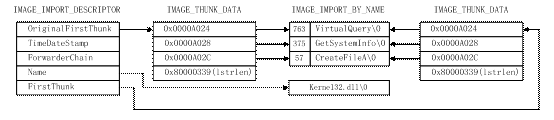
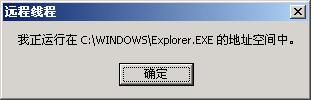

+++
title = 'NT环境下进程隐藏的实现'
date = 2004-03-12T09:07:00+08:00
categories = ['技术']
tags = ['Windows']
+++

**本文发表于《CSDN开发高手》2004年第3期**  [源码](https://github.com/localvar/backup/tree/master/Inject)

在NT环境下隐藏进程，也就是说在用户不知情的条件下，执行自己的代码的方法有很多种，比如说使用注册表插入DLL，使用windows挂钩等等。其中比较有代表性的是Jeffrey Richer在《windows核心编程》中介绍的`LoadLibrary`方法和罗云彬在《windows环境下32位汇编语言程序设计》中介绍的方法。两种方法的共同特点是：都采用远程线程，让自己的代码作为宿主进程的线程在宿主进程的地址空间中执行，从而达到隐藏的目的。相比较而言，Richer的方法由于可以使用 c/c++ 等高级语言完成，理解和实现都比较容易，但他让宿主进程使用`LoadLibrary`来装入新的DLL，所以难免留下蛛丝马迹，隐藏效果并不十分完美。罗云彬的方法在隐藏效果上绝对一流，不过，由于他使用的是汇编语言，实现起来比较难（起码我写不了汇编程序😄）。笔者下面介绍的方法可以说是对上述两种方法的综合：采用 c/c++ 编码，实现完全隐藏。并且，笔者的方法极大的简化了远程线程代码的编写，使其编写难度与普通程序基本一致。

# 基础知识

让自己的代码作为宿主进程的线程，在宿主进程的地址空间中执行确实是个不错的主意。但是要自己把程序放到其他进程的地址空间中去运行，将面临一个严峻的问题：如何实现代码重定位。关于重定位问题，请看下面的程序：

```cpp
…
int func()        //函数func的定义
…
int a = func();   //对func的调用
…
```

这段程序经过编译链接后，可能会变成下面的样子：

```asm
…
0x00401800: push ebp           // 这是函数func的入口
0x00401801: mov ebp, esp
…
0x00402000: call 00401800      // 对函数func的调用
0x00402005: mov dword ptr [ebp-08], eax
…
```

请注意`0x00402000`处的直接寻址指令`call 00401800`。上面的程序在正常执行（由windows装入并执行）时，因为PE文件的文件头中含有足够的信息，所以系统能够将代码装入到合适的位置从而保证地址`00401800`处就是函数`func`的入口。但是当我们自己把程序装入到其他进程的地址空间中时，我们无法保证这一点，最终的结果可能会象下面这样：

```asm
…
0x00801800: push ebp           // 这是函数func的入口
0x00801801: mov ebp, esp
…
0x00802000: call 00401800      // 00401800处是什么?
0x00802005: mov dword ptr [ebp-08], eax
…
```

显然，运行上面的代码将产生不可预料的结果（最大的可能就是执行我们费尽千辛万苦才装入的代码的线程连同宿主进程一起被系统杀死）。不知大家注意过系统中动态链接库（dll）的装入没有：一个dll被装入不同进程时，装入的地址可能不同，所以系统在这种情况下也必须解决dll中直接寻址指令的重定位问题。原来，绝大多数dll中都包含一些由编译器插入的用于重定位的数据，这些数据就构成了重定位表。系统根据重定位表中的数据，修改dll的代码，完成重定位操作。Richer使用的`LoadLibrary`也是借用了这一点。所以我们的重定位方法就是：替系统来完成工作，自己根据重定位表中的数据进行重定位。既然如此，那就让我们来了解一下重定位表吧。

先来分析一下重定位表中需要保存哪些信息。还以上面的代码为例，要让它能正确执行，就必须把指令`call 00401800`改为`call 00801800`。进行这一改动需要两个数据，第一是改哪，也就是哪个内存地址中的数据需要修改，这里是`0x00802001`（不是`0x00802000`）；第二是怎么改，也就是应该给该位置的数据加上多少，这里是`0x00400000`。这第二个数据可以从dll的实际装入地址和建议装入地址计算而来，只要让前者减后者就行了。其中实际装入地址装入的时候就会知道，而建议装入地址记录在文件头的`ImageBase`字段中。所以，综上所述，重定位表中需要保存的信息是：有待修正的数据的地址。

| 位置  | 数据      | 描述                         |
| ------- | ----------- | ------------------------------ |
| 0000h | 00001000h | 页起始地址（RVA）            |
| 0004h | 00000010h | 重定位块长度                 |
| 0008h | 3006h     | 第一个重定位项，32位都须修正 |
| 000ah | 300dh     | 第二个重定位项，32位都须修正 |
| 000ch | 3015h     | 第三个重定位项，32位都须修正 |
| 000eh | 0000h     | 第四个重定位项，用于对齐     |
| 0010h | 00003000h | 页起始地址（RVA）            |
| 0014h | 0000000ch | 重定位块长度                 |
| 0018h | 3008h     | 第一个重定位项，32位都须修正 |
| 001ah | 302ah     | 第二个重定位项，32位都须修正 |
| …    | …        | 其他重定位块                 |
| 0100h | 0000h     | 重定位表结束标志             |

知道了重定位表要保存哪些信息，我们再来看看PE文件的重定位表是如何保存这些信息的。重定位表的位置和大小可以从PE文件头的数据目录中的第六个`IMAGE_DATA_DIRECTORY`结构中获取。由于记录一个需要修正的代码地址需要一个双字（32位）的存储空间，而且程序中直接寻址指令也比较多，所以为了节省存储空间，windows把重定位表压缩了一下，以页（4k）为单位分块存储。在一个页面中寻址只需要12位的数据，把这12位数据再加上4位其它数据凑齐16位就构成一个重定位项。在每一页的所有重定位项前面附加一个双字表示页的起始地址，另一个双字表示本重定位块的长度，就可以记录一个页面中所有需要重定位的地址了。所有重定位块依次排列，最后以一个页起始地址为0的重定位块结束重定位表。上表是一个重定位表的例子。

上面提到每个重定位项还包括4位其他信息，这4位是重定位项的高4位，虽然有4位，但我们实际上能看到的值只有两个：0和3。0表示此项仅用作对齐，无其他意义；3表示重定位地址指向的双字的32位都需要修正。还要注意一点的是页起始地址是一个相对虚拟地址（RVA），必须加上装入地址才能得到实际页地址。例如上表中的第一个重定位项表示需要重定位的数据位于地址(假设装入地址是00400000h)：装入地址(00400000h)+页地址（1000h）+页内地址（0006h）=00401006h。

至此，已经解决了重定位问题。应该说，现在我们已经能够开始编码了。但是，不知你是否读过其它有关进程隐藏的文章（使用类似Jeffrey Richer的方法的例外）并且注意到它们总是以显式链接的方式调用Windows API，例如下面对`MessageBox`的调用：

```cpp
//fnLoadLibrary和fnGetProcAddress分别指向Windows API函数LoadLibraryW和GetProcAddress
typedef int (WINAPI *FxMsgBox)(HWND, LPCWSTR, LPCTSTR, UINT);
…
HMODULE hUser32 = fnLoadLibrary(L"User32.dll");
FxMsgBox fnMsgBox = (FxMsgBox)(fnGetProcAddress(hUser32, "MessageBoxW"));
fnMsgBox(…);
…
```

那它们为什么不使用更简便的隐式链接呢？原来，要隐式链接dll并调用其中的输出函数，首先必须保证程序运行时dll已经被装入，否则就会出错。其次，调用API函数的指令格式一般是：`call dword ptr [xxxxxxxx]`，要让程序正常运行，就必须在调用前在地址`xxxxxxxx`处填入目标函数的入口地址。程序正常装入时，系统会保证这两点。但是要自己装入程序，保证这两点就有一些麻烦，所以它们一般使用显式链接来绕过这两个问题。

如果你不在乎为每一个API使用一个typedef和一个`GetProcAddress`的话（也许还有一个`LoadLibrary`），使用显式链接就已经足够好了。但是设想一下实际情况吧：你的代码中调用几十乃至数百个API的情况是很常见的，为每一个API写这些重复性的代码将使编程毫无乐趣可言，所以，我们一定要解决那两个问题，从而使用隐式链接。我们处理隐式链接问题的思路和前面处理重定位问题时是一样的，即：替系统来完成工作，在远程线程代码调用第一个API之前，装入dll并填好相关入口地址。

```cpp
//摘自WINNT.H
typedef struct _IMAGE_IMPORT_DESCRIPTOR {
    union {
        DWORD   Characteristics;
        DWORD   OriginalFirstThunk;
    };
    DWORD   TimeDateStamp;
    DWORD   ForwarderChain;
    DWORD   Name;
    DWORD   FirstThunk;
} IMAGE_IMPORT_DESCRIPTOR;
```

还是先来学习一下基础知识—PE文件的输入表。输入表记录了一个Win32程序隐式加载的所有dll的文件名及从中引入的API的函数名，通过PE文件头的数据目录中的第二个`IMAGE_DATA_DIRECTORY`，我们可以获得输入表的位置和大小。实际上，输入表是一个由`IMAGE_IMPORT_DESCRIPTOR`结构组成的数组，每个结构对应一个需要隐式加载的dll文件，整个输入表以一个`Characteristics`字段为0的`IMAGE_IMPORT_DESCRIPTOR`结束。上面就是`IMAGE_IMPORT_DESCRIPTOR`结构的定义。

其中的`Name`字段是一个RVA，指向此结构所对应的dll的文件名，文件名是以NULL结束的字符串。在PE文件中，`OriginalFirstThunk`和`FirstThunk`都是RVA，分别指向两个内容完全相同的`IMAGE_THUNK_DATA`结构的数组，每个结构对应一个引入的函数，整个数组以一个内容为0的`IMAGE_THUNK_DATA`结构作为结束标志。`IMAGE_THUNK_DATA`结构定义如下：

```cpp
//摘自WINNT.H
typedef struct _IMAGE_THUNK_DATA32 {
    union {
        DWORD ForwarderString;      // PBYTE 
        DWORD Function;             // PDWORD
        DWORD Ordinal;
        DWORD AddressOfData;        // PIMAGE_IMPORT_BY_NAME
    } u1;
} IMAGE_THUNK_DATA32;
typedef IMAGE_THUNK_DATA32        IMAGE_THUNK_DATA;
```

从上面的定义可以看出，完全能够把`IMAGE_THUNK_DATA`结构当作一个`DWORD`使用。当这个`DWORD`的最高为是1时，表示函数是以序号的形式引入的；否则函数是以函数名的形式引入的，且此`DWORD`是一个RVA，指向一个`IMAGE_IMPORT_BY_NAME`结构。我们可以使用在WINNT.H中预定义的常量`IMAGE_ORDINAL_FLAG`来测试最高位是否为1。`IMAGE_IMPORT_BY_NAME`结构定义如下：

```cpp
//摘自WINNT.H
typedef struct _IMAGE_IMPORT_BY_NAME {
    WORD    Hint;
    BYTE    Name[1];
} IMAGE_IMPORT_BY_NAME;
```

其中`Hint`字段的内容是可选的，如果它不是0，则它也表示函数的序号，我们编程是不必考虑它。虽然上面的定义中`Name`数组只包含一个元素，但其实它是一个变长数组，保存的是一个以NULL结尾的字符串，也就是函数名。

也许上面的解释已经把你弄得头晕脑涨了，来看看下面的导入表的实际结构吧，希望下图能帮你清醒一下：



光看前面的讲解中，你也许会有一个疑问：既然`OriginalFirstThunk`和`FirstThunk`指向的内容完全一样，只用一个不就行了吗？好了，不要再怀疑Windows的设计者了，在PE文件中它们确实是一样的，但是当文件被装入内存后，差别就出现了：`OriginalFirstThunk`的内容不会变，但`FirstThunk`里数据却会变成与其相对应的函数的入口地址。内存中的输入表结构如下图所示：


事实上，前面提到的`call dword ptr [xxxxxxxx]`指令中的`xxxxxxxx`就是`FirstThunk`中的一个`IMAGE_THUNK_DATA`的地址，而这个`IMAGE_THUNK_DATA`在装入完成之后保存的就是与其对应的函数的入口地址。知道动态链接是怎么回事了吧！

# 编程实现

到现在为止，有关进程隐藏的基础知识就都说完了，下面我们就开始动手编程，其他问题我将结合代码进行说明。

我们要编写两个程序，一个是dll，它里面包含要插入到宿主进程中去的代码和数据；另一个是装载器程序，它将把dll装入宿主进程并通过创建远程线程来运行这些代码。为了更好的隐藏，我把编译好的dll作为资源加入到了装载器之中。至于宿主进程，我选择的是explorer.exe，因为每一个windows系统中都有它的身影。装载器程序运行之后，远程线程将弹出如下一个消息框，证明代码插入成功。



两个程序有一个公用的头文件ThreadParam.h，我在它里面定义了要传递给远程线程的参数的结构，这个结构包括两个函数指针，使用时，它们将分别指向windows API函数`LoadLibrary`和`GetProcAddress`，还有一个指针指向远程线程在目标进程中的映像基址，后面将对这三个指针进行具体说明，下面是ThreadParam.h的内容：

```cpp
typedef HMODULE (WINAPI *FxLoadLibrary)(LPCSTR lpFileName);
typedef FARPROC (WINAPI *FxGetProcAddr)(HMODULE hModule, LPCSTR lpProcName);
typedef struct tagTHREADPARAM
{
	FxLoadLibrary fnLoadLibrary;
	FxGetProcAddr fnGetProcAddr;
	LPBYTE pImageBase;
}THREADPARAM, *PTHREADPARAM;
```

我们先来看装载器程序。这里面还会涉及到其他一些PE文件格式方面的内容，限于篇幅，我将不再详细介绍，请读者参考相关资料。同时，为了使程序更加短小，我假设它从不出错，去掉了所有用于错误处理的代码。

首先介绍一下程序中用到的全局变量和常数。其中`_pinh`指向嵌入装载器的dll的PE文件头，供需要的地方使用。之后的四个宏是为了以后程序书写方便而定义，`IMAGE_SIZE`表示dll的映像大小，也就是需要在宿主进程中开辟多大的内存空间；`RVA_EXPORT_TABEL`表示dll输出表的RVA地址；`RVA_RELOC_TABEL`表示dll重定位表的RVA地址；`PROCESS_OPEN_MODE`表示打开宿主进程的方式，只有按这种方式打开，我们才能完成所有必需的工作。

```cpp
static  PIMAGE_NT_HEADERS 	_pinh = NULL;
#define IMAGE_SIZE		(_pinh->OptionalHeader.SizeOfImage)
#define RVA_EXPORT_TABEL	(_pinh->OptionalHeader.DataDirectory[0].VirtualAddress)
#define RVA_RELOC_TABEL	(_pinh->OptionalHeader.DataDirectory[5].VirtualAddress)
#define PROCESS_OPEN_MODE  (PROCESS_CREATE_THREAD|PROCESS_VM_WRITE|PROCESS_VM_OPERATION)
```

下面是主函数的定义，从中我们可以看到大致的工作步骤，注释中的序号标明了每一步的开始位置。

```cpp
int APIENTRY _tWinMain(HINSTANCE hInst, HINSTANCE, LPTSTR lpCmdLine, int nCmdShow)
{
	LPTHREAD_START_ROUTINE pEntry = NULL;
	PTHREADPARAM pParam = NULL;
	LPBYTE pImage = (LPBYTE)MapRsrcToImage();					// ①
	DWORD dwProcessId = GetTargetProcessId();					// ②
	HANDLE hProcess = OpenProcess(PROCESS_OPEN_MODE, FALSE, dwProcessId);
	LPBYTE pInjectPos = (LPBYTE)VirtualAllocEx(hProcess, NULL, IMAGE_SIZE,
		MEM_COMMIT, PAGE_EXECUTE_READWRITE);
	PrepareData(pImage, pInjectPos, (PVOID*)&pEntry, (PVOID*)&pParam);		// ③
	WriteProcessMemory(hProcess, pInjectPos, pImage, IMAGE_SIZE, NULL);		// ④
	HANDLE hThread = CreateRemoteThread(hProcess, NULL, 0, pEntry, pParam, 0, NULL);
	CloseHandle(hThread);								// ⑤
	CloseHandle(hProcess);
	VirtualFree(pImage, 0, MEM_RELEASE);
	return 0;
}
```

第①步：将资源中的dll文件映射到内存，形成映像。这一步由函数`MapRsrcToImage`完成。它首先将打开资源中的dll，找到dll的PE文件头并让全局变量`_pinh`指向它。然后，它再根据文件头中的`SizeOfImage`字段在装载器进程（为求方便，我们的数据准备工作都在装载器进程中实现，只是到最后，才把准备好的数据一次性写入宿主进程）中开辟足够的内存空间用于存放dll的内存映像。把dll映射到内存的操作是以节为单位来进行的，PE文件中的节表（`IMAGE_SECTION_HEADER`）提供了每个节的大小、在文件中的位置和要放到内存中的位置（RVA）等信息。文件头不属于任何节，我们把它的数据放到内存区的起始位置（这样做是有原因的，将在介绍dll程序时说明）。

```cpp
static LPBYTE MapRsrcToImage()    //将资源中的DLL映射到内存
{
	HRSRC hRsrc = FindResource(NULL, _T("rtdll"), _T("RT_DLL"));
	HGLOBAL hGlobal = LoadResource(NULL, hRsrc);
	LPBYTE pRsrc = (LPBYTE)LockResource(hGlobal);
	_pinh = (PIMAGE_NT_HEADERS)(pRsrc + ((PIMAGE_DOS_HEADER)pRsrc)->e_lfanew);
	LPBYTE pImage = (LPBYTE)VirtualAlloc(NULL, IMAGE_SIZE, MEM_COMMIT, PAGE_READWRITE);
	DWORD dwSections = _pinh->FileHeader.NumberOfSections;
	DWORD dwBytes2Copy = (((LPBYTE)_pinh) - pRsrc) + sizeof(IMAGE_NT_HEADERS);
	PIMAGE_SECTION_HEADER pish = (PIMAGE_SECTION_HEADER)(pRsrc + dwBytes2Copy);
	dwBytes2Copy += dwSections * sizeof(IMAGE_SECTION_HEADER);
	memcpy(pImage, pRsrc, dwBytes2Copy);
	for(DWORD i=0; i<dwSections; i++, pish++)
	{
		LPBYTE pSrc = pRsrc + pish->PointerToRawData;
		LPBYTE pDest = pImage + pish->VirtualAddress;
		dwBytes2Copy = pish->SizeOfRawData;
		memcpy(pDest, pSrc, dwBytes2Copy);
	}
	_pinh = (PIMAGE_NT_HEADERS)(pImage + ((PIMAGE_DOS_HEADER)pImage)->e_lfanew);
	return pImage;
}
```

第②步：打开宿主进程，并在其中开辟用于写入数据的内存空间。这一步比较简单，其中函数`GetTargetProcessId`用于获取explorer.exe的进程ID。

```cpp
static DWORD GetTargetProcessId()	//取得explorer进程的pid
{
	DWORD dwProcessId = 0;
	HWND hWnd = FindWindow(_T("Progman"), _T("Program Manager"));
	GetWindowThreadProcessId(hWnd, &dwProcessId);
	return dwProcessId;
}
```

第③步：准备好要写入宿主进程的数据。这一步要把①中建立的dll映像根据②中开辟的存储空间的基址进行重定位，为线程准备参数，并计算线程的入口地址。

```cpp
static void PrepareData(LPBYTE pImage, LPBYTE pInjectPos, PVOID* ppEntry, PVOID* ppParam)
{
	LPBYTE pRelocTbl = pImage + RVA_RELOC_TABEL;
	DWORD dwRelocOffset = (DWORD)pInjectPos - _inh.OptionalHeader.ImageBase;
	RelocImage(pImage, pRelocTbl, dwRelocOffset);
	PTHREADPARAM param = (PTHREADPARAM)pRelocTbl;
	HMODULE hKernel32 = GetModuleHandle(_T("kernel32.dll"));
	param->fnGetProcAddress=(FxGetProcAddress)GetProcAddress(hKernel32,"GetProcAddress");
	param->fnLoadLibrary = (FxLoadLibrary)GetProcAddress(hKernel32, "LoadLibraryA");
	param->pImageBase = pInjectPos;
	*ppParam = pInjectPos + RVA_RELOC_TABEL;
	*ppEntry = pInjectPos + GetEntryPoint(pImage);
}
```

首先，它根据实际装入地址和建议地址计算出要加到重定位数据上去的数值，然后调用函数`RelocImage`进行重定位操作。`RelocImage`主要是根据我们前面介绍的重定位表的结构来对dll映像进行重定位。看了`RelocImage`的代码，你是不是感到有些惊讶？我们费了那么多气力来说明重定位问题，但实现它却只需要这么几行程序！其实这说明了一点：PE文件格式设计得非常简洁，我们完全没必要对它有恐惧感。后面处理隐式链接的代码将再次证明这一点。

```cpp
static void RelocImage(PBYTE pImage, PBYTE pRelocTbl, DWORD dwRelocOffset)
{
	PIMAGE_BASE_RELOCATION pibr = (PIMAGE_BASE_RELOCATION)pRelocTbl;
	while(pibr->VirtualAddress != NULL)
	{
		WORD* arrOffset = (WORD*)(pRelocTbl + sizeof(IMAGE_BASE_RELOCATION));
		DWORD dwRvaCount = (pibr->SizeOfBlock - sizeof(IMAGE_BASE_RELOCATION)) / 2;
		for(DWORD i=0; i<dwRvaCount; i++)
		{
			DWORD dwRva = arrOffset[i];
			if((dwRva & 0xf000) != 0x3000)
				continue;
			dwRva &= 0x0fff;
			dwRva += pibr->VirtualAddress + (DWORD)pImage;
			*(DWORD*)dwRva += dwRelocOffset;
		}
		pRelocTbl += pibr->SizeOfBlock;
		pibr = (PIMAGE_BASE_RELOCATION)pRelocTbl;
	}
}
```

由于我们在宿主进程中分配的内存只有`IMAGE_SIZE`那么大，所以必须在重定位操作完成之后，才能把线程参数写进去，这是因为重定位表在完成重定位之后，就没用了，我们正好可以借用它的空间来存放线程参数，而且一般情况下，空间足够使用，除非你要传递特别多的参数。这样，参数的地址自然就是实际装入地址加上重定位表的RVA地址了。

最后的工作是获取线程的入口地址，由函数`GetEntryPoint`来完成。我们的dll程序输出一个名为`ThreadEntry`的函数，其原型兼容windows的线程入口函数，我们把它作为远程线程的执行体。`GetEntryPoint`根据dll的输出表信息从映像中找到`ThreadEntry`的入口地址并将其返回。不过，`GetEntryPoint`返回的地址是一个RVA，必须加上装入地址`pInjectPos`才是实际入口地址。

```cpp
static DWORD GetEntryPoint(LPBYTE pImage)
{
	DWORD dwEntry = 0, index = 0;
	IMAGE_EXPORT_DIRECTORY* pied = (IMAGE_EXPORT_DIRECTORY*)(pImage + RVA_EXPORT_TABEL);
	DWORD* pNameTbl = (DWORD*)(pImage + pied->AddressOfNames);
	for(index=0; index<pied->NumberOfNames; index++, pNameTbl++)
		if(strcmp("ThreadEntry", (char*)(pImage + (*pNameTbl))) == 0)
		{
			index = ((WORD*)(pImage + pied->AddressOfNameOrdinals))[index];
			dwEntry = ((DWORD*)(pImage + pied->AddressOfFunctions))[index];
			break;
		}
	return dwEntry;
}
```

第④步：把准备好的数据写入宿主进程，并创建远程线程来运行写入的代码。

第⑤步：进行装载器程序结束前的清理工作。

以上是装载器程序的全部内容，接下来介绍dll程序。前面已经说过，dll要输出一个名为`ThreadEntry`的函数作为远程线程的入口，所以我们从`ThreadEntry`开始。

```cpp
extern DWORD ThreadMain(HINSTANCE hInst);
DWORD WINAPI ThreadEntry(PTHREADPARAM pParam)
{
	DWORD dwResult = -1;
	__try{
		if(LoadImportFx(pParam->pImageBase, pParam->fnLoadLibrary, pParam->fnGetProcAddr))
			dwResult = ThreadMain((HINSTANCE)pParam->pImageBase);
	}
	__except(EXCEPTION_EXECUTE_HANDLER)
	{
		dwResult = -2;
	}
	return dwResult;
}
```

整个`ThreadEntry`的代码被包含在一个SEH（结构化异常处理）之中，这可以避免部分由于寄生代码出错而导致宿主被系统杀死的情况。`ThreadEntry`首先调用`LoadImportFx`函数完成隐式链接dll的处理。

`LoadImportFx`的工作原理就是按照前面介绍的输入表的结构，使用`LoadLibrary`加载dll文件，然后用`GetProcAddress`获得输入函数的入口地址并写入相应的`IMAGE_THUNK_DATA`中。我在这里要说明的是：为什么远程线程能使用装载器进程中`LoadLibrary`和`GetProcAddress`的入口地址来实现对这两个函数的调用？因为按照前面的说法，我们无法保证包含这两个函数的dll已被装入，更无法保证它们的指向的正确性。其实，这里我利用了windows系统中的两个事实：一是基本上所有的windows进程都会装入`kernel32.dll`（在我的机器上，只有smss.exe例外），而这两个函数就位于`kernel32.dll`中；另一个是所有装入`kernel32.dll`的进程都会把它装入同一个内存地址，这是因为它是windows系统中最基本的dll之一。所以，我这样使用在绝大多数情况下不会有任何问题。

```cpp
BOOL LoadImportFx(LPBYTE pBase, FxLoadLibrary fnLoadLibrary, FxGetProcAddr fnGetProcAddr)
{
	PIMAGE_DOS_HEADER pidh = (PIMAGE_DOS_HEADER)pBase;
	PIMAGE_NT_HEADERS pinh = (PIMAGE_NT_HEADERS)(pBase + pidh->e_lfanew);
	PIMAGE_IMPORT_DESCRIPTOR piid = (PIMAGE_IMPORT_DESCRIPTOR)
		(pBase + pinh->OptionalHeader.DataDirectory[1].VirtualAddress);
	for(; piid->OriginalFirstThunk != 0; piid++)
	{
		HMODULE hDll = fnLoadLibrary((LPCSTR)(pBase + piid->Name));
		PIMAGE_THUNK_DATA pOrigin = (PIMAGE_THUNK_DATA)(pBase + piid->OriginalFirstThunk);
		PIMAGE_THUNK_DATA pFirst = (PIMAGE_THUNK_DATA)(pBase + piid->FirstThunk);
		LPCSTR pFxName = NULL;
		PIMAGE_IMPORT_BY_NAME piibn = NULL;
		for(; pOrigin->u1.Ordinal != 0; pOrigin++, pFirst++)
		{
			if(pOrigin->u1.Ordinal & IMAGE_ORDINAL_FLAG)
				pFxName = (LPCSTR)IMAGE_ORDINAL(pOrigin->u1.Ordinal);
			else
			{
				piibn = (PIMAGE_IMPORT_BY_NAME)(pBase + pOrigin->u1.AddressOfData);
				pFxName = (LPCSTR)piibn->Name;
			}
			pFirst->u1.Function = (DWORD)fnGetProcAddr(hDll, pFxName);
		}
	}
	return TRUE;
}
```

处理完隐式链接之后，`ThreadEntry`调用`ThreadMain`来进行完成远程线程的实际工作。可能你已经注意到`ThreadMain`有一个参数是`HINSTANCE`类型，但从`ThreadEntry`可知，它实际上是dll在宿主中的装入地址，为什么可以这样做呢？答案是：我不知道，你去问微软吧?。不过据我观察，普通程序的任何一个模块（module）的句柄都是其装入地址，所以我也就照猫画虎了。这也解释了前面处理重定位时把文件头放入映像基址的原因—系统需要文件头信息，我必须为它准备好（虽然`LoadImportFx`函数也需要文件头来定位输入表，但不是根本原因，因为完全可以让它使用其他方式）。

下面是我的`ThreadMain`，它弹出前面提到的消息框。看到了吧？你可以像写普通程序一样写远程线程的代码，没有复杂的自定位，也没有烦人的显式链接，这个世界真美好！

```cpp
DWORD ThreadMain(HINSTANCE hInst)
{
	TCHAR szModule[256], szText[512], szFormat[256];
	LoadString(hInst, IDS_FORMAT, szFormat, sizeof(szFormat) / sizeof(TCHAR));
	GetModuleFileName(NULL, szModule, 256);
	_stprintf(szText, szFormat, szModule);
	MessageBox(NULL, szText, _T("远程线程"), MB_OK);
	return 0;
}
```

# 小结

本文在相当大的程度上简化了进程隐藏技术，你甚至可以把它当作一个模板，仅仅实现一个`ThreadMain`就可以把代码隐藏到其他进程中去为所欲为了。但这决不是笔者写作此文的目的，我希望读者只把它当作一项技术，加深自己对windows系统的理解。其实，本文对动态链接的处理还远没有达到操作系统程度，举例来说：PE文件的数据目录现在使用了15项，但本文只处理了4项：输出表，输入表，重定位表和IAT（可以看作输入表的一部分），不把所有15项都处理完，远程代码的行为就可能与正常情况不同。我希望能与各位读者共同努力，不断完善这项技术，更希望大家能够负责任的使用它，利用它更好的防治各种有害代码。
