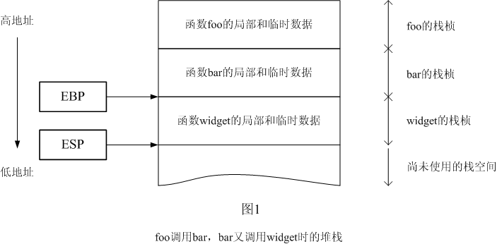
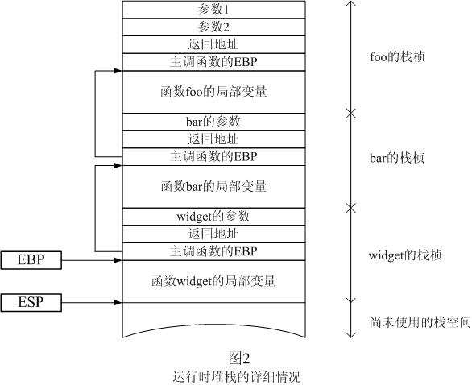
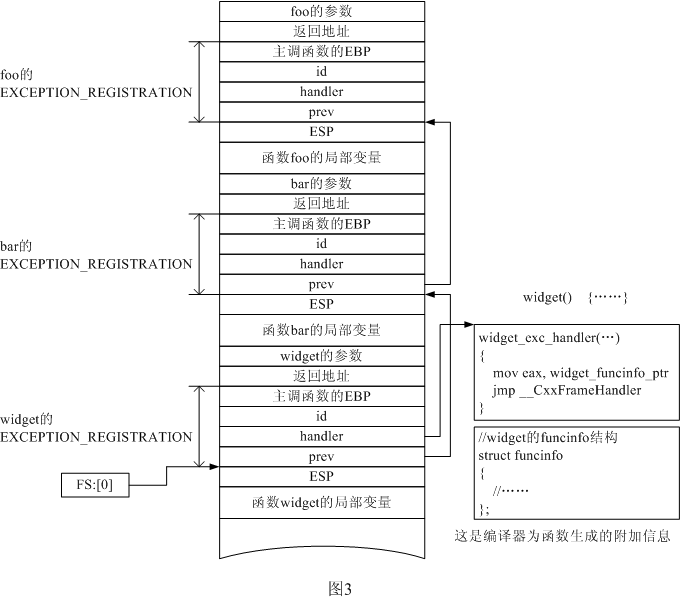
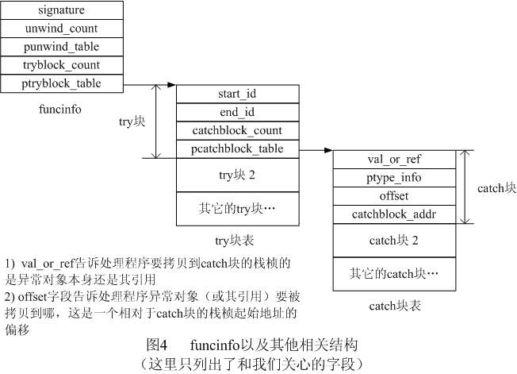
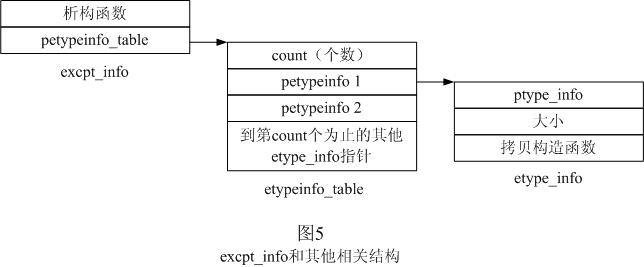
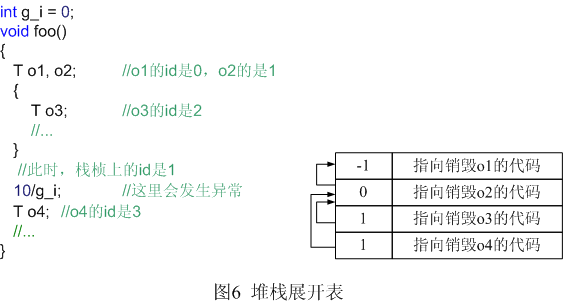

+++
title = 'C++编译器如何实现异常处理'
date = 2005-07-21T09:31:00+08:00
categories = ['技术']
tags = ['C++']
[params]
  origin = 'translated'
[params.author]
  name = 'Vishal Kochhar'
+++

[原文](http://www.codeproject.com/KB/cpp/exceptionhandler.aspx)

与传统语言相比，C++ 的一项革命性创新就是它支持异常处理。传统的错误处理方式经常满足不了要求，而异常处理则是一个极好的替代解决方案。它将正常代码和错误处理代码清晰的划分开来，程序变得非常干净并且容易维护。本文讨论了编译器如何实现异常处理。我将假定你已经熟悉异常处理的语法和机制。本文还提供了一个用于 VC++ 的异常处理库，要用库中的处理程序替换掉 VC++ 提供的那个，你只需要调用下面这个函数：

```cpp
install_my_handler();
```

之后，程序中的所有异常，从它们被抛出到堆栈展开（stack unwinding），再到调用catch块，最后到程序恢复正常运行，都将由我的异常处理库来管理。

与其它 C++ 特性一样，C++ 标准并没有规定编译器应该如何来实现异常处理。这意味着每一个编译器的提供商都可以用它们认为恰当的方式来实现它。下面我会描述一下 VC++ 是怎么做的，但即使你使用其它的编译器或操作系统①，本文也应该会是一篇很好的学习材料。VC++ 的实现方式是以windows系统的结构化异常处理（SEH）②为基础的。

# 结构化异常处理—概述

在本文的讨论中，我认为异常或者是被明确的抛出的，或者是由于除零溢出、空指针访问等引起的。当它发生时会产生一个中断，接下来控制权就会传递到操作系统的手中。操作系统将调用异常处理程序，检查从异常发生位置开始的函数调用序列，进行堆栈展开和控制权转移。Windows定义了结构“EXCEPTION_REGISTRATION”，使我们能够向操作系统注册自己的异常处理程序。

```cpp
struct EXCEPTION_REGISTRATION
{
   EXCEPTION_REGISTRATION* prev;
   DWORD handler;
};
```

注册时，只需要创建这样一个结构，然后把它的地址放到FS段偏移0的位置上去就行了。下面这句汇编代码演示了这一操作：

```asm
mov        FS:[0],    exc_regp
```

prev字段用于建立一个EXCEPTION_REGISTRATION结构的链表，每次注册新的EXCEPTION_REGISTRATION时，我们都要把原来注册的那个的地址存到prev中。

那么，那个异常回调函数长什么样呢？在excpt.h中，windows定义了它的原形：

```cpp
EXCEPTION_DISPOSITION (*handler)(
    _EXCEPTION_RECORD *ExcRecord,
    void * EstablisherFrame, 
    _CONTEXT *ContextRecord,
    void * DispatcherContext);
```

不要管它的参数和返回值，我们先来看一个简单的例子。下面的程序注册了一个异常处理程序，然后通过除以零产生了一个异常。异常处理程序捕获了它，打印了一条消息就完事大吉并退出了。

```cpp
#include <iostream>
#include <windows.h> 

using std::cout;
using std::endl; 

struct EXCEPTION_REGISTRATION
{
   EXCEPTION_REGISTRATION* prev;
   DWORD handler;
}; 

EXCEPTION_DISPOSITION myHandler(
    _EXCEPTION_RECORD *ExcRecord,
    void * EstablisherFrame, 
    _CONTEXT *ContextRecord,
    void * DispatcherContext)
{
    cout << "In the exception handler" << endl;
    cout << "Just a demo. exiting..." << endl;
    exit(0);
    return ExceptionContinueExecution; //不会运行到这
} 

int g_div = 0; 

void bar()
{
    //初始化一个EXCEPTION_REGISTRATION结构
    EXCEPTION_REGISTRATION reg, *preg = ®
    reg.handler = (DWORD)myHandler;
    //取得当前异常处理链的“头”
    DWORD prev;
    _asm
    {
        mov EAX, FS:[0]
        mov prev, EAX
    }
    reg.prev = (EXCEPTION_REGISTRATION*) prev;
    //注册！
    _asm
    {
        mov EAX, preg
        mov FS:[0], EAX
    } 

    //产生一个异常
    int j = 10 / g_div;  //异常，除零溢出
} 

int main()
{
    bar();
    return 0;
} 

/*-------输出-------------------
In the exception handler
Just a demo. exiting...
---------------------------------*/
```

注意EXCEPTION_REGISTRATION必须定义在栈上，并且必须位于比上一个结点更低的内存地址上，windows对此有严格要求，达不到的话，它就会立刻终止进程。

# 函数和堆栈

堆栈是用来保存局部对象的连续内存区。更明确的说，每个函数都有一个相关的栈桢（stack frame）来保存它所有的局部对象和表达式计算过程中用到的临时对象，至少理论上是这样的。但现实中，编译器经常会把一些对象放到寄存器中以便能以更快的速度访问。堆栈是一个处理器（CPU）层次的概念，为了操纵它，处理器提供了一些专用的寄存器和指令。

图1是一个典型的堆栈，它示出了函数foo调用bar，bar又调用widget时的情景。请注意堆栈是向下增长的，这意味着新压入的项的地址低于原有项的地址。



通常编译器使用EBP寄存器来指示当前活动的栈桢。本例中，CPU正在运行widget，所以图中的EBP指向了widget的栈桢。编译器在编译时将所有局部对象解析成相对于栈桢指针（EBP）的固定偏移，函数则通过栈桢指针来间接访问局部对象。举个例子，典型的，widget访问它的局部变量时就是通过访问栈桢指针以下的、有着确定位置的几个字节来实现的，比如说EBP-24。

上图中也画出了ESP寄存器，它叫栈指针，指向栈的最后一项。在本例中，ESP指着widget的栈桢的末尾，这也是下一个栈桢（如果它被创建的话）的开始位置。

处理器支持两种类型的栈操作：压栈（push）和弹栈（pop）。比如，`pop EAX`的作用是从ESP所指的位置读出4字节放到EAX寄存器中，并把ESP加上（记住，栈是向下增长的）4（在32位处理器上）；类似的，`push EBP`的作用是把ESP减去4，然后将EBP的值放到ESP指向的位置中去。

编译器编译一个函数时，会在它的开头添加一些代码来为其创建并初始化栈桢，这些代码被称为序言（prologue）；同样，它也会在函数的结尾处放上代码来清除栈桢，这些代码叫做尾声（epilogue）。

一般情况下，序言是这样的：

```asm
Push EBP       ; 把原来的栈桢指针保存到栈上 
Mov EBP, ESP  ; 激活新的栈桢 
Sub ESP, 10   ; 减去一个数字，让ESP指向栈桢的末尾
```

第一条指令把原来的栈桢指针EBP保存到栈上；第二条指令通过让EBP指向主调函数的EBP的保存位置来激活被调函数的栈桢；第三条指令把ESP减去了一个数字，这样ESP就指向了当前栈桢的末尾，而这个数字是函数要用到的所有局部对象和临时对象的大小。编译时，编译器知道函数的所有局部对象的类型和“体积”，所以，它能很容易的计算出栈桢的大小。

尾声所做的正好和序言相反，它必须把当前栈桢从栈上清除掉：

```asm
Mov ESP, EBP  
Pop EBP        ; 激活主调函数的栈桢 
Ret             ; 返回主调函数
```

它让ESP指向主调函数的栈桢指针的保存位置（也就是被调函数的栈桢指针指向的位置），弹出EBP从而激活主调函数的栈桢，然后返回主调函数。

一旦CPU遇到返回指令，它就要做以下两件事：把返回地址从栈中弹出，然后跳转到那个地址去。返回地址是主调函数执行call指令调用被调函数时自动压栈的。Call指令执行时，会先把紧随在它后面的那条指令的地址（被调函数的返回地址）压入栈中，然后跳转到被调函数的开始位置。图2更详细的描绘了运行时的堆栈。如图所示，主调函数把被调函数的参数也压进了堆栈，所以参数也是栈桢的一部分。函数返回后，主调函数需要移除这些参数，它通过把所有参数的总体积加到ESP上来达到目的，而这个体积可以在编译时知道：

```asm
Add ESP, args_size
```

当然，也可以把参数的总体积写在被调函数的返回指令的后面，让被调函数去移除参数，下面的指令就在返回主调函数前从栈中移去了24个字节：

```86asm
Ret 24
```

取决于被调函数的调用约定（call convention），这两种方式每次只能用一个。你还要注意的是每个线程都有自己独立的堆栈。



# C++和异常

回忆一下我在第一节中介绍的EXCEPTION_REGISTRATION结构，我们曾用它向操作系统注册了发生异常时要被调用的回调函数。VC++也是这么做的，不过它扩展了这个结构的语义，在它的后面添加了两个新字段：

```cpp
struct EXCEPTION_REGISTRATION
{
   EXCEPTION_REGISTRATION* prev;
   DWORD handler;
   int   id;
   DWORD ebp;
};
```

VC++会为绝大部分函数③添加一个EXCEPTION_REGISTRATION类型的局部变量，它的最后一个字段（ebp）与栈桢指针指向的位置重叠。函数的序言创建这个结构并把它注册给操作系统，尾声则恢复主调函数的EXCEPTION_REGISTRATION。id字段的意义我将在下一节介绍。

VC++编译函数时会为它生成两部分数据：

1. 异常回调函数
2. 一个包含函数重要信息的数据结构，这些信息包括catch块、这些块的地址和这些块所关心的异常的类型等等。我把这个结构称为funcinfo,有关它的详细讨论也在下一节。

图3是考虑了异常处理之后的运行时堆栈。widget的异常回调函数位于由FS:[0]指向的异常处理链的开始位置（这是由widget的序言设置的）。异常处理程序把widget的funcinfo结构的地址交给函数\_\_CxxFrameHandler，\_\_CxxFrameHandler会检查这个结构看函数中有没有catch块对当前的异常感兴趣。如果没有的话，它就返回ExceptionContinueSearch给操作系统，于是操作系统会从异常处理链表中取得下一个结点，并调用它的异常处理程序（也就是调用当前函数的那个函数的异常处理程序）。



这一过程将一直进行下去——直到处理程序找到一个能处理当前异常的catch块为止，这时它就不再返回操作系统了。但是在调用catch块之前（由于有funcinfo结构，所以知道catch块的入口，参见图3），必须进行堆栈展开，也就是清理掉当前函数的栈桢下面的所有其他的栈桢。这个操作稍微有点复杂，因为：异常处理程序必须找到异常发生时生存在这些栈桢上的所有局部对象，并依次调用它们的析构函数。后面我将对此进行详细介绍。

异常处理程序把这项工作委托给了各个栈桢自己的异常处理程序。从FS:[0]指向的异常处理链的第一个结点开始，它依次调用每个结点的处理程序，告诉它堆栈正在展开。与之相呼应，这些处理程序会调用每个局部对象的析构函数，然后返回。此过程一直进行到与异常处理程序自身相对应的那个结点为止。

由于catch块是函数的一部分，所以它使用的也是函数的栈桢。因此，在调用catch块之前，异常处理程序必须激活它所隶属的函数的栈桢。

其次，每个catch块都只接受一个参数，其类型是它希望捕获的异常的类型。异常处理程序必须把异常对象本身或者是异常对象的引用拷贝到catch块的栈桢上，编译器在funcinfo中记录了相关信息，处理程序根据这些信息就能知道到哪去拷贝异常对象了。

拷贝完异常并激活栈桢后，处理程序将调用catch块。而catch块将把控制权下一步要转移到的地址返回来。请注意：虽然这时堆栈已经展开，栈桢也都被清除了，但它们占据的内存空间并没有被覆盖，所有的数据都还好好的待在栈上。这是因为异常处理程序仍在执行，象其他函数一样，它也需要栈来存放自己的局部对象，而其栈桢就位于发生异常的那个函数的栈桢的下面。catch块返回以后，异常处理程序需要“杀掉”异常对象。此后，它让ESP指向目标函数（控制权要转移到的那个函数）的栈桢的末尾——这样就把（包括它自己的在内的）所有栈桢都删除了，然后再跳转到catch块返回的那个地址去，就胜利的完成整个异常处理任务了。但它怎么知道目标函数的栈桢末尾在哪呢？事实上它没法知道，所以编译器把这个地址保存到了栈桢上（由前言来完成），如图3所示，栈桢指针EBP下面第16个字节就是。

当然，catch块也可能抛出新异常，或者是将原来的异常重新抛出。处理程序必须对此有所准备。如果是抛出新异常，它必须杀掉原来的那个；而如果是重新抛出原来的异常，它必须能继续传播（propagate）这个异常。

这里我要特别强调一点：由于每个线程有自己独立的堆栈，所以每个线程也都有自己独立的、由FS:[0]指向的EXCEPTION_REGISTRATION链。

# C++和异常—2

图4是funcinfo的布局，注意这里的字段名可能与VC++编译器实际使用的不完全一致，而且我也只给出了和我们的讨论相关的字段。堆栈展开表（unwind table）的结构留到下节再讨论。



异常处理程序在函数中查找catch块时，它首先要判断异常发生的位置是否在当前函数（发生异常的那个函数）的一个try块中。是则查找与此try块相关的catch块表，否则直接返回。

先来看看它怎样找try块。编译时，编译器给每个try块都分配了start id和end id。通过funcinfo结构，异常处理程序可以访问这两个id，见图4。编译器为函数中的每个try块都生成了相关的数据结构。

上一节中，我说过VC++给EXCEPTION_REGISTRATION结构加上了一个id字段。回忆一下图3，这个结构位于函数的栈桢上。异常发生时，处理程序读出这个值，看它是否在try块的两个id确定的区间[start id，end id]中。是的话，异常就发生在这个try块中；否则继续查看try块表中的下一个try块。

谁负责更新id的值，它的值又应该是什么呢？原来，编译器会在函数的多个位置安插代码来更新id的值，以反应程序的实时运行状态。比如说，编译器会在进入try块的地方加上一条语句，把try块的start id写到栈桢上。

找到try块后，处理程序就遍历与其关联的catch块表，看是否有对当前异常感兴趣的catch块。在try块发生嵌套时，异常将既源于内层try块，也源于外层try块。这种情况下，处理程序应该按先内后外的顺序查找catch块。但它其实没必要关心这些，因为，在try块表中，VC++总是把内层try块放在外层try块的前面。

异常处理程序还有一个难题就是“如何根据catch块的相关数据结构判断这个catch块是否愿意处理当前异常”。这是通过比较异常的类型和catch块的参数的类型来完成的。例如下面这个程序：

```cpp
void foo()
{
   try {
      throw E();
   }
   catch(H) {
      //.
   }
}
```

如果H和E的类型完全相同的话，catch块就要捕获这个异常。这意味着处理程序必须在运行时进行类型比较，对C等语言来说，这是不可能的,因为它们无法在运行时得到对象的类型。C++则不同，它有了运行时类型识别（runtime type identification，RTTI），并提供了运行时类型比较的标准方法。C++在标准头文件<typeinfo>中定义了type_info类，它能在运行时代表一个类型。catch块数据结构的第二个字段（ptype_info，见图4）是一个指向type_info结构的指针，它在运行时就代表catch块的参数类型。type_info也重载了==运算符，能够指出两种类型是否完全相同。这样，异常处理程序只要比较（调用==运算符）catch块参数的type_info（可以通过catch块的相关数据结构来访问）和异常的type_info是否相同，就能知道catch块是不是愿意捕获当前异常了。

catch块的参数类型可以通过funcinfo结构得到，但异常的type_info从哪来呢？当编译器碰到

```cpp
throw E();
```

这条语句时，它会为异常生成一个excpt_info结构，如图5所示。还是要提醒你注意这里用的名字可能与VC++使用的不一致，而且仍然只有与我们的讨论相关的字段。从图中可以看出，异常的type_info可以通过excpt_info结构得到。由于异常处理程序需要拷贝异常对象（在调用catch块之前），也需要消除掉它（在调用catch块之后），所以编译器在这个结构中同时提供了异常的拷贝构造函数、大小和析构函数的信息。



在catch块的参数是基类，而异常是派生类时，异常处理程序也应该调用catch块。然而，这种情况下，比较它们的type_info绝对是不相等，因为它们本来就不是相同的类型。而且，type_info类也没有提供任何其他函数或运算符来指出一个类是另一个类的基类。但异常处理程序还必须得去调用catch块！为了解决这个问题，编译器只能为处理程序提供更多的信息：如果异常是派生类，那么etypeinfo_table（通过excpt_info访问）将包含多个指向etype_info（扩展了type_info，这个名字是我启的）的指针，它们分别指向了各个基类的etype_info。这样，处理程序就可以把catch块的参数和所有这些type_info比较，只要有一个相同，就调用catch块。

在结束这一部分之前，还有最后一个问题：异常处理程序是怎么知道异常和excpt_info结构的？下面我就要回答这个问题。VC++会把throw语句翻译成下面的样子：

```cpp
// throw E(); //编译器会为E生成excpt_info结构
E e = E();  //在栈上创建异常
_CxxThrowException(&e, E_EXCPT_INFO_ADDR);
```

\_\_CxxThrowException会把控制权连带它的两个参数都交给操作系统（控制权转移是通过软件中断实现的，请参见RaiseException）。而操作系统，在为调用异常回调函数做准备时，会把这两个参数打包到一个_EXCEPTION_RECORD结构中。接着，它从EXCEPTION_REGISTRATION链表的头结点（由FS:[0]指向）开始，依次调用各节点的异常处理程序。而且，指向当前EXCEPTION_REGISTRATION结构的指针也会作为异常处理程序的第二个参数出现。前面已经说过，VC++中的每个函数都在栈上创建并注册了EXCEPTION_REGISTRATION结构。所以传递这个参数可以让处理程序知道很多重要信息，比如说：EXCEPTION_REGISTRATION的id字段（用于查找catch块）、函数的栈桢（用于清理栈桢）和EXCEPTION_REGISTRATION结点在异常链表中的位置（用于堆栈展开）等。第一个参数是指向_EXCEPTION_RECORD结构的指针，通过它可以找到异常和它的excpt_info结构。下面是excpt.h中定义的异常回调函数的原型：

```cpp
EXCEPTION_DISPOSITION (*handler)(
    _EXCEPTION_RECORD *ExcRecord,
    void * EstablisherFrame, 
    _CONTEXT *ContextRecord,
    void * DispatcherContext);
```

后两个参数和我们的讨论关系不大。函数的返回值是一个枚举类型（也在excpt.h中定义），我前面已经说过，如果处理程序找不到catch块，它就会向系统返回ExceptionContinueSearch，对本文而言，我们只要知道这一个返回值就行了。_EXCEPTION_RECORD结构是在winnt.h中定义的：

```cpp
struct _EXCEPTION_RECORD
{
    DWORD ExceptionCode;
    DWORD ExceptionFlags; 
    _EXCEPTION_RECORD *ExcRecord;
    PVOID   ExceptionAddress; 
    DWORD NumberParameters;
    DWORD ExceptionInformation[15]; 
} EXCEPTION_RECORD;
```

ExceptionInformation数组中元素的个数和类型取决于ExceptionCode字段。如果是C++异常（异常代码是0xe06d7363，源于throw语句），那么数组中将包含指向异常和excpt_info结构的指针；如果是其他异常，那数组中基本上就不会有什么内容，这些异常包括除零溢出、访问违例等，你可以在winnt.h中找到它们的异常代码。

ExceptionFlags字段用于告诉异常处理程序应该采取什么操作。如果它是EH_UNWINDING（见Except.inc），那是说堆栈正在展开，这时，处理程序要清理栈桢，然后返回。否则处理程序应该在函数中查找catch块并调用它。清理栈桢意味着必须找到异常发生时生存在栈桢上的所有局部对象,并调用其析构函数，下一节我们将就此进行详细讨论。

# 清理栈桢

C++标准明确指出：堆栈展开工作必须调用异常发生时所有生存的局部对象的析构函数。如下面的代码：

```cpp
int g_i = 0;
void foo()
{
   T o1, o2;
   {
       T o3;
   }
   10/g_i; //这里会发生异常
   T o4;
   //...
}
```

foo有o1、o2、o3、o4四个局部对象，但异常发生时，o3已经“死亡”，o4还未“出生”，所以异常处理程序应该只调用o1和o2的析构函数。

前面已经说过，编译器会在函数的很多地方安插代码来记录当前的运行状态。实际上，编译器在函数中设置了一些关键区域，并为它们分配了id，进入关键区域时要记录它的id，退出时恢复前一个id。try块就是一个例子,其id就是start id。所以，在try块的入口，编译器会把它的start id记到栈桢上去。局部对象从创建到销毁也确定了一个关键区域，或者，换句话说，编译器给每个局部对象分配了唯一的id，例如下面的程序：

```cpp
void foo()
{
   T t1;
   //.
}
```

编译器会在t1的定义后面（也就是t1创建以后）,把它的id写到栈桢上：

```cpp
void foo()
{
   T t1;
   _id = t1_id; //编译器插入的语句
   //.
}
```

上面的_id是编译器偷偷创建的局部变量，它的位置与EXCEPTION_REGISTRATION的id字段重叠。类似的，在调用对象的析构函数前，编译器会恢复前一个关键区域的id。

清理栈桢时，异常处理程序读出id的值（通过EXCEPTION_REGISTRATION结构的id字段或栈桢指针EBP下面的4个字节来访问）。这个id可以表明，函数在运行到与它相关联的那个点之前没有发生异常。所有在这一点之前定义的对象都已初始化，应该调用这些对象中的一部分或全部对象的析构函数。请注意某些对象是属于子块（如前面代码中的o3）的，发生异常时可能已经销毁了，不应该调用它们的析构函数。

编译器还为函数生成了另一个数据结构——堆栈展开表（unwindtable，我启的名字），它是一个unwind结构的数组，可通过funcinfo来访问，如图4所示。函数的每个关键区域都有一个unwind结构，这些结构在展开表中出现的次序和它们所对应的区域在函数中的出现次序完全相同。一般unwind结构也会关联一个对象（别忘了，每个对象的定义都开辟了关键区域，并有id与其对应），它里面有如何销毁这个对象的信息。每当编译器碰到对象定义，它就生成一小段代码，这段代码知道对象在栈桢上的地址（就是它相对于栈桢指针的偏移），并能销毁它。unwind结构中有一个字段用于保存这段代码的入口地址：

```cpp
typedef  void (*CLEANUP_FUNC)();
struct unwind
{
    int prev;
    CLEANUP_FUNC  cf;
};
```

try块对应的unwind结构的cf字段是空值NULL，因为没有与它对应的对象，所以也没有东西需要它去销毁。通过prev字段，这些unwind结构也形成了一个链表。异常处理程序清理栈桢时，会读取当前的id值，以它为索引取得展开表中对应的项，并调用其第二个字段指向的清理代码，这样，那个与之关联的对象就被销毁了。然后，处理程序将以当前unwind结构的prev字段为索引，继续在展开表中找下一个unwind结构，调用其清理代码。这一过程将一直重复，直到链表的结尾（prev的值是-1）。图6画出了本节开始时提到的那段代码的堆栈展开表。



现在把new运算符也加进来，对于下面的代码：

```cpp
T* p = new T();
```

系统会首先为T分配内存，然后调用它的构造函数。所以，如果构造函数抛出了异常，系统就必须释放这些内存。因此，动态创建那些拥有“有为的构造函数”的类型时，VC++也为new运算符分配了id，并且堆栈展开表中也有与其对应的项，其清理代码将释放分配的内存空间。调用构造函数前，编译器把new运算符的id存到EXCEPTION_REGISTRATION结构中，构造函数顺利返回后，它再把id恢复成原来的值。

更进一步说，构造函数抛出异常时，对象可能刚刚构造了一部分，如果它有子成员对象或子基类对象，并且发生异常时它们中的一部分已经构造完成的话，就必须调用这些对象的析构函数。和普通函数一样，编译器也给构造函数生成了相关的数据来帮助完成这个任务。

展开堆栈时，异常处理程序调用的是用户定义的析构函数，这一点你必须注意，因为它也有可能抛出异常！C++标准规定堆栈展开过程中，析构函数不能抛出异常，否则系统将调用std::terminate。

# 实现

本节我们讨论其他三个有待详细解释的问题：

1. 如何安装异常处理程序
2. catch块重新抛出异常或抛出新异常时应该如何处理
3. 如何对所有线程提供异常处理支持

随同本文，有一个演示项目，查看其中的readme.txt文件可以得到一些编译方面的帮助①。

第一项任务是安装异常处理程序，也就是把 VC++ 的处理程序替换掉。从前面的讨论中，我们已经清楚地知道 __CxxFrameHandler 函数是 VC++ 所有异常处理工作的入口。编译器为每个函数都生成一段代码，它们在发生异常时被调用，把相应的funcinfo结构的指针交给 __CxxFrameHandler。

install_my_handler()函数会改写 __CxxFrameHandler 的入口处的代码，让程序跳转到 my_exc_handler() 函数。不过，__CxxFrameHandler 位于只读的内存页，对它的任何写操作都会导致访问违例，所以必须首先用 VirtualProtectEx 把该内存页的保护方式改成可读写，等改写完毕后，再改回只读。写入的数据是一个jmp_instr结构。

```cpp
//install_my_handler.cpp 

#include <windows.h>
#include "install_my_handler.h" 

//C++默认的异常处理程序
extern "C" 
EXCEPTION_DISPOSITION  __CxxFrameHandler(
     struct _EXCEPTION_RECORD *ExceptionRecord,
     void * EstablisherFrame,
     struct _CONTEXT *ContextRecord,
     void * DispatcherContext
     ); 

namespace
{
    char cpp_handler_instructions[5];
    bool saved_handler_instructions = false;
} 

namespace my_handler
{
    //我的异常处理程序
    EXCEPTION_DISPOSITION my_exc_handler(
         struct _EXCEPTION_RECORD *ExceptionRecord,
         void * EstablisherFrame,
         struct _CONTEXT *ContextRecord,
         void * DispatcherContext
         ) throw(); 

#pragma pack(push, 1)
    struct jmp_instr
    {
        unsigned char jmp;
        DWORD         offset;
    };
#pragma pack(pop)
    bool WriteMemory(void * loc, void * buffer, int size)
    {
        HANDLE hProcess = GetCurrentProcess();
        //把包含内存范围[loc，loc+size]的页面的保护方式改成可读写 
        DWORD old_protection;
        BOOL ret;
        ret = VirtualProtectEx(hProcess, loc, size, 
                         PAGE_READWRITE, &old_protection);
        if(ret == FALSE)
            return false; 

        ret = WriteProcessMemory(hProcess, loc, buffer, size, NULL);
        //恢复原来的保护方式
        DWORD o2;
        VirtualProtectEx(hProcess, loc, size, old_protection, &o2); 

        return (ret == TRUE);
    } 

    bool ReadMemory(void *loc, void *buffer, DWORD size)
    {
        HANDLE hProcess = GetCurrentProcess();
        DWORD bytes_read = 0;
        BOOL ret;
        ret = ReadProcessMemory(hProcess, loc, buffer, size, &bytes_read);
        return (ret == TRUE && bytes_read == size);
    } 

    bool install_my_handler()
    {
        void * my_hdlr = my_exc_handler;
        void * cpp_hdlr = __CxxFrameHandler; 

        jmp_instr jmp_my_hdlr; 
        jmp_my_hdlr.jmp = 0xE9;
        //从__CxxFrameHandler+5开始计算偏移，因为jmp指令长5字节
        jmp_my_hdlr.offset = reinterpret_cast<char*>(my_hdlr) - 
                    (reinterpret_cast<char*>(cpp_hdlr) + 5);
        if(!saved_handler_instructions)
        {
            if(!ReadMemory(cpp_hdlr, cpp_handler_instructions,
                        sizeof(cpp_handler_instructions)))
                return false;
            saved_handler_instructions = true;
        } 

        return WriteMemory(cpp_hdlr, &jmp_my_hdlr, sizeof(jmp_my_hdlr));
    } 

    bool restore_cpp_handler()
    {
        if(!saved_handler_instructions)
            return false;
        else
        {
            void *loc = __CxxFrameHandler;
            return WriteMemory(loc, cpp_handler_instructions, 
                           sizeof(cpp_handler_instructions));
        }
    }
}
```

编译指令#pragma pack(push, 1)告诉编译器不要在jmp_instr结构中填充任何用于对齐的空间。没有这条指令，jmp_instr的大小将是8字节，而我们需要它是5字节。

现在重新回到异常处理这个主题上来。调用catch块时，它可能重新抛出异常或抛出新异常。前一种情况下，异常处理程序必须继续传播（propagate）当前异常；后一种情况下，它需要在继续之前销毁原来的异常。此时，处理程序要面对两个难题：“如何知道异常是源于catch块还是程序的其他部分”和“如何跟踪原来的异常”。我的解决方法是：在调用catch块之前，把当前异常保存在exception_storage对象中，并注册一个专用于catch块的异常处理程序——catch_block_protector。调用get_exception_storage()函数，就能得到exception_storage对象：

```cpp
exception_storage* p = get_exception_storage();
p->set(pexc, pexc_info);
注册 catch_block_protector;
调用catch块;
//....
```

这样，当catch块（重新）抛出异常时，程序将会执行catch_block_protector。如果是抛出了新异常，这个函数可以从exception_storage对象中分离出前一个异常并销毁它；如果是重新抛出原来的异常（可以通过ExceptionInformation数组的前两个元素知道是新异常还是旧异常，后一种情况下着两个元素都是0，参见下面的代码），就通过拷贝ExceptionInformation数组来继续传播它。下面的代码就是catch_block_protector()函数的实现。

```cpp
//-------------------------------------------------------------------
// 如果这个处理程序被调用了，可以断定是catch块（重新）抛出了异常。
// 异常处理程序（my_handler）在调用catch块之前注册了它。其任务是判断
// catch块抛出了新异常还是重新抛出了原来的异常，并采取相应的操作。
// 在前一种情况下，它需要销毁传递给catch块的前一个异常对象；在后一种
// 情况下，它必须找到原来的异常并将其保存到ExceptionRecord中供异常
// 处理程序使用。
//-------------------------------------------------------------------
EXCEPTION_DISPOSITION  catch_block_protector(
     _EXCEPTION_RECORD *ExceptionRecord,
     void * EstablisherFrame,
     struct _CONTEXT *ContextRecord,
     void * DispatcherContext
     ) throw()
{
    EXCEPTION_REGISTRATION *pFrame;
pFrame = reinterpret_cast<EXCEPTION_REGISTRATION*>(EstablisherFrame);
if(!(ExceptionRecord->ExceptionFlags & ( _EXCEPTION_UNWINDING | _EXCEPTION_EXIT_UNWIND)))
    {
        void *pcur_exc = 0, *pprev_exc = 0;
        const excpt_info *pexc_info = 0, *pprev_excinfo = 0;
        exception_storage *p = get_exception_storage();
  pprev_exc = p->get_exception();
  pprev_excinfo = p->get_exception_info();
p->set(0, 0);
        bool cpp_exc = ExceptionRecord->ExceptionCode == MS_CPP_EXC;
        get_exception(ExceptionRecord, &pcur_exc);
        get_excpt_info(ExceptionRecord, &pexc_info);
        if(cpp_exc && 0 == pcur_exc && 0 ==   pexc_info) //重新抛出
        {
    ExceptionRecord->ExceptionInformation[1] = reinterpret_cast<DWORD>(pprev_exc);
    ExceptionRecord->ExceptionInformation[2] = reinterpret_cast<DWORD>(pprev_excinfo);
        }
        else
        {
            exception_helper::destroy(pprev_exc, pprev_excinfo);
        }
    }
    return ExceptionContinueSearch;
}
```

下面是get_exception_storage()函数的一个实现：

```cpp
exception_storage* get_exception_storage()
{
    static exception_storage es;
    return &es;
}
```

在单线程程序中，这是一个完美的实现。但在多线程中，这就是个灾难了，想象一下多个线程访问它，并把异常对象保存在里面的情景吧。由于每个线程都有自己的堆栈和异常处理链，我们需要一个线程安全的get_exception_storage实现：每个线程都有自己单独的exception_storage，它在线程启动时被创建，并在结束时被销毁。Windows提供的线程局部存储（thread local storage，TLS）可以满足这个要求，它能让每个线程通过一个全局键值来访问为这个线程所私有的对象副本，这是通过TlsGetValue()和TlsSetValue这两个API来完成的。

Excptstorage.cpp中给出了get_exception_storage()函数的实现。它会被编译成动态链接库，因为我们可以籍此知道线程的创建和退出——系统在这两种情况下都会调用所有（当前进程加载的）dll的DllMain()函数，这让我们有机会创建特定于线程的数据，也就是exception_storage对象。

```cpp
//excptstorage.cpp 

#include "excptstorage.h"
#include <windows.h> 

namespace
{
    DWORD dwstorage;
} 

namespace my_handler
{
    __declspec(dllexport) exception_storage* get_exception_storage() throw()
    {
        void *p = TlsGetValue(dwstorage);
        return reinterpret_cast<exception_storage*>(p);
    }
} 

BOOL APIENTRY DllMain( HANDLE hModule, 
                       DWORD  ul_reason_for_call, 
                       LPVOID lpReserved
                     )
{
    using my_handler::exception_storage;
    exception_storage *p;
    switch(ul_reason_for_call)
    {
case DLL_PROCESS_ATTACH:
    //主线程（第一个线程）不会收到DLL_THREAD_ATTACH通知，所以，
    //与其相关的操作也放在这了
        dwstorage = TlsAlloc();
        if(-1 == dwstorage)
            return FALSE;
        p = new exception_storage();
        TlsSetValue(dwstorage, p);
        break;
    case DLL_THREAD_ATTACH:
        p = new exception_storage();
        TlsSetValue(dwstorage, p);
        break;
    case DLL_THREAD_DETACH:
        p = my_handler::get_exception_storage();
        delete p;
        break;
    case DLL_PROCESS_DETACH:
        p = my_handler::get_exception_storage();
        delete p;
        break;
    }
    return TRUE;
}
```

# 结论

综上所述，异常处理是在操作系统的协助下，由C++编译器和运行时异常处理库共同完成的。

# 注释和参考资料

① 本文写作期间，微软发布了Visual Studio 7.0。本文的异常处理库主要是在运行于奔腾处理器的windows2000上使用 VC++ 6.0编译和测试的。但我也在 VC++ 5.0 和 VC++ 7.0 beta版上测试过。6.0和7.0之间有一些差别，6.0先把异常（或其引用）拷贝到catch块的栈桢上，然后在调用catch块之前进行堆栈展开；7.0则先进行堆栈展开。在这方面，我的库代码的行为比较接近6.0版。

② 参见Matt Pietrek发表在MSDN上的文章《structured exception handling》。

③ 如果一个函数既不含try块，也没有定义任何具有“有为的析构函数”的对象，那么编译器将不为它生成用于异常处理的数据。
