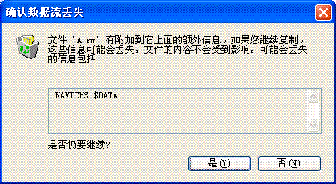

+++
title = '用 NTFS 流隐藏文件'
date = 2005-11-13T09:51:00+08:00
categories = ['技术']
tags = ['Windows']
+++

大家把 NTFS 分区上的文件拷贝到非 NTFS 分区上时，可能偶尔遇到过下面的情况，系统提示会有数据丢失，这是怎么回事呢？



实际上 NTFS 文件系统引入了“流”这个概念，每个文件都可以有多个流，而我们一般只使用了一个，通过给文件分配更多的流，可以实现某种意义上的“文件隐藏”。 例如可以控制台中使用下面的命令建立一个文本文件：

```shell
dir d:>abc.txt
```

它列出 `d:` 根目录的所有文件，然后将其重定向到文件 `abc.txt`，现在你可以检查一下 `abc.txt` 的大小和内容，并记录下来。然后再执行下面这条命令：

```shell
dir c:>abc.txt:stream.txt
```

执行完毕后，检查 `abc.txt`，大小和内容都没有变化，但其实 `abc.txt` 已经多了一个流 `stream.txt`，而重定向的内容就输出到了它里面，不信使用下面的命令看一下（注意流的名字也要以 `.txt` 结尾，否则 `notepad` 就找不到了）：

```shell
notepad abc.txt:stream.txt
```

这样我们就把一个文件隐藏了，`dir` 命令看不见，文件属性看不到，资源管理器也看不到，如果不知道流的名字，`notepad` 也是无法访问的。

实际上，流还可以不依赖于文件，下面的命令也是合法的（先不要试，否则可能会有点麻烦）：

```shell
dir e:>:stream.txt
```

这是把流绑到了文件夹上，这种流就更隐蔽了。一般情况下要想删除流只有将其宿主删除，如果你执行了刚才的命令，并且是在根文件夹上执行的，如果你想删除它，那就恭喜你要格盘了:)。 不过我们是程序员，通过写程序还是不难删除流的，只要调用 `DeleteFile`，并提供流的名字就行了。要想枚举一个文件中的所有流，目前只能通过 `BackupRead` 来完成。我写了一个小程序，通过它可以枚举、删除、导入导出流中的数据，下面的是它的代码（写的比较仓促，可能还有一些 bug，不过主要功能都实现了）。

```cpp
#include <windows.h> 
#include <stdio.h> 
#include <locale.h> 
#include <wchar.h> 
#include <malloc.h> 
#include <stddef.h> 

enum RUN_MODE 
{ 
    SHOW_USAGE = 0, 
    SHOW_STREAMS, 
    DELETE_STREAMS, 
    IMPORT_STREAM, 
    EXPORT_STREAM, 
}; 

LPCWSTR g_szObj = NULL; 
LPCWSTR g_szStrm = NULL; 
LPCWSTR g_szFile = NULL; 

int ParseArgs( int argc, LPWSTR* argv ) 
{ 
    if( argc == 1 || argc == 3 ) 
        return SHOW_USAGE; 

    g_szObj = *(argv + 1); 
    if( argc == 2 ) 
        return SHOW_STREAMS; 

    LPCWSTR act = *(argv + 2); 
    if( act[0] != L'-' && act[0] != L'/' ) 
        return SHOW_USAGE; 

    if( act[1] == L'd' ) 
        return DELETE_STREAMS; 

    if( argc == 4 || argc > 5 ) 
        return SHOW_USAGE; 

    g_szStrm = *(argv + 3); 
    g_szFile = *(argv + 4); 
    if( act[1] == L'i' ) 
        return IMPORT_STREAM; 

    if( act[1] == L'e' ) 
        return EXPORT_STREAM; 

    return SHOW_USAGE; 
} 

int ShowUsage() 
{ 
    wprintf( L"USAGE:/n" 
        L"nsvw file.a : view streams in file.a/n" 
        L"nsvw file.a -d s1 s2 ... : delete stream s1, s2 and ... from file.a/n" 
        L"nsvw file.a -i s1 file.b : copy the content of file.b to stream s1 in file.a/n" 
        L"nsvw file.a -e s1 file.c : copy the content of stream s1 in file.a to file.c/n" 
        ); 
    return 0; 
} 

int ShowStreams() 
{ 
    HANDLE hFile = CreateFile( g_szObj, GENERIC_READ, FILE_SHARE_READ, NULL, 
            OPEN_EXISTING, FILE_ATTRIBUTE_NORMAL, NULL ); 
    if( hFile == INVALID_HANDLE_VALUE ) 
    { 
        wprintf( L"Unable to open object /"%s/"/n", g_szObj ); 
        return static_cast<int>( GetLastError() ); 
    } 

    WIN32_STREAM_ID wsi = {0}; 
    WCHAR szStrmName[MAX_PATH]; 
    LPVOID pContext = NULL; 

    BOOL bOk = TRUE; 
    int nCount = 0; 
    while( bOk ) 
    { 
        DWORD dwBytes = 0; 
        LPBYTE buf = reinterpret_cast<LPBYTE>( &wsi ); 
        DWORD dwSize = static_cast<DWORD>(offsetof(WIN32_STREAM_ID, cStreamName)); 
        bOk = BackupRead( hFile, buf, dwSize, &dwBytes, FALSE, FALSE, &pContext ); 
        if( !bOk || dwBytes == 0 ) 
            break; 
        if( wsi.dwStreamNameSize > 0 ) 
        { 
            buf = reinterpret_cast<LPBYTE>( szStrmName ); 
            dwSize = wsi.dwStreamNameSize; 
            BackupRead( hFile, buf, dwSize, &dwBytes, FALSE, FALSE, &pContext ); 
            szStrmName[dwSize / sizeof(WCHAR)] = 0; 
            wprintf( L"NAME: /"%s/"/t/tSIZE: %I64d/n", szStrmName, wsi.Size.QuadPart ); 
            ++nCount; 
        } 
        DWORD dw1, dw2; 
        BackupSeek( hFile, wsi.Size.LowPart, wsi.Size.HighPart, &dw1, &dw2, &pContext ); 
    } 

    DWORD dwError = GetLastError(); 
    ::BackupRead( hFile, NULL, 0, NULL, TRUE, FALSE, &pContext ); 
    ::CloseHandle( hFile ); 

    wprintf( L"Total %d stream(s)./n", nCount );
    return static_cast<int>( dwError ); 
} 

void BuildStreamName( LPCWSTR szStrm, LPWSTR buf, size_t size ) 
{ 
    _snwprintf( buf, size, L"%s:%s", g_szObj, szStrm ); 
    buf[size - 1] = 0; 
} 

int DeleteStreams( int count, LPWSTR* streams ) 
{ 
    const int nSize = MAX_PATH * 2; 
    WCHAR szStrmName[nSize]; 
    size_t size = sizeof(szStrmName) / sizeof(WCHAR); 

    for( int i = 0; i < count; ++i ) 
    { 
        BuildStreamName( *(streams + i), szStrmName, nSize ); 
        if( ::DeleteFileW( szStrmName ) ) 
            wprintf( L"stream %s was deleted./n", *(streams + i) ); 
        else 
            wprintf( L"unable to delete stream %s./n", *(streams + i) ); 
    } 

    return 0; 
} 

int CopyStream( LPCWSTR szSrc, LPCWSTR szDst ) 
{ 
    int nRet = 0; 
    HANDLE hSrc = INVALID_HANDLE_VALUE, hDst = INVALID_HANDLE_VALUE; 
    HANDLE hSrcFm = NULL, hDstFm = NULL; 
    PVOID pSrc = NULL, pDst = NULL; 

    __try 
    { 
        hSrc = ::CreateFile( szSrc, GENERIC_READ, FILE_SHARE_READ, NULL, OPEN_EXISTING, FILE_ATTRIBUTE_NORMAL, NULL ); 
        if( hSrc == INVALID_HANDLE_VALUE ) 
            __leave; 

        DWORD dwSize = ::GetFileSize( hSrc, NULL ); 
        if( dwSize > 0 ) 
        { 
            hSrcFm = ::CreateFileMapping( hSrc, NULL, PAGE_READONLY, 0, 0, NULL ); 
            if( hSrcFm == NULL ) 
                __leave; 

            pSrc = ::MapViewOfFile( hSrcFm, FILE_MAP_READ, 0, 0, dwSize ); 
            if( pSrc == NULL ) 
                __leave; 
        } 

        hDst = ::CreateFile( szDst, FILE_ALL_ACCESS, FILE_SHARE_READ, NULL, CREATE_ALWAYS, FILE_ATTRIBUTE_NORMAL, NULL ); 
        if( hDst == INVALID_HANDLE_VALUE ) 
            __leave; 

        if( dwSize > 0 ) 
        { 
            hDstFm = ::CreateFileMapping( hDst, NULL, PAGE_READWRITE, 0, dwSize, NULL ); 
            if( hDstFm == NULL ) 
                __leave; 

            pDst = ::MapViewOfFile( hDstFm, FILE_MAP_WRITE, 0, 0, dwSize ); 
            if( pDst == NULL ) 
                __leave; 

            memcpy( pDst, pSrc, dwSize ); 
        } 
        else 
        { 
            ::SetFilePointer( hDst, 0, 0, FILE_BEGIN ); 
            ::SetEndOfFile( hDst ); 
        } 
    } 
    __finally 
    { 
        nRet = static_cast<int>( ::GetLastError() ); 
    } 

    if( pDst != NULL ) 
        ::UnmapViewOfFile( pDst ); 
    if( pSrc != NULL ) 
        ::UnmapViewOfFile( pSrc ); 
    if( hDstFm != NULL ) 
        ::CloseHandle( hDstFm ); 
    if( hSrcFm != NULL ) 
        ::CloseHandle( hSrcFm ); 
    if( hDst != INVALID_HANDLE_VALUE ) 
        ::CloseHandle( hDst ); 
    if( hSrc != INVALID_HANDLE_VALUE ) 
        ::CloseHandle( hSrc ); 

    return nRet; 
} 

int ImportStream() 
{ 
    const int nSize = MAX_PATH * 2; 
    WCHAR szStrmName[nSize]; 
    size_t size = sizeof(szStrmName) / sizeof(WCHAR); 
    BuildStreamName( g_szStrm, szStrmName, nSize ); 
    int nRes = CopyStream( g_szFile, szStrmName ); 
    if( nRes != 0 ) 
        wprintf( L"Import failed./n" ); 
    else 
        wprintf( L"Import completed./n" ); 
    return nRes; 
} 

int ExportStream() 
{ 
    const int nSize = MAX_PATH * 2; 
    WCHAR szStrmName[nSize]; 
    size_t size = sizeof(szStrmName) / sizeof(WCHAR); 
    BuildStreamName( g_szStrm, szStrmName, nSize ); 
    int nRes = CopyStream( szStrmName, g_szFile ); 
    if( nRes != 0 ) 
        wprintf( L"Export failed./n" ); 
    else 
        wprintf( L"Export completed./n" ); 
    return nRes; 

} 

int __cdecl wmain( int argc, LPWSTR* argv ) 
{ 
    int nRetCode = 0; 

    _wsetlocale( LC_ALL, L".OCP" ); 
    wprintf( L"NTFS Stream Viewer VERSION 1.0/n" ); 

    switch( ParseArgs( argc, argv ) ) 
    { 
    case SHOW_USAGE: 
        nRetCode = ShowUsage(); 
        break; 

    case SHOW_STREAMS: 
        nRetCode = ShowStreams(); 
        break; 

    case DELETE_STREAMS: 
        nRetCode = DeleteStreams( argc - 3, argv + 3 ); 
        break; 

    case IMPORT_STREAM: 
        nRetCode = ImportStream(); 
        break; 

    case EXPORT_STREAM: 
        nRetCode = ExportStream(); 
        break; 

    default: 
        wprintf( L"internel error!/n" ); 
        nRetCode = -1; 
        break; 
    } 

    return nRetCode; 
}
```

**PS:** 真正注意到“流”的存在是卸载“卡巴斯基”时，它提示我要删除 NTFS 分区上所有文件的附加数据流。说实话, 卸载了它之后，机器快多了，因此怀疑卡巴会导致每次文件操作都去访问附加的数据流，也就是导致文件访问变慢。
