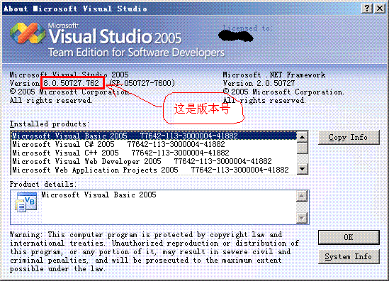

+++
title = 'vs2005 编译的程序不能运行的几个解决方法'
date = 2007-01-31T20:00:00+08:00
categories = ['技术']
+++

这两天有点焦头烂额，我们这边运行的好好的程序，到了测试的机器上就不能启动（是根本运行不了，而不是运行出错），弄得我异常郁闷。经过了一番摸索，发现和 winxp、win2003 中为解决 DLL hell 而引入的 manifest 机制有关系。而以前我们用 vs2003 开发，它并没有强制程序使用 manifest，但到了 vs2005 中，这已经改成必需的了，而我们并没有按照需要进行相关的配置，所以程序启动不了了。根据目前的经验，vs2005 编译的程序不能启动大致有两个原因，下面简单介绍解决办法。

# 1\. 在开发组的机器上（安装有 vs2005）有时都不能启动

这一般是项目的文件被放在了 FAT/FAT32 分区上导致的，解决方法是把它们都移动到 NTFS 分区上，或者把 ` 项目属性 | Manifest Tool | General | Use FAT32 Work-around` 设为 `yes`。

# 2\. 开发组运行正常，换到其它机器上就不行了

这一般就是系统 DLL（包括 CRT、MFC、ATL 等）没有正确配置导致的。如果程序是 release 版，那么很简单，只要把 `/SDK/v2.0/BootStrapper/Packages/vcredist_x86` 下的 `vcredist_x86.exe` 拷贝到目标机器上运行即可，这是以 x86 平台为例的，如果你用的是别的 CPU 平台（amd64 或 ia64）把 x86 替换成相应的内容就可以了。

如果是 debug 版，就复杂一些了，首先要确定你需要的 DLL 的版本，绝大多数（注意：不是“所有”）情况下它和编译器的版本相同，通过 vs2005 的关于对话框就能看到，如下图所示：

确定版本后，在开发组的机器上进入 `%windir%/winsxs` 文件夹（下面将以 `x86` 平台 `8.0.50727.762` 版本的 `debug crt` 为例进行说明），拷贝以下文件到目标机器的相同位置即可：

* **x86**\_Microsoft.VC80.**DebugCRT**\_1fc8b3b9a1e18e3b\_**8.0.50727.762**\_x-ww\_5490cd9f 文件夹下的所有文件

* `Manifests` 文件夹下的
  * **x86**\_Microsoft.VC80.**DebugCRT**\_1fc8b3b9a1e18e3b\_**8.0.50727.762**\_x-ww\_5490cd9f.cat
  * **x86**\_Microsoft.VC80.**DebugCRT**\_1fc8b3b9a1e18e3b\_**8.0.50727.762**\_x-ww\_5490cd9f.manifest 

* Policies/**x86**\_policy.8.0.Microsoft.VC80.**DebugCRT**\_1fc8b3b9a1e18e3b\_x-ww\_09e017b4 文件夹下的
  * **8.0.50727.762**.cat
  * **8.0.50727.762**.policy 

注意，上面的操作只是在目标操作系统为 winxp，win2003 及以上时才需要的，如果是 win2000 及以下的系统，只要把第一个文件夹下的文件拷贝到 system32 中就行了。

# 附

MSDN 上有关 VC 应用程序部署的几片文章，供参考：

* [Troubleshooting C/C++ Isolated Applications and Side-by-side Assemblies](http://msdn2.microsoft.com/en-us/library/ms235342.aspx)
* [Deployment Examples](http://msdn2.microsoft.com/en-us/library/ms235285\(VS.80\).aspx)

以下是与这个问题相关的一些系统提示信息，为了让碰到这些问题的人更容易搜到这篇文章，我把它们列在这里。

* 参照的汇编没有安装在系统上
* 应用程序要求的组件版本同另一个活动的组件有冲突。
* 系统无法执行指定的程序
* ERROR_SXS_ASSEMBLY_NOT_FOUND
* 14003
* 0x800736B3
* The referenced assembly is not installed on your system
