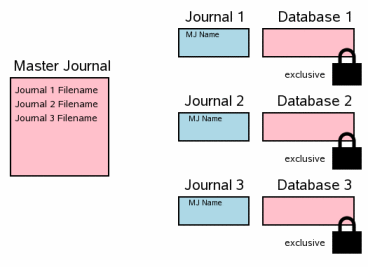

+++
title = 'SQLITE中原子提交的实现'
date = 2008-02-13T17:30:00+08:00
categories = ['技术']
tags = ['数据库', '算法']
[params.author]
  name = '未知'
+++

[原文链接](http://www.sqlite.org/atomiccommit.html)

# 1\. 引言

像 SQLITE 这样支持事务的数据库的一个重要特性是“原子提交”。原子提交意味着，一个事务中的所有修改动作要么全都发生，要么一个都不发生。有了原子提交，对一个数据库文件不同部分的多次写操作，就会像瞬间同时完成了一样。当然，现实中的存储器硬件会把写操作串行化，并且写每个扇区都会花上那么一小段时间，所以，绝对意义上的“瞬间同时完成”是不可能的。但 SQLITE 的原子提交逻辑还是让整个过程看起来像那么回事。

SQLITE 保证，即使事务执行过程中发生了操作系统崩溃或掉电，整个事务也是原子的。本文描述了 SQLITE 实现原子提交时所采用的技术。

# 2\. 对硬件的假设

虽然有的时候会使用闪存，但下文中，我们将把存储设备称为“磁盘”。

我们假设对磁盘的写操作是以“扇区”为单位的，也就是说不可能直接对磁盘进行小于一个扇区的修改，要想进行这类修改，你必须把整个扇区读进内存，进行所需的修改，然后再把整个扇区写回去。

对真正“磁盘”来说，读写操作的最小单位都是一个扇区；但闪存有些不同，它们的最小读单位一般远小于最小写单位。SQLITE 只关心最小写单位，所以，在本文中，我们说“扇区”的时候，指的是向存储器中写数据时的最小数据量。

3.3.14 版之前，SQLITE 在任何情况下都认为一个扇区的大小是 512 字节，有一个编译期选项能改变这个值，但从未有人用更大一些的值测试过相关代码。直到不久以前，把这个值定为 512 都是合理的，因为所有的磁盘驱动器都在内部使用 512 字节的扇区。但最近，有人把磁盘扇区的大小提升到了 4096 字节，而且，闪存的扇区一般也是大于 512 字节的。由于这些原因，从 3.3.14 版开始，SQLITE 的操作系统接口层提供了一种可以从文件系统获取真实扇区大小的方法。不过，到目前为止（3.5.0 版），这一方法仍然只是返回一个硬编码的 512 字节，因为不论是 win32 系统还是 Unix 系统，都没有一个标准的机制来获得实际的值。但这种方法给了嵌入式设备的提供商们根据实际情况进行调整的能力，也让我们未来在 win32 和 Unix 上给出一个更有意义的实现成了可能。

SQLITE 并不假设对扇区的写操作是原子的，它仅假设这种写是“线性”的。所谓线性是指：写一个扇区时，硬件总是从扇区一端开始，一个字节一个字节的写到另一端结束，中间不会后退，硬件可以从头向尾写，也可以从尾向头写。如果掉电发生时只写到了扇区的中间，则可能出现扇区一部分修改了而另一部分没被修改的情况。SQLITE 在这里做的一个关键假设是：只要扇区被修改了，那么它的第一个字节和最后一个字节中的至少一个会被修改，也就是说，硬件绝不会从中间开始向两端写。我们不清楚这个假设是否总是对的，但它看起来是合理的。

在上一段中，我们说“SQLITE 没有假设写扇区是原子的”。默认情况下，这是正确的，但在 3.5.0 版中，我们增加了一个叫做“虚拟文件系统（VFS）”的接口，它是 SQLITE 和底层文件系统通讯的唯一路径。代码中包含了用于 Unix 和Windows 的默认 VFS 实现，同时提供了一种在运行时创建新 VFS 实现的机制。在这个新的 VFS 接口中有一个称为 `xDeviceCharacteristics` 的方法，它通过询问文件系统来判断文件系统是否支持某些特性。如果文件系统支持某个特性，SQLITE 就会试着利用这个特性进行某种优化。默认的 `xDeviceCharacteristics` 不会指出文件系统支持原子的写扇区操作，所以与此相关的优化都是关闭的。

SQLITE 假设操作系统会缓冲写操作，并且写操作会在数据被真正写到磁盘上之前返回。SQLITE 还假设写操作会被操作系统记录下来。因此，SQLITE 会在关键点上执行 `flush` 或 `fsync`，并假设 `flush` 和 `fsync` 会等所有正在进行的“写操作”真正执行完毕后才返回。在某些版本的 Windows 和 Unix 上，`flush` 和 `fsync` 原语会被打断，这非常不幸，在这些系统上，如果提交的过程中发生了掉电，SQLITE 的数据库有可能崩溃掉，而 SQLITE 自己则对此无能为力。SQLITE 假设操作系统能像广告宣传的那样完美，如果事实并非如此，你只好祈求老天保佑不要经常掉电了。

SQLITE 假设文件增长时，新增加的部分最初包含的是垃圾数据，然后它们会被实际的数据覆盖掉。换句话说，SQLITE 假设文件大小的变化发生在文件内容变化之前。这是个悲观的假设，为了保证在从“文件大小改变”开始到“文件内容写完”为止的这段时间内，系统掉电不会导致数据库崩溃，SQLITE 要做一些额外的工作。VFS 的 `xDeviceCharacteristics` 也可能会指出文件系统总是先写数据后更新文件的大小，这种情况下，SQLITE 可以跳过一些过于小心的数据库保护操作，从而减少一次提交所需的磁盘 I/O 数量。但目前 Windows 和 Unix 上的 VFS 实现都没有做这个假设。

SQLITE 假设文件删除是原子的，至少从用户程序的角度来看要是这样。也就是说，如果 SQLITE 要删除一个文件，并且删除的过程中掉电了，那么电力恢复后，文件要么不能从文件系统中找到，要么它的内容和删除之前一模一样。如果文件还能从文件系统中找到，但内容被修改或清空了，那么数据库极有可能会崩溃。

SQLITE 假设检测由宇宙射线、热噪声、驱动程序bug等引起的位错误（bit error）是操作系统和硬件的责任。SQLITE 没有在数据库文件中增加任何冗余信息来检测或纠正这类问题。SQLITE 假设它所读的数据与它上次所写的数据总是完全相同。

# 3\. 单文件提交

我们先来从整体上看看 SQLITE 在一个单独的数据库文件上操作时，要保证事务提交的原子性需要哪些步骤。为防止掉电时文件被破坏，文件格式在设计时也有相应考虑，相关细节和多数据库提交技术将在后续章节讨论。

## 3\.1\. 初始状态

下图给出了数据库连接刚刚打开时计算机的状态。图的最右侧是存储在磁盘上的数据，每个小格代表一个扇区，蓝色表示扇区存储的是原始数据；图的中间部分是操作系统的缓存，在当前的例子中，缓存是“冷”的，所以它的每个格都没有着色；最左侧是使用 SQLITE 的进程（译注：本文的作者可能更喜欢 Unix，所以在 Windows 上，原文中的部分“进程”用“线程”替换一下会更好，我没有做这种替换，故需要您在阅读过程中结合上下文判断“进程”的具体含义）的内存，数据库连接刚刚创建，还没有读任何数据，所以用户的内存空间中什么也没有。

## 3\.2\. 获取一个“读锁”

SQLITE 写数据库之前，必须先读，这样它才能知道数据库中已经有些什么了。即使是单纯的追加数据，SQLITE 也要先从 `sqlite_master` 表中读出数据库的表结构，从而知道如何去解析 `INSERT` 语句，以及新数据应该保存到文件的哪个位置。

读操作的第一步是获取一个数据库文件的“共享锁”。这个共享锁允许两个或多个数据库连接同时读数据库文件，但不许其他数据库连接写这个文件。这个锁非常重要，因为，如果在读数据的过程中另一个连接写了数据，我们就可能读到一个新数据和旧数据的混合体，这会让其他连接的写操作失去原子性。

请注意，共享锁是操作系统的磁盘缓存实现的，而不是磁盘本身。一般来说，文件锁仅仅是操作系统内核中的一些标志（细节取决于具体操作系统的接口层）。所以，当系统崩溃或掉电后，这个锁就自动消失了。并且，通常情况下，创建这个锁的进程退出后，锁也会自动消失。

## 3\.3\. 从数据库中读数据

获得共享锁后，我们开始从数据库文件中读出数据。在这个例子中，由于我们假设最初的缓存是“冷”的，所以要先把数据从磁盘读到操作系统的缓存，再把它们从缓存复制到用户空间。后续的读操作，由于部分或全部数据可能已经在缓存中了，或许就只需要从缓存复制到用户空间这一步了。

一般情况下，我们不会需要数据库文件的所有页（译注：页是 SQLITE 对数据进行缓冲的最小单位，但本文中有时它和扇区是一个意思，请注意结合上下文区分），所以我们读的只是它的一个子集。本例中，我们的数据库文件有 8 个页，而我们需要的是其中的 3 个。一个真实的数据库可能有数千个页，但每次查询要访问的一般只是其中很小的一部分。

## 3\.4\. 获取一个预定（Reserved）锁

在对数据库做任何修改之前，SQLITE 需要获得一个预定锁。预定锁和共享锁很像，它们都允许其他进程读数据库文件。并且，预定锁也可以和多个共享锁共存。但是，一个数据库文件某一时刻只能有一个预定锁，也就是只允许一个进程有写数据的意图。

预定锁的目的是告诉整个系统：有一个进程要在不久的将来修改数据库文件了，但它目前还没有任何实际行动。由于仅仅是个“意图”，其他进程还可以继续自己的读操作，但是它们不能也有这个意图了。

## 3\.5\. 创建回滚日志（Journal）文件

在任何实质性的修改之前，SQLITE 还需要创建一个独立的回滚日志文件，并把所有要被替换的数据库页的原始内容写到这个文件中去。实际上，日志文件将保存将数据库文件恢复到原始状态所需的全部信息。

日志文件有一个不大的文件头（图中用绿色表示），它记录了数据库文件的原始大小。如果数据库文件因为修改变大了，我们仍然可以凭它来获得文件的原始大小。数据库页和它们的对应的页号会被放在一起写到日志文件中去。

创建新文件时，大多数操作系统（Windows、Linux、MacOSX 等）并不会立即向磁盘写数据。新文件一开始只存在于操作系统的缓存中，直到操作系统有空闲的时候，它才会真的去在磁盘上创建这个文件。这种方式让用户觉得文件创建非常快，起码比真的去做磁盘 I/O 快多了。在下图中，为了表示这一情形，我们只在操作系统缓存中画了这个日志文件。

## 3\.6\. 在用户空间中修改数据库

数据库页的原始内容保存到日志文件后，就可以在用户空间中修改了。每个数据库连接有一份私有的用户空间拷贝，所以这些修改只会被当前的连接看到，其他连接看到的仍然是操作系统缓存中未被修改的内容。在这种情况下，虽然有一个进程正在对数据库进行修改，其他进程仍然可以继续读数据库的原始内容。

## 3\.7\. 把日志文件“刷”到磁盘

下一步是把回滚日志文件的内容刷到具有持久性的存储器上。后面你会看到，这是让数据库能够在掉电情况下存活的关键之一。它可能要花不少时间，因为往持久性存储器上写东西一般是很慢的。

这一步通常比仅仅把回滚日志刷到磁盘上复杂的多。在大多数平台上，你要刷（`flush` 或 `fsync`）两次才行。第一次是日志文件的基本内容。然后修改日志文件的头部，以反应日志文件中实际的页面数。接着刷第二次，把文件头刷上去。至于为什么要修改文件头并多刷一次，我们将在后续章节讨论。

## 3\.8\. 获取一个独占锁

为了对数据库文件进行真正的修改，我们需要一个独占锁。获取这个锁需要两步，首先是获取一个待决（Pending）锁，然后再把它提升为独占锁。

待决锁允许其他已经有了共享锁的进程继续读数据库文件，但它不允许创建新的共享锁。设计它的目的是为了避免一大堆读进程把写进程给饿到。系统中可能会有几十甚至上百个进程想读数据库文件，每个这样的进程都要经历一个“获得共享锁、读数据、释放锁”的过程。如果很多进程都想读同一个数据库文件，那么一个极有可能现象是：新进程总是在已有的进程释放共享锁之前获得一个新的共享锁。这样一来，数据库文件就上就总有共享锁了，要写数据的进程可能会一直没有机会得到自己的独占锁。通过禁止创建新的共享锁，待决锁解决了这个问题，已有的共享锁会逐渐被释放，最终，当它们全部被释放后，待决锁就可以升级到独占锁了。

## 3\.9\. 更新数据库文件

一旦获得独占锁，就可以保证没有其他进程在读这个数据库文件了，这时更新它就是安全的了。一般来说，这里的更新只会影响到操作系统磁盘缓存这一层，而不会影响磁盘上的物理文件。

## 3\.10\. 把变化刷到存储器

为了把数据库的变化写到持久性存储器，我们还要再刷一次。这也是保证数据库在掉电情况下不崩溃的关键。当然，向磁盘或闪存写数据实在是太慢了，这一步和 3.7 节中的刷日志文件加在一起会消耗掉 SQLITE 一次事务提交的绝大部分时间。

## 3\.11\. 删除日志文件

把所有变化都安全的写到存储器上以后，回滚日志文件就可以删除了。这是提交事务的那个时间点。如果掉电或系统崩溃发生在这之前，后面将要介绍的恢复过程会让数据库文件回到修改之前的状态，就好像什么都没发生过一样。如果掉电或系统崩溃发生在日志文件被删除之后，那么所有的修改都会生效。所以，SQLITE 对数据库的修改全部有效还是全部无效，实际上是取决于这个日志文件是否存在。

删除文件不一定真的是原子操作，但从用户程序的角度来看，它却好像总是原子的。进程总可以询问操作系统“这个文件存在吗？”并等到是或否的回答。如果事务提交过程中发生了掉电，SQLITE 就会问操作系统是否存在回滚日志文件，存在则事务是不完整的，需要回滚，不存在则说明事务确实成功提交了。

SQLITE 事务的实现依赖于回滚日志文件是否存在和用户程序眼中的原子的文件删除。所以，事务也是一个原子操作。

## 3\.12\. 释放锁

最后一步是释放独占锁，这样其他进程就又能访问数据库文件了。

在下图中，我们看到，用户空间中的数据在锁被释放后就清除了。如果是较早版本的 SQLITE，这是实际情况。但从最近几版开始，SQLITE 不这么做了，因为下个操作可能还会用到它们。比起从操作系统的缓存或磁盘中读数据来，重用这些已经在本地内存中的数据的性能要高得多。再次使用它们之前，我们要先得到一个共享锁，然后再检查一下在我们没有锁的这段时间内是否有别的进程修改了数据库文件。数据库的第一页有一个计数器，每次对数据库进行修改时都会递增它。检查这个计数器，就能知道数据库是否被别的进程修改过了。如果修改过，就必须清除用户空间中的数据并把新数据读进来。但更大的可能是没有任何修改，这样就可以重用原有的数据，从而大幅提高效率。

# 4\. 回滚

原子提交看起来是瞬间完成的，但很明显，前面介绍的过程需要一定的时间才能完成。如果在提交过程中电源被切断，为了让整个过程看起来是瞬时的，我们必须回滚那些不完整的修改，并把数据库恢复到事务开始之前的状态。

## 4\.1\. 如果出了问题…

假设掉电发生在 3.10 节所讲的那一步，也就是把数据库变化刷到磁盘中去的时侯。电力恢复后，情况可能会像下图所示的那样。我们要修改三页数据，但只成功完成了一页，有一页只写了一部分，另一页则一点都没写。

电力恢复后日志文件是完整的，这是个关键。3.7 节中的操作就是为了保证在对数据文件做任何改变之前回滚日志的所有内容已经安全的写到持久性存储器中去了。

## 4\.2\. “热的”回滚日志

任何进程第一次访问数据库文件之前，必须获得一个 3.2 节中描述的共享锁。然后，如果发现还有一个日志文件，SQLITE 就会检查这个回滚日志是不是“热的”。我们必须回放热日志文件，从而把数据库恢复到一致的状态。只有在一个程序正在提交事务时发生掉电或崩溃的情况下，才会出现热日志文件。

日志文件在符合以下所有条件时才是热的：

* 日志文件是存在的
* 日志文件不是空文件
* 数据库文件上没有预定锁
* 日志文件头中没有主日志文件的文件名，或者，如果有主日志文件名的话，主日志文件是存在的。

热日志文件告诉我们：之前有进程试图提交一个事务，但由于某种原因，这个提交没有完成。也就是说：数据库处于一种不一致的状态，使用之前必须修复（回滚）。

## 4\.3\. 获取数据库上的独占锁

处理热日志的第一步是获得数据库文件上的独占锁，这可以防止两个或更多的进程同时回放一个热日志。

## 4\.4\. 回滚不完整的修改

获得了独占锁，进程就有权力修改数据库文件了。它从日志中读出页面的原有内容，然后把它们分别写回到其在数据库文件中的原始位置上去。前面说过，日志文件的头部记录了数据库文件在事务开始前的大小，如果修改让数据库文件变大了，SQLITE 会使用这一信息把文件截断到原始大小。这一步结束之后，数据库文件就应该和事务开始前一样大，并且包含和那时完全一样的数据了。

## 4\.5\. 删除热日志文件

日志中的所有信息都回放到数据库文件，并将数据库文件刷到磁盘（回滚时可能会再次掉电）以后，就可以删除热日志文件了。

## 4\.6\. 继续前进，就像那个中断了的事务根本没发生过一样

回滚的最后一步是把独占锁降级为共享锁。此后，数据库的状态看起来就像那个中断了的事务根本没有开始过一样了。由于整个回滚过程是完全自动、透明的，使用 SQLITE 的那个程序根本就不会知道有一个事务中断并回滚了。

# 5\. 多文件提交

通过 `ATTACH DATABASE` 命令，SQLITE 允许一个数据库连接使用多个数据库文件。当在一个事务中修改多个文件时，所有文件都会被原子的更新。换句话说，或者所有文件都会被更新，或者一个也不会被更新。在多个文件上实现原子提交比在单个文件上实现更复杂，本章将解释 SQLITE 是如何做到这一点的。

## 5\.1\. 每个数据库一个日志

当一个事务涉及了多个数据库文件时，每个数据库都有自己回滚日志，并且对它们的锁也是各自独立的。下图展示了三个数据库文件在一个事务中被修改的情况，它所描述的状态相当于单文件事务在第 3.6 节中的状态。每个数据库文件有各自的预定锁，它们将要被修改的那些页的原始内容已经写进回滚日志了，但还没有刷到磁盘上。用户内存中的数据已经被修改了，不过数据库文件本身还没有任何变化。

相比之前，下图做了一些简化。在这张图上，蓝色仍然代表原始数据，粉红色仍然代表新数据。但上面没有画出回滚日志和数据库的页，并且也没有明确区分操作系统缓存中的数据和磁盘上的数据。所有这些在这张图上仍然适用，不过即使把它们画出来我们也学不到什么新的东西，所以，为了缩小图幅，我们把它们省略掉了。

## 5\.2\. 主日志文件

多文件提交中的下一步是创建一个“主日志文件”。这个文件的名字是最初的数据库文件名（也就是用`sqlite3_open()`打开的那个数据库，而不是之后附加上来的那些）加上后缀 `-mjHHHHHHHH`。其中 `HHHHHHHH` 是一个 32 位 16 进制随机数，每次生成新的主日志文件时，它都会不同。

（注意：上面一段中用来生成主日志文件名的方法是 3.5.0 版中使用的方法。这个方法并没有规范化，也不是 SQLITE 对外接口的一部分，在未来版本中，我们可能会修改它。）

主日志中没有与原始数据库页面内容相关的信息，它里面保存的是所有参与到这个事务中的回滚日志文件的完整路径。

主日志生成完毕后，会被立即刷到磁盘上，中间没有任何别的操作。在 Unix 系统上，主日志所在的目录，也会被同步一下，以确保掉电后它也会出现在这个目录下。

## 5\.3\. 更新回滚日志文件头

下一步是把主日志的路径记录到回滚日志的文件头中去，回滚日志创建时在文件头预留了相应的空间。

主日志路径写到回滚日志文件头之前和之后，要分别把回滚日志的内容往磁盘上刷一次。这可能有些效率损失，但非常重要，而且，幸运的是，刷第二次时一般只有一页（最开始的那页）数据有变化，所以整个操作可能并没有想象的那么慢。

这个操作大致相当于单文件提交时的第 7 步，也就是第 3.7 节中的内容。

## 5\.4\. 更新数据库文件

把回滚日志刷到磁盘上后，就可以安全的更新数据库文件了。我们需要获得所有数据库文件上的独占锁，然后写数据，并把这些数据刷到磁盘上去。这一步相当于单文件提交时的第 8、9和 10 步。

## 5\.5\. 删除主日志文件

下一步是删除主日志文件，这是多文件事务被实际提交的时间点。它相当于单文件提交时的第 11 步，也就是删除日志文件的那一步。
如果掉电或系统崩溃发生在这之后，重启时，即使存在回滚日志文件，事务也不会被回滚。这里的区别在于回滚日志的文件头里面有主日志的路径。SQLITE 只认为文件头中没有主日志文件路径的回滚日志（单文件提交的情况）或主日志文件仍然存在的回滚日志是“热的”，并且只会回放热的回滚日志。

## 5\.6\. 清理回滚日志文件

最后是删除所有的回滚日志文件，释放独占锁以便其他进程发现数据的变化。这一步对应的是单文件提交时的第 12 步。

由于事务已经提交了，所以删除这些文件在时间上并不是非常紧迫。当前的实现是删除一个日志文件，并释放其对应的数据库文件上的独占锁，然后再接着处理下一个。今后，我们可能把它改成先删除所有日志文件，再释放独占锁。这里，只要保证删除日志文件在前，释放其对应的锁在后就行，文件被删除的顺序或锁被释放的顺序并不重要。

# 6\. 提交中的更多细节

第 3 章从总体上介绍了 SQLITE 原子提交的实现方法，但漏掉了几个重要的细节，本章将对它们进行一些补充说明。

## 6\.1\. 总是日志中记录整个扇区

在把数据库页面的原始内容写进回滚日志时，即使页面比扇区小，SQLITE 也会把完整的扇区写进去。从前，SQLITE 中的扇区大小是硬编码的 512 字节，而最小页面也是 512 字节，所以不会有什么问题。但从 3.3.14 版开始，SQLITE 也支持扇区大小超过 512 字节的存储器了，所以，从这一版起，当某个扇区中的任何页面被写进日志时，这个扇区中的其它页面也会被一同写进去。

掉电可能在写扇区时发生，总是记录整个扇区可以在这种情况下保证数据库不被破坏。例如，我们假设每个扇区有四个页面，现在 2 号页面被修改了，为了把变化写入这个页面，底层硬件，因为它只能写完整的扇区，也会把 1、3、4 号页面重新写一遍，如果写操作被打断，这三个页面的数据可能就不对了。为了避免这种情况，必须把扇区中的所有页面写到回滚日志中去。

## 6\.2\. 日志文件中的垃圾数据

向日志文件末尾追加数据时，SQLITE 一般悲观的假设文件系统会先用垃圾数据把文件撑大，再用正确的数据覆盖这些垃圾。换句话说，SQLITE 假设文件体积先变大，之后才是写入实际内容。如果掉电发生在文件已经变大但数据还未写入时，回滚日志中就会包含垃圾数据。电力恢复后，另一个 SQLITE 进程会发现这个日志文件，并试图恢复它，这就有可能把垃圾数据拷贝到数据库文件，进而对其造成破坏。

为对付这个问题，SQLITE 建立了两道防线。首先，SQLITE 在回滚日志的文件头中记录了实际的页面数。这个数字一开始是 0，所以，在回放一个不完整的回滚日志时，SQLITE 会发现文件中没有包含任何页面，也就不会对数据库做任何修改。提交之前，回滚日志会被刷到磁盘上，以保证其中没有任何垃圾。之后，文件头中的页面数才会被改成实际的数值。文件头总是保存在一个单独的扇区去，所以，如果在覆盖它或把它刷到磁盘上时发生掉电，其它页面是不会被破坏的。注意回滚日志要往磁盘上刷两次：第一次是写页面的原始内容，第二次是写文件头中的页面数。

上一段描述的是同步选项设置为 `full`（`PRAGMA synchronous=FULL`）时的情形，这也是默认的设置。不过，当同步选项低于 `normal` 时，SQLITE 只会刷一次日志文件，也就是修改完页面数后的那一次。由于（大于 0 的）页面数可能先于其它数据到达磁盘，这样做有一定的风险。SQLITE 假设文件系统会记录写请求，所以即使先写数据后写页面数，页面数也可能会先被磁盘记录下来。所以，作为第二道防线，SQLITE 在日志文件中为每页数据都记录了一个 32 位的校验码。回滚日志文件时，SQLITE 会检查这个校验码，一旦发现错误，就会放弃回滚操作。要注意的是，校验码无法完全保证页面数据的正确性，数据有错误但校验码正确的概率虽然极小，却不是零。不过，校验码机制至少让类似的事情看起来不那么容易发生了。

在同步选项设置为 `full` 时，就没有必要用校验码了，我们只在同步选项低于 `normal` 时才需要它。然而，鉴于校验码是无害的，故不管同步选项如何设置，它们总是出现在回滚日志中的。

## 6\.3\. 提交之前的缓存溢出

第三章描述的过程假设提交之前所有的数据库变化都能保存在内存中。一般来说就是这样的，但特殊情况也会出现。这时，数据库变化会在事务提交之前用完用户缓存，需要把缓存中的内容提前写入数据库才行。

操作之前，数据库连接处于第 3.6 步时的状态：原始页面的内容已经保存到回滚日志了，修改后的页面位于用户内存中。为了回收缓存，SQLITE 执行第 3.7 到 3.9 步，也就是把回滚日志刷到磁盘上，获取独占锁，然后把变化写入数据库。但后续步骤在事务真正提交之前都有所不同。SQLITE 会在日志文件的最后追加一个文件头（使用一个单独的扇区），独占锁继续保留，而执行流程将跳到第 3.6 步。当事务提交或再次回收缓存时，将重复执行第 3.7 和 3.9 步（由于第一次回收缓存时获得了独占锁且一直没有释放，3.8 步将被跳过）。

把预定锁提升为独占锁将降低并发度，额外的刷磁盘操作也非常慢，所以回收缓存会严重影响系统效率。因此，只要有可能，SQLITE 就不会使用它。

# 7\. 优化

对程序的性能分析显示，在绝大多数系统和绝大多数情况下，SQLITE 把绝大部分时间消耗在了磁盘 I/O 上。所以，减少磁盘 I/O 的数量是最有可能大幅提升效率的方法。本章将介绍 SQLITE 在保证原子提交的前提下，为减少磁盘 I/O 而使用的一些技术。

## 7\.1\. 在事务之间保持缓存数据

在 3.12 节中，我们说过当释放共享锁时会丢弃所有已经在用户缓存中的数据库信息。之所以这样做，是因为没有共享锁的时候其他进程能够随意修改数据库文件的内容，从而导致已经缓存的数据过时。所以，每当一个新事务开始时，SQLITE 都必须重新读一次以前读过的东西。这个操作并不像大家想象的那么糟糕，因为要重新读的数据极有可能仍在操作系统的缓存中，所谓的“重读”一般仅仅是把数据从内核空间拷贝到用户空间而已。不过，即使如此，也是需要一些时间的。

从 3.3.14 版开始，我们在 SQLITE 中增加了一个机制来避免不必要的重读。这些版本中，释放共享锁后，用户缓存的页面继续保留。等到 SQLITE 启动下一个事务并获得共享锁后，它会检查是否有其他进程修改了数据库文件。如果自上次释放锁后有修改，用户缓存会被清空并重读。但一般不会有任何修改，所以用户缓存仍然有效，这样很多不必要的读操作就被避免了。

为了判断数据库文件是否被修改，SQLITE 在文件头（第 24 到 27 字节）中使用了一个计数器，每个修改操作都会递增它。释放数据库锁之前，SQLITE 会记下这个计数器的值，等到再次获得锁以后，它比较记录的值和实际的值，相同则重用已有的缓存数据，不同则清空缓存并重读。

## 7\.2\. 独占访问模式

自 3.3.14 版开始，SQLITE 中增加了“独占访问模式”。在这种模式下，SQLITE 会在事务提交后继续保留独占锁。这样一来，其他进程就不能访问数据库了。不过，由于大多数的部署方案都只有一个进程访问数据库，所以一般不会有什么问题。独占访问模式让以下三个减少磁盘 I/O 的方法成为了可能：

1. 除了第一个事务，不必每次递增数据库文件头中的计数器。这通常意味着在数据库文件和回滚日志中各自少刷一次1号页面。
2. 因为没有别的进程能访问数据库，所以没必要每次启动事务时检查计数器和清空用户缓存。
3. 事务结束后可以截断（译注：把文件长度设置为 0 字节）回滚日志文件，而不是删除它。在很多操作系统上，截断比删除快的多。

第三项优化，也就是用截断代替删除，并不要求一直拥有独占锁。理论上说，总是实现它，而不是只在独占访问模式下实现它是可能的，也许我们会在未来版本中让其成为现实。不过，到目前为止（3.5.0 版），这项优化仍然只在独占访问模式下有效。

## 7\.3\. 不记录空闲页面

从数据库中删除数据时，那些不再使用的页面会被加到“空闲页表”里去。之后的插入操作将首先使用这些页面，而不是扩大数据库文件。 一些空闲页面中也有重要数据，比如说其他空闲页面的位置等等。但大多数空闲页面的内容没有用，我们把这些页面称为“叶页”。修改叶页的内容对数据库没有任何影响。

由于叶页的内容没用，SQLITE 不会把它们在提交过程的第 3.5 步中记录到回滚日志里去。也就是说，修改叶页，但不在回滚过程中恢复它们对数据库无害。同样的，一个新叶页的内容既不会在第 3.9 步中写入数据库也不会在第 3.3 步中被读出来。在数据库文件有空闲空间时，这项优化大幅减少了磁盘 I/O 的数量。

## 7\.4\. 单页更新和原子扇区写

从 3.5.0 版开始，新的 VFS 接口包含了一个名叫 `xDeviceCharacteristics` 的方法，它可以报告底层存储器是否支持一些特性。这些特性中，有一个是“原子扇区写”。

我们前面说过，SQLITE 假设写扇区是线性的，而不是原子的。线性写从扇区的一端开始，逐字节写到另一端结束。如果在线性写的中间发生掉电，则可能扇区的一端被修改了，另一端却保持不变。但在原子写的情况下，扇区或者被完全更新了，或者完全没有变化。

我们相信大多数现在磁盘驱动器实现了原子扇区写。掉电时，驱动器使用电容中的电能和（或）盘片旋转的动能完成正在进行的操作。然而，在系统写调用与磁盘电子元件之间存在太多的层次，所以我们在 Unix 和 Windows 的默认 VFS 实现上做了一个保守的假设，认为写扇区不是原子的。另一方面，能对其使用的文件系统有更多发言权的设备厂商，如果它们的硬件确实支持原子扇区写，也许会选择打开 `xDeviceCharacteristics` 中的这个选项。

当写扇区是原子的、数据库页面和扇区一样大，而且数据库的变化只涉及到一个页面时，SQLITE 会跳过整个记日志和同步过程，直接把修改后的页面写到数据库文件上。数据库文件第一页上的修改计数器也会独立修改，因为即使在更新它之前掉电也是无害的。

译注：个人认为，如果硬件不支持原子扇区写，是无法在软件层次上实现绝对意义上的原子提交的。

## 7\.5\. 支持安全追加的文件系统

3.5.0 版加入的另一项优化措施是基于文件系统的“安全追加”功能的。SQLITE 假设向文件（特别是回滚日志文件）追加数据时，文件大小的改变早于文件内容增加。所以，如果掉电发生在文件变大之后，数据写完之前，文件中就会包含垃圾数据。也可以通过 VFS 中的 `xDeviceCharacteristics` 方法指出文件系统支持“安全追加”功能，这意味着内容的增加早于大小的改变，所以掉电或系统崩溃不可能向日志文件中引入垃圾。

文件系统支持安全追加时，SQLITE 总是在日志文件头的页面数字段中填入 -1，表示回滚时要处理的页面数应该根据日志文件的大小自动计算。这个 -1 不会被修改，所以提交时，我们可以不用单独刷一次日志文件的第一页。而且，当回收缓存时，也没有必要在日志文件末尾再写一个新的文件头了，我们只要继续在已有的日志文件上追加新页面即可。

# 8\. 对原子提交的测试

我们作为 SQLITE 的开发者，对其在掉电和系统崩溃时的健壮性充满自信，因为，我们的自动测试过程在模拟的掉电故障下，对它的恢复能力进行了非常多的检测。我们把这种模拟的故障称为“崩溃测试”。

崩溃测试使用了一个修改过的 VFS，以便模拟掉电或崩溃时可能出现的各种文件系统错误。它可以模拟出没有完整写入的扇区、因为写操作没有完成而包含垃圾数据的页面、顺序错误的写操作等，这些错误在测试场景的各个路径点上都会出现。崩溃测试不停地执行事务，让模拟的掉电或系统崩溃发生在各个不同的时刻，造成各种不同的数据损坏。在模拟的崩溃事件发生之后，测试程序重新打开数据库，检测事务是否完全完成或者（看起来）根本没有启动，也就是数据库是否处于一个一致的状态。

SQLITE 的崩溃测试帮助我们发现了恢复机制中的很多小问题（现在都已经修复了）。其中的一部分非常隐晦，单单通过代码检查和分析可能是发现不了的。这些经验让 SQLITE 的开发者相信：那些没有使用类似崩溃测试的数据库系统，非常有可能包含在系统崩溃或掉电时导致数据库损坏的 BUG。

# 9\. 可能发生的问题

虽然 SQLITE 的原子提交机制本身是健壮的，但它却有可能被恶意的对手或不那么完善的操作系统实现给打垮。本章将介绍几个可能在掉电或系统崩溃时导致数据库损坏的情形。

## 9\.1\. 有问题的锁

SQLITE 使用文件系统的锁来保证某一时刻只有一个进程和数据库连接可以修改数据库。文件系统的锁机制是在VFS层实现的，并且在每种操作系统上都有所不同。SQLITE 自身的正确性依赖于这个实现的正确性。如果它出了问题，导致两个或更多进程能同时修改一个数据库文件，肯定会严重损坏数据库。

有人向我们报告说 Windows 的网络文件系统和（Unix 的，译注）NFS 的锁都有些问题。我们验证不了这些报告，但是考虑到在网络文件系统上实现一个正确的锁的难度，我们也无法否定它们。由于网络文件系统的效率也很低，所以我们建议你最好是避免在其上使用 SQLITE。如果一定要这么做的话，请考虑使用一个附加的锁机制来保证即使文件系统自身的锁机制不起作用时，也不会出现多个进程同时写一个数据库文件的情况。

苹果 Mac OS X 计算机上预装的 SQLITE 进行了一个扩展，可以在苹果支持的所有网络文件系统上使用一个替代的加锁策略。只要所有进程使用统一的方式访问数据库文件，这个扩展就工作的很好。但不幸的是，这些加锁机制是相互独立的，如果一个进程用 AFP 锁，另一个用点文件（dot-file）锁，那这两个进程就可能发生冲突，因为 AFP 锁并不能禁止点文件锁，反之亦然。

## 9\.2\. 不完整的刷磁盘操作

在第 3.7 节和 3.10 节中你已经看到，SQLITE 要把系统缓存刷到磁盘上。在 Unix 系统上，这是用 `fsync()` 系统调用来完成的，Windows 上则是用 `FlushFileBuffers()`。可是，我们收到的报告显示，很多系统上的这些接口没有广告宣传的那么好。我们听说，在一些 Windows 版本上，通过修改注册表，可以完全禁用 `FlushFileBuffers()`；而 Linux 的某些历史版本中的 `fsync` 仅仅是个什么也不干的空操作。我们还知道，即使是在 `FlushFileBuffers()` 或 `fsync()` 可以正常工作的系统上，IDE 磁盘控制器也经常会在数据仍处在自己的缓存中时，撒谎说数据已经到达磁盘表面了。

在苹果的系统上，如果你把 `fullsync` 选项打开（`PRAGMA fullsync=ON`），它可以保证数据确实刷到磁盘上了。`Fullsync` 本身就很慢，而 `fullsync` 的实现还需要重置磁盘控制器，这会让其他根本不相关的磁盘 I/O 也变慢，所以我们不建议你这样做。

## 9\.3\. 文件删除只完成了一半

SQLITE 假设从用户程序的角度看文件删除是原子操作。如果删除文件时掉电，电力恢复后，SQLITE 期望这个文件或者不存在，或者是一个完整的、和删除前一模一样的文件。如果操作系统做不到这一点，事务就有可能不是原子的。

## 9\.4\. 文件中的垃圾

SQLITE 的数据库文件是普通的文件，其它用户程序也可以打开它并任意的往里面写数据，一些流氓程序就可能这样做。垃圾数据的来源也可能是操作系统或磁盘控制器的 BUG，尤其是那些会在掉电时触发的 BUG。对此类问题，SQLITE 无能为力。

## 9\.5\. 删除或重命名热日志文件

如果发生了掉电或崩溃，并且生成了热日志文件，那么，在另一个 SQLITE 进程打开它和数据库文件并完成回滚之前，这两个文件的名字绝对不能改变。在第 4.2 步时，SQLITE 会在打开的数据库文件所在的目录下，寻找热日志文件，这个文件的名字是从数据库文件名派生而来的。所以，只要这两个文件中的任何一个被移走或改名，就会找不到热日志，也就不会进行回滚。

我们认为 SQLITE 恢复过程的失败模式一般是这样的：发生了掉电；电力恢复后，一位好心的用户或者系统管理员开始清点损失；他们发现有一个名为 `important.data` 的文件，他们可能很熟悉这个文件，所以没有对其进行任何操作；但崩溃后，磁盘上还有一个名为 `important.data-journal` 的热日志文件，用户把它删除了，因为他们认为这个文件是系统中的垃圾。防止此类事件的唯一方法可能就是加强用户教育了。

如果有多个链接（硬链接或符号链接）指向一个数据库文件，那么生成的日志文件会依据打开数据库文件时使用链接名来命名。如果发生了崩溃，并且下次打开数据库时使用了另一个链接，则也会因为找不到热日志文件而不进行回滚。

某些时候，掉电会导致文件系统出错，以致新更改的文件名无法记录，这时，文件就会被移动到 `/lost+found` 目录下。为防止此类错误，SQLITE 会在同步日志文件的同时，打开并同步一下这个文件所在的目录。但是，一些八竿子打不着的程序，在数据库文件所在目录下创建其他文件的操作，也可能会导致文件被移动到 `/lost+found` 里去，这是SQLITE 控制不了的，所以 SQLITE 对它也没什么办法。如果你正在使用此类名字空间易被损坏的文件系统（我们相信大多数现代的日志文件系统没有此问题），我们建议你把 SQLITE 的数据库文件放在单独的子目录中。

# 10\. 总结和展望

不论是过去还是现在，总有人能发现一些 SQLITE 原子提交机制的失败模式，开发者也不得不为此做一些补丁。但这类事情发生的已经越来越少了，失败模式也变得越来越隐晦。不过，如果藉此认为 SQLITE 的原子提交逻辑已经无懈可击了，肯定是相当愚蠢的。开发者们能承诺的只是尽量快速的修复新发现的 BUG。

同时，我们也在寻找新的方法来优化这个提交机制。在 Linux、MacOSX 和W indows 上，当前的 VFS 实现都做了悲观的假设。也许在与一些熟悉这些系统工作原理的专家交流之后，我们能放宽一些限制，让它跑得更快些。特别的，我们猜测大部分现代文件系统已经具有了“安全追加”和“原子扇区写”这两个特性，但在确认之前，我们仍会保守的做最坏假设。
