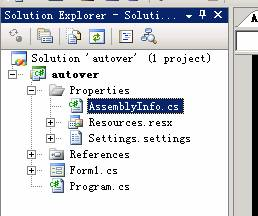
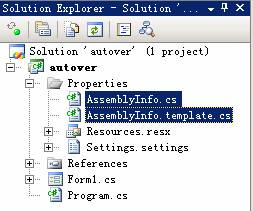
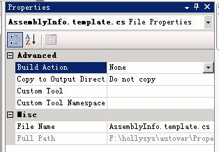
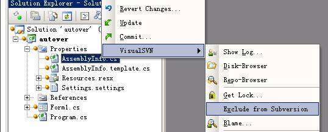
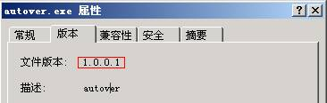

+++
title = '使用SVN实现版本号自增'
date = 2008-05-20T17:00:00+08:00
categories = ['技术']
tags = ['其他']
+++

在[《介绍一下SVN》]()一文中，我提到了自动递增版本号的功能，现在就来具体说明一下实现方法。虽然标题中说的是“使用SVN”，但我们实际用的是 SVN 的客户端工具 `TortoiseSVN` 中的 `SubWCRev` 程序。另外文中的例子也使用了 Visual Studio 的 SVN 插件 `VisualSVN`，它并非必须，用了方便一些，不用也行。我平时主要使用 C/C++ 语言，但考虑 C# 有更大的用户群，我的示例项目也采用了 C#。

# 1\. 生成一个名为 `autover` 的项目

注意项目的 `Properties` 文件夹下有一个名为 `AssemblyInfo.cs` 的文件，`autover` 程序的版本号就写在它里面。



# 2\. 创建模板文件

在 Windows 的资源管理器中进入 `Properties` 文件夹，把 `AssemblyInfo.cs` 文件复制一份，命名为 `AssemblyInfo.template.cs`，并把它加入到项目中来。



# 3\. 修改 `AssemblyInfo.template.cs` 的属性

`AssemblyInfo.template.cs` 文件是用来自动生成版本号的模板文件，它不应该被编译，所以我们要把它的 `Build Action` 改成 `None`，如下图所示：



# 4\. 修改 `AssemblyInfo.template.cs` 的内容

在这个文件中，你能找到如下两行代码：

```csharp
[assembly: AssemblyVersion( "1.0.0.0" )]
[assembly: AssemblyFileVersion( "1.0.0.0" )]
```

其中的 `1.0.0.0` 就是程序的版本号，它使用的是 `主版本号.次版本号.内部版本号.修订号` 的形式。前三个改成你自己需要的数字，最后一个改成 `$WCREV$`，改完之后应该是类似下面的样子：

```csharp
[assembly: AssemblyVersion( "1.0.0.$WCREV$" )]
[assembly: AssemblyFileVersion( "1.0.0.$WCREV$" )]
```

在这个文件的最后，你还应该加上下面两段代码，它们可以检测出有本地修改（修改了但没有提交）的代码和有混合版本的代码。

```csharp
#if $WCMIXED?true:false$
#if DEBUG
#warning mixed update revisions founded
#else
#error mixed update revisions founded
#endif
#endif

#if $WCMODS?true:false$
#if DEBUG
#warning local modification founded
#else
#error local modification founded
#endif
#endif
```

# 5\. 修改项目属性

在项目属性的 `Build Event` 页的 `Pre-build event command line` 中输入：

```
"%ProgramFiles%/TortoiseSVN/bin/SubWCRev.exe" "$(SolutionDir)" "$(ProjectDir)Properties/AssemblyInfo.template.cs" "$(ProjectDir)Properties/AssemblyInfo.cs" –f
```

注意，这里我们必须保证 TortoiseSVN 安装到了默认路径上。在多人参加的项目中这应该是强制性的要求，否则，大家安装的路径都不一样，甲机器上能用的配置，到了乙机器上可能就不行了。

然后，你可能还需要将 `Publish` 页中的 `Automatically increment revision with each publish` 选项关掉（我不确定这步是否必须）。C# 可以自己递增版本号，但它生成的版本号和代码库中的代码没有对应关系，我个人觉得意义不大。并且它还可能会把我们的版本自增机制搞乱。所以应该关掉。

# 6\. 把项目加入版本库

使用 VisualSVN 的 `Add solution to Subversion` 命令把项目加入 SVN，但不要提交。

# 7\. 从 SVN 中排除 `AssemblyInfo.cs` 文件

每次编译时，这个文件都会基于 `AssemblyInfo.template.cs` 重新生成，所以没必要加入版本库。这步做完之后就可以提交整个项目了。



# 8\. 编译

编译完成后，看一下生成的 `autover.exe` 文件的版本信息，本例中是 `1.0.0.1`。随便改点什么，提交，重新编译，你会发现它自动变成了 `1.0.0.2`，也就是程序的修订号总是与生成它的代码的修订号一致。这样，当程序出问题后，我们通过这个数字就能轻松得到生成它的那一版代码了。



# 9\. 其它问题

第 8 步中大家做完修改后再编译时可能会看到警告或错误信息，说代码有本地修改或混合版本。这就是第 4 步中，在 `AssemblyInfo.template.cs` 文件最后加的两段代码的作用，它们检测代码是否都已经提交了并且版本是否一致，一旦发现问题就会在调试版中生成警告信息，在发布版中生成错误信息。使用这种方法，我们可以基本消除发布的程序的版本和代码的版本出现不一致的可能性。去掉这两个错误或警告的方法也很简单，把代码整体提交或更新一下就行了。
