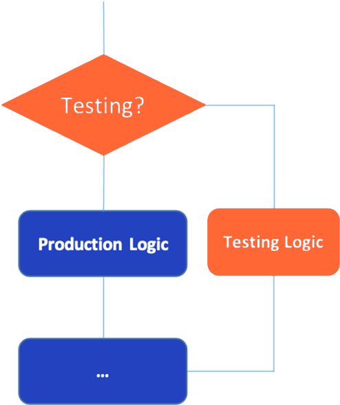
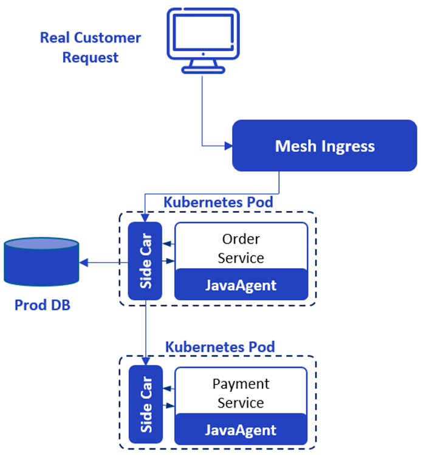
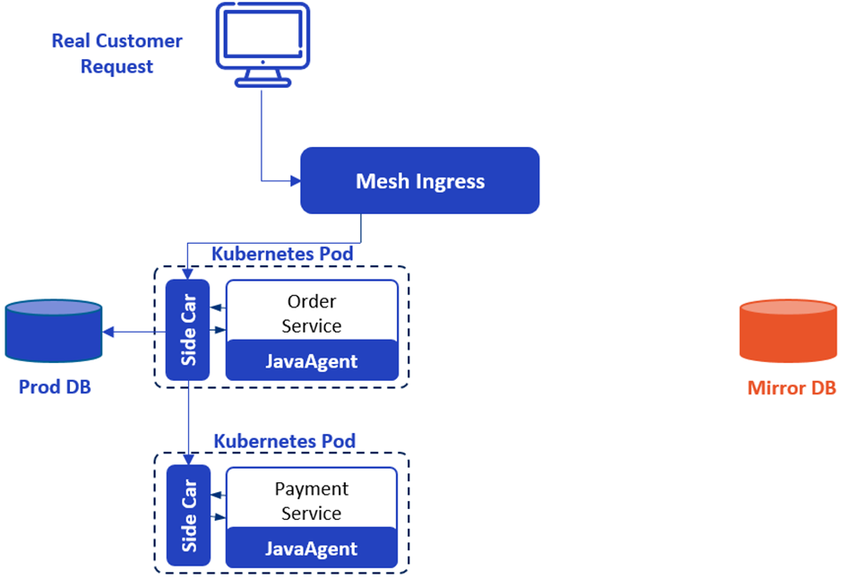
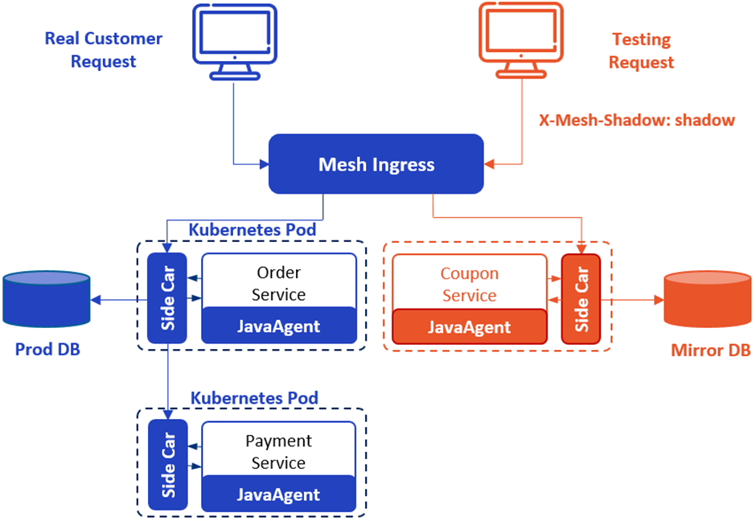
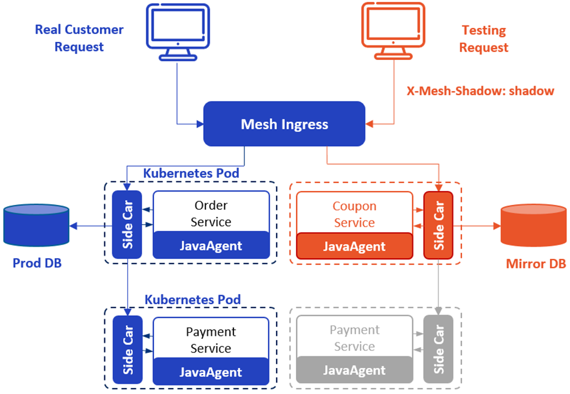

+++
title = '无侵入式生产环境全链路压力测试'
date = 2022-03-03T13:00:00+08:00
categories = ['技术']
tags = ['其他', 'MegaEase']
summary = "随着硬件性能的提升，网络带宽的增加和数据量的急剧增长，传统的单机应用无法满足现代企业的需求，取而代之的是基于分布式的软件系统。这些软件系统在提供强大计算能力的同时，引入了复杂性。本文介绍了一种新型的基于云原生架构的生产线上全链路压力测试方法——Shadow Service，通过实现业务一致性、数据一致性、资源一致性和各种隔离性，保证了测试结果的准确性和生产系统的安全。同时，我们详细介绍了如何在一个简化后的订单支付场景中使用Shadow Service实现压力测试。"
+++

[English Version]()

**注**：本文与[陈皓](https://www.coolshell.cn)合作完成，已发表在《现代信息科技》2023年第11期上。

随着硬件性能越来越强，带宽越来越高，数据越来越多，传统的单机应用已经无法满足用户需求，取而代之的是由各种组件基于网络而构成的软件系统。

但这种软件系统，在带来更强大的计算能力的同时，也引入了单机时代所不具有的复杂性。今天，一个完整的软件系统，模块数量少则几十，多则成千上万。并且，为了提高开发上线速度，这些模块会由不同的团队使用不同的语言开发，这也让模块间的通讯变得更加复杂。

同时，今天的业务模式相比过去也发生了很大的变化，类似双十一的促销活动，会让系统承受数倍、数十倍于日常的压力。所以，压力测试变得日益重要，但传统的测试方法也变得越来越无法适应业务需求。

# 专用测试环境的问题

在单机时代，使用 1:1 的测试环境，是非常好的压力测试方法。但到了网络时代，这种做法却可能非常不切实际。

首先是成本。要测试单机软件，即使是独立开发者，绝大多数情况下也可以轻松的购买一台独立的测试用计算机；但今天的系统所需的资源太多了，要想 1:1 的按照生产系统搭建一套测试系统，单是服务器成本就会高的让大多数公司难以承受，更不用说还可能有带宽、电力、机房等费用。

即使公司财大气粗，真的 1:1 建起测试环境，保持这个测试环境与生产环境的软件、数据完全一致也充满挑战。

因为是测试环境，大家会在上面不断部署各个模块的测试版本，所以，必然会有程序员测试完自己的模块之后没有将其恢复成生产版本，长期下来，测试环境与生产环境的差异会越来越大，导致测试结果失真。

再者，由于成本实在太高，我认为也没有公司能壕到为每个开发组配置这样一套测试环境，也就是说，大家必须共用同一套环境。这时，如果没有极好的内部协调机制，多个开发组同时进行的测试也会影响测试结果。

还有测试数据的问题，如果不能保证测试环境的数据与生产环境接近甚至相同，测试结果就不可信。比如一个类似微博的系统，像我这种普通用户一般只有几十或几百人关注，所以我发一条消息，随便怎么做都可以很容易的通知所有关注者。但对一个千万大V，情况就会截然不同。所以，我们不能简单的使用模拟数据进行测试。

为了让测试结果真实可靠，最好能够把完整的生产数据导入到测试环境。乍看上去，这只需要简单的备份恢复下数据库，但生产环境包含大量敏感数据，随意复制到测试环境无疑会极大的增加数据泄露的风险。

# 在生产环境进行测试的问题

因为使用测试环境进行压测存在诸多困难，人们就把目光转向了生产环境，尝试直接利用生产环境上的压力低谷时段进行测试。但这是一种侵入式的解决方案，涉及到修改甚至重新定义业务逻辑，所以同样面临巨大挑战。

如下图所示，蓝色框是原有业务逻辑，橙色框是为实现这一方案而新增的逻辑。表面上看，这些逻辑只需要增加一些 if/else 就能实现，但实际情况则要复杂的多。



假设我们要修改的是一个网购系统，那么用户购物下订单的流程应该会涉及到用户、订单、支付等一系列的模块。

如果我们要修改用户模块，在那个菱形框里，要如何才能判断应该走测试逻辑还是生产逻辑呢？比较常见的方法是预先指定一个用户 ID 的范围，如果是这个范围的用户，就走测试逻辑，否则走生产逻辑。

用户模块之后，逻辑走到了订单模块，这时，我们可能仍然希望通过用户 ID 来判断是否应该走测试逻辑，但实际情况却可能是：经过一系列的复杂处理流程，订单模块根本看不到用户信息，所以此路不通。

为了让订单模块能区分出正常订单和测试订单，就要求用户模块在橙色的方框里进行特殊处理，比如给订单号加上特殊标记等。但是，在一个复杂的系统里，用户模块并不容易知道后续流程要经过的所有模块，所以，为了不影响正常的生产逻辑，仅仅保证测试状态的正常传递就需要付出不小的努力，更不用说还要考虑是否要访问不同的数据集，是否要模拟第三方服务等各种情况。

很明显，这种业务逻辑的修改，所需的工作量与功能点数量成正比。但除了巨大的工作量，更严重的问题是，在辛苦的修改之后，有谁能保证所有需要做的修改都改了，并且改对了？而万一有遗漏或错误，就有可能破坏生产系统，这个风险实在是太大了。

# 解决之道

从前面的分析可以看出，传统的测试方法或者成本高昂且得不到准确的数据，或者工作量巨大且存在破坏生产系统的风险。因此，MegaEase 认为，要解决网络时代的全站压力测试问题，必须使用一种全新的方法，而这种方法的关键在于“**三一致**”和“**四隔离**”。

三一致是指业务一致、数据一致和资源一致。也就是说，测试系统和生产系统应该完全相同，只有这样，才能得到准确的测试数据。现实的说，100% 的一致并不容易做到，比如，我们通常无法要求第三方配合我们进行测试，所以，只能使用模拟的方法替换掉部分第三方依赖。但我们仍然需要尽最大可能保证两个系统的一致性。

四隔离是指业务隔离、数据隔离、流量隔离和资源隔离。这些隔离，都是为了将生产系统和测试系统完全分开，避免它们相互影响。

很显然，三一致解决的是测试结果的准确性问题，而四隔离则保证了测试过程不会影响生产系统。

基于上面的理念，MegaEase 在 EaseMesh 中实现了 Shadow Service 功能。使用这一功能，用户可以非常容易的为系统中的所有服务创建一个副本，除了带有 shadow 标记之外，这些副本与原始服务完全相同，从而保证了**业务一致**和**业务隔离**。同时，Shadow Service 还会自动创建一条 Canary 规则，将带有 X-Mesh-Shadow: shadow 头部的请求作为测试请求转发到服务副本，将其它请求发送给原始服务，以实现**流量隔离**。

在数据方面，Shadow Service 可以根据配置替换掉包括 MySQL、Kafka、Redis 等在内的多种中间件的连接信息，并籍此改变数据请求的发送目标，这保证了**数据隔离**。而用户则可以直接将生产数据复制一份作为测试数据来保证**数据一致**。

**资源一致**和**资源隔离**是指测试系统要使用与生产系统规格相同的资源，但不应该共享同一套资源。这主要是一个硬件问题，但 Kubernetes 已经在软件层面给出了非常好的答案，而 EaseMesh 是建立在 Kubernetes 之上的，所以，通过将服务副本部署到新的 POD 中，资源一致和资源隔离就都得到了保证。

# Shadow Service的使用方法

下面我们以一个简化后的订单支付的场景，介绍一下 Shadow Service 的具体使用方法。这是场景涉及订单（Order）和支付（Payment）两个服务，订单服务会调用支付服务，支付服务最终会调用第三方服务（图中未画出）来完成支付，同时，订单服务还会访问 MySQL 数据库。

整个系统，通过 [EaseMesh](https://github.com/megaease/easemesh) 部署在 Kubernetes 中，部署过程中， EaseMesh 会向应用的 POD 中注入的 SideCar （基于[Easegress](https://github.com/megaease/easegress)）和 [JavaAgent](https://github.com/megaease/easeagent)，从而劫持应用发出的 HTTP 请求和数据请求，实现前面提到的“三一致”和“四隔离”。系统的总体架构如下图所示。



要对其进行测试，我们需要首先创建数据库的副本。这一步，可以通过数据库的备份恢复功能来完成，因为数据副本和原始数据位于同一个安全域，所以不必对数据进行脱敏处理。



然后，使用 emctl apply 命令应用下面的配置文件来创建订单服务的 Shadow 副本和 Canary 规则（自动创建，所以没有包含在下面的配置中）。注意，在创建服务的副本时，我们将其使用的数据库指向了刚刚创建的数据库副本。

```yaml
kind: ShadowService  
apiVersion: mesh.megaease.com/v1alpla1  
metadata:  
  name: shadow-order-service  
spec:  
  serviceName: order-service  
  namespace: megaease-mall  
  mysql:  
    uris: "jdbc:mysql://172.20.2.216:3306/shadow\_order\_db..."  
    userName: "megaease"  
    password: "megaease"  
```



最后，因为不想在测试的时候实际支付费用，我们需要 Mock 支付服务。注意，调用第三方支付服务时通常会涉及多个非常复杂的安全验证步骤，这导致这个服务难以被直接 Mock 。所以，我们把第三方服务包装成了系统内部的服务，并籍此简化了调用接口，下面的配置文件 Mock 的实际上是这个包装后的服务。

```yaml
kind: Mock
apiVersion: mesh.megaease.com/v1alpha1
metadata:
  name: payment-service
  registerTenant: megaease-mall
spec:
  enabled: false
  rules:
    \- match:
        pathPrefix: /
        headers:
          X-Mesh-Shadow:
            exact: shadow
      code: 200
      headers:
        Content-Type: application/json
      body: '{"result":"succeeded"}'
```

这样就完成了整个测试系统的创建，我们可以向其发送带有 `X-Mesh-Shadow: shadow` 头部的请求来进行压力测试.。最终的系统架构是下面的样子。



# Shadow Service 的优势

相对于传统的测试方法，使用 Shadow Service 进行压力测试在以下五个方面具有明显的优势：

* **0代码修改**：全部通过配置完整，不需要修改任何代码，没有改出 Bug 的风险。  
*  **低成本**：在使用云服务器的情况下，测试用的硬件资源随用随申请，用完就释放，仅需要为实际使用时段付费。  
* **业务逻辑与生产环境基本一致**：除少数被 Mock 的服务外，测试系统与生产系统完全一致，最大程度避免了业务逻辑的差异导致的误差。  
* **可以使用生产数据进行测试**：测试系统和生产系统的数据完全一致，保证了测试结果的准确性。  
*  **安全**：虽然测试时使用的是生产数据，但测试系统和生产系统处于同一个安全域，所以没有增加数据泄露风险。

最后，欢迎大家下载安装我们的[EaseMesh](https://github.com/megaease/easemesh)产品并试用 Shadow Service 功能。
