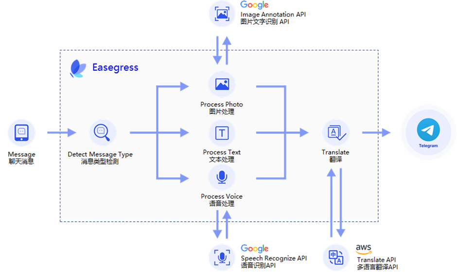
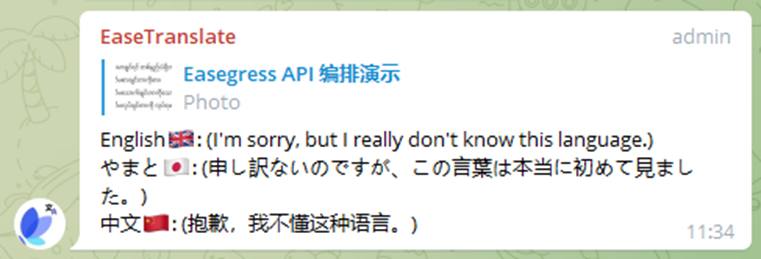

+++
title = '使用 Easegress 实现 Telegram 翻译机器人'
date = 2022-08-29T15:08:00+08:00
categories = ['技术']
tags = ['其他', 'MegaEase']
summary = "Easegress 2.0 版本大幅增强了流量编排功能，使用户无需编写任何代码，就可以通过编排多个 API 来实现一个超级 API。本文通过一个 Telegram 翻译机器人演示了这个功能。这个机器人可以自动将收到的消息翻译为中文、日文和英文，并且，除了文字消息，还支持翻译语音和图片消息。"
+++

[English Version]()

[Easegress](https://github.com/megaease/easegress) 是 [MegaEase](https://megaease.cn/) 开发的新一代流量型网关产品，它完全架构于云原生技术之上，避免了传统反向代理在高可用、流量编排、监控、服务发现等方面的不足，具有云原生、高可用、动态流量编排、可观测、可扩展等特点。

最近，Easegress 发布了 2.0 版本，再次大幅增强了流量编排功能，使用户无需编写任何代码，就可以通过编排多个 API 来实现一个超级 API。本文，我们会通过编排一个 Telegram 翻译机器人来演示一下这个功能。这个机器人可以自动将收到的消息翻译为中文、日文和英文，并且，除了文字消息，还支持翻译语音和图片消息。

# 1. 准备

由于机器人需要接收 Telegram 消息通知，并调用第三方 API，所以我们需要提前准备好以下各项：

* 根据[这篇文档](https://github.com/megaease/easegress/blob/main/README.zh-CN.md#%E5%AE%89%E8%A3%85-easegress)安装好 Easegress 的最新版本，并请确保外部应用至少可以通过 80、88、443 或 8443 端口中的一个访问到这个 Easegress 实例。  
* 根据[这篇文档](https://core.telegram.org/bots#3-how-do-i-create-a-bot)创建一个 Telegram 机器人，设置好名字（本文使用的是 EaseTranslateBot），记下它的 token，并[设置一个 Webhook](https://core.telegram.org/bots/api#setwebhook)，Webhook 的地址指向上一步中安装的 Easegress 实例。我们的机器人将通过这个 Webhook 接收新消息通知。  
* AWS 的 Access Key ID 和 Access Key Secret，并确保可以通过这个 Access Key 使用 AWS 的翻译 API。  
* Google Cloud 的 Token，并确保可以通过这个 Token 使用 Google Cloud 的语音识别（Speech Recognize）API 和 OCR(Image Annotation）API。

您也可以使用其它厂商的翻译、语音识别或 OCR API，但这需要您对后文中的示例做相应调整。

# 2. 实现原理

下图展示了这个机器人的工作流程。



收到 Telegram 服务器通过 Webhook 发来的新消息通知后，机器人首先检查消息类型，并分别进行如下处理：

* **文字消息**：直接提取消息文本；  
* **语音消息**：这种情况下，消息体中只有语音文件的 ID，所以需要先调用 Telegram 的 API 将 ID 转换成文件地址，然后下载这个文件，并把其内容发给 Google 语音识别服务，将其转换为文本；  
* **图片消息**：前半部分基本与语音消息相同，但会将图片内容发给 Google 的 Image Annotation 服务，将其转换为文本。

经过以上处理，三种消息就都变成了文本，之后，就可以调用 AWS 的翻译服务，将其依次翻译为不同的目标语言，本文示例使用的目标语言是中文、日文和英文。

# 3. Pipeline

首先，我们来看一下 Pipeline 编排出来的总体流程：

```yaml
flow:
# Telegram 要求每个请求都返回应答，但我们不会处理所有请求，所以，
# 我们把 ResponseBuilder 放在最前面以确保能够返回应答。
- filter: buildFinalResponse

# 检测消息类型，并跳转到对应的位置。
- filter: detectMessageType
  jumpIf:
    result0: processText             # 文字
    result1: processVoice            # 语音
    result2: processPhoto            # 图片
    "": END                          # 忽略消息，直接结束处理流程

# 文字消息
- filter: requestBuilderExtractText
  alias: processText                 # 别名
  namespace: extract                 # 所属命名空间
  jumpIf:                            # 条件跳转，如果一切正常就开始翻译，
    "": translate                    # 否则会自动结束处理流程

# 语音消息
- filter: requestBuilderGetVoiceFile # 构造将语音文件 ID 转换成文件路
  alias: processVoice                # 径的请求
  namespace: extract
- filter: proxyTelegram              # 发送请求，得到文件路径
  namespace: extract
- filter: requestBuilderDownloadFile # 构造下载语音文件的请求
  namespace: extract
- filter: proxyTelegram              # 发送请求，得到文件内容
  namespace: extract
- filter: requestBuilderSpeechRecognize  # 构造调用语音识别 API 的请求
  namespace: extract
- filter: proxySpeechRecognize       # 发送请求，得到识别结果
  namespace: extract
- filter: requestBuilderSpeechText   # 保存识别结果
  namespace: extract
  jumpIf:                            # 条件跳转，如果一切正常就开始翻译，
    "": translate                    # 否则会自动结束处理流程

# 图片消息（流程与语音消息基本相同）
- filter: requestBuilderGetPhotoFile
  alias: processPhoto
  namespace: extract
- filter: proxyTelegram
  namespace: extract
- filter: requestBuilderDownloadFile
  namespace: extract
- filter: proxyTelegram
  namespace: extract
- filter: requestBuilderImageAnnotate
  namespace: extract
- filter: proxyImageAnnotate
  namespace: extract
- filter: requestBuilderPhotoText    # 不使用条件跳转，正常进入翻译流程
  namespace: extract

# 翻译为中文
- filter: requestBuilderTranslate    # 构造调用翻译 API 的请求
  alias: translate
  namespace: zh
- filter: signAWSRequest             # 根据 AWS 的要求进行签名
  namespace: zh
- filter: proxyTranslate             # 发送请求，得到翻译结果
  namespace: zh

# 翻译为英文（流程与中文翻译相同）
- filter: requestBuilderTranslate
  namespace: en
- filter: signAWSRequest
  namespace: en
- filter: proxyTranslate
  namespace: en

# 翻译为日文（流程与中文翻译相同）
- filter: requestBuilderTranslate
  namespace: ja
- filter: signAWSRequest
  namespace: ja
- filter: proxyTranslate
  namespace: ja

# 回复，将翻译结果发送给 Telegram
- filter: requestBuilderReply        # 发送消息回复的 API 的请求
  namespace: tg
- filter: proxyTelegram              # 将翻译结果发送到 Telegram
  namespace: tg
```

结合前面已经解释过的“实现原理”，我们不难看懂整个流程。但要注意，因为最终的回复需要综合多个 API 的执行结果，我们使用了多个命名空间（namespace）来保存这些 API 的调用参数和执行结果，也就是发送的请求（Request）和它们返回的应答（Response）。

为了达到更好的效果，我们还在 Pipeline 上定义了一些数据：

```yaml
data:
  zh:
    fallback: "(抱歉，我不懂这种语言。)"
    text:  "中文🇨🇳"
  ja:
    fallback: "(申し訳ないのですが、この言葉は本当に初めて見ました。)"
    text: "やまと🇯🇵"
  en:
    fallback: "(I'm sorry, but I really don't know this language.)"
    text:  "English🇬🇧"
```

其中，`zh`、`ja`、`en`是中文、日文和英文的语言代码，`text` 是语言名称和对应的旗帜，`fallback` 是翻译失败时的替代文字，如下图所示：



# 4. Filter

在 Easegress 中，Filter 是处理流量的组件，具体到本文示例，Pipeline 负责编排流程，检测消息类型、调用第三方 API 等工作则都是由 Filter 完成的，下面分别介绍下示例中用到的主要 Filter。

## 4.1 后端代理（Proxy）

所有对外的 API 请求都要通过 Proxy Filter 发出，本文示例使用了四个外部服务，所以也就相应的使用了四个 Proxy Filter，由于它们的配置都非常简单，就不多做介绍了。

```yaml
# Google Image Annotate
name: proxyImageAnnotate
kind: Proxy
pools:
- servers:
  - url: https://vision.googleapis.com

# Google Speech Recognize
name: proxySpeechRecognize
kind: Proxy
pools:
- servers:
  - url: https://speech.googleapis.com

# AWS Translate
name: proxyTranslate
kind: Proxy
pools:
- servers:
  - url: https://translate.us-east-2.amazonaws.com

# Telegram
name: proxyTelegram
kind: Proxy
pools:
- servers:
  - url: https://api.telegram.org
```

## 4.2 检测消息类型

这是由一个 ResultBuilder Filter 完成的，配置如下：

```yaml
kind: ResultBuilder
name: detectMessageType
template: |
  {{- $msg := or .requests.DEFAULT.JSONBody.message .requests.DEFAULT.JSONBody.channel_post -}}
  {{- if $msg.text}}result0{{else if $msg.voice}}result1{{else if $msg.photo}}result2{{end -}}
```

它的 template 字段是根据 [Go 语言 text/template 包](https://pkg.go.dev/text/template)的要求编写的模板，在运行时会生成一个字符串，ResultBuilder 会将这个字符串作为自己的执行结果返回给 Pipeline，而 Pipeline 可以根据这个执行结果进行跳转。也就是说，ResultBuilder 和 Pipeline 相互配合，能够实现类似程序开发语言中的 switch-case 功能。

Telegram 中的消息可能来自用户组（Group），也可能来自频道（Channel），两种情况下，代表消息体的字段不同，模板首先对此进行了判断，但不管是哪种情况，消息体的格式都是相同的。

模板中，`.requests.DEFAULT` 所代表的就是 Telegram 通过 Webhook 发来的，承载着具体消息的 HTTP 请求，其中， `DEFAULT` 是这个请求所属的命名空间。而通过检测消息体中 `text`、`voice`、`photo` 三个字段的有效性，我们就能知道消息类型了。

目前，ResultBuilder 的执行结果只能是 `result0` \- `result9`，所以，我们这里使用 `result0` 代表文字消息，`result1` 代表语音消息，`result2` 代表图片消息。后面我们会进一步改进这个 Filter，让其返回的执行结果更易读。

## 4.3 读取文件内容

语音和图片消息都需要先将消息中的文件 ID 转换为文件路径，然后读取文件来拿到其内容，这一工作是使用下面的 Filter 完成的：

```yaml
# Convert voice file ID to path
kind: RequestBuilder
name: requestBuilderGetVoiceFile
template: |
  {{$msg := or .requests.DEFAULT.JSONBody.message .requests.DEFAULT.JSONBody.channel_post}}
  method: GET
  url: https://api.telegram.org/bot{YOUR BOT TOKEN}/getFile?file_id={{$msg.voice.file_id}}

# Convert image(photo) file ID to path
kind: RequestBuilder
name: requestBuilderGetPhotoFile
template: |
  {{$msg := or .requests.DEFAULT.JSONBody.message .requests.DEFAULT.JSONBody.channel_post}}
  method: GET
  url: https://api.telegram.org/bot{YOUR BOT TOKEN}/getFile?file_id={{(last $msg.photo).file_id}}

# Download(read) file
kind: RequestBuilder
name: requestBuilderDownloadFile
template: |
  method: GET
  url: https://api.telegram.org/file/bot{YOUR BOT TOKEN}/{{.responses.extract.JSONBody.result.file_path}}
```

注意，转换文件 ID 到路径这一步，图片要比语音复杂一些，这是因为，对于同一张原始图片，Telegram 可能会生成多张不同尺寸的缩略图，并把所有缩略图和原始图片一起发过来，这时，最后一张才是原始图片。

## 4.4 语音识别和OCR

这两个 Filter 略显复杂，但都只是在按照第三方服务的要求创建对应的 HTTP 请求。

```yaml
# Speech Recognize
kind: RequestBuilder
name: requestBuilderSpeechRecognize
template: |
  url: https://speech.googleapis.com/v1/speech:recognize?key={YOUR GOOGLE API KEY}}
  method: POST
  body: |
    {
      "config": {
        "languageCode": "zh",
        "alternativeLanguageCodes": ["en-US", "ja-JP"],
        "enableAutomaticPunctuation": true,
        "model": "default",
        "encoding": "OGG_OPUS",
        "sampleRateHertz": 48000
      },
      "audio": {
        "content": "{{.responses.extract.Body | b64enc}}"
      }
    }

# OCR
kind: RequestBuilder
name: requestBuilderImageAnnotate
template: |
  url: https://vision.googleapis.com/v1/images:annotate?key={YOUR GOOGLE API KEY}}
  method: POST
  body: |
    {
      "requests": [{
        "features": [{
          "type": "TEXT_DETECTION",
          "maxResults": 50,
          "model": "builtin/latest"
         }],
        "image": {
          "content": "{{.responses.extract.Body | b64enc}}"
        }
      }]
    }
```

## 4.5 文本提取

针对三种不同的消息类型，我们分别使用了一个 Filter 来进行文本提取：

```yaml
# Extract text from text message
kind: RequestBuilder
name: requestBuilderExtractText
template: |
  {{- $msg := or .requests.DEFAULT.JSONBody.message .requests.DEFAULT.JSONBody.channel_post -}}
  body: |
    {
       "exclude": true,
       "text": "{{$msg.text | jsonEscape}}"
    }

# Extract Text From Voice(Speech) Message
kind: RequestBuilder
name: requestBuilderSpeechText
template: |
  {{$result := index .responses.extract.JSONBody.results 0}}
  {{$result = index $result.alternatives 0}}
  body: |
    {"text": "{{$result.transcript | jsonEscape}}"}

# Extract Text From Image(Photo) Message
kind: RequestBuilder
name: requestBuilderPhotoText
template: |
  {{$result := index .responses.extract.JSONBody.responses 0}}
  body: |
    {"text": "{{replace "\n" " " $result.fullTextAnnotation.text | jsonEscape}}"}
```

您可能已经注意到，我们在文本消息中使用了一个 `exclude` 字段，这是为了在翻译结果中排除消息原文，而在语音或图片消息中，识别的文本内容可能是不准确的，所以要保留识别出来的文本供用户参考。

## 4.6 翻译

由于 AWS 要求对所有调用请求签名，所以，通过 RequestBuilder 创建请求后，又使用了一个 RequestAdaptor 来完成签名。

```yaml
# Build AWS translate Request
kind: RequestBuilder
name: requestBuilderTranslate
template: |
  method: POST
  url: https://translate.us-east-2.amazonaws.com/TranslateText
  headers:
    "Content-Type": ["application/x-amz-json-1.1"]
    "X-Amz-Target": ["AWSShineFrontendService_20170701.TranslateText"]
  body: |
    {
       "SourceLanguageCode": "auto",
       "TargetLanguageCode": "{{.namespace}}",
       "Text": "{{.requests.extract.JSONBody.text | jsonEscape}}"
    }

# Sign the request
name: signAWSRequest
kind: RequestAdaptor
sign:
  apiProvider: aws4
  accessKeyId: {YOUR AWS ACCESS KEY ID}
  accessKeySecret: {YOUR AWS ACCESS KEY SECRET}
  scopes: ["us-east-2", "translate"]
```

## 4.7 将翻译结果组织成回复消息

这个 Filter 是本文示例中配置最复杂的，但总体上看，它也只是在按照 Telegram 的要求，将前面获取到的信息组织在一起。其中，`$.data.PIPELINE` 即是在引用我们定义在 Pipeline 上的数据。

```yaml
kind: RequestBuilder
name: requestBuilderReply
template: |
  {{$msg := or .requests.DEFAULT.JSONBody.message .requests.DEFAULT.JSONBody.channel_post}}
  method: POST
  url: https://api.telegram.org/bot{YOUR BOT TOKEN}/sendMessage
  headers:
    "Content-Type": ["application/json"]
  body: |
    {
      "chat_id": {{$msg.chat.id}},
      "reply_to_message_id": {{$msg.message_id}},
      "text": "{{- range $ns, $resp := $.responses -}}
        {{- if not (get $.data.PIPELINE $ns)}}{{continue}}{{end -}}
        {{- if and $.requests.extract.JSONBody.exclude (eq $resp.JSONBody.SourceLanguageCode $resp.JSONBody.TargetLanguageCode)}}{{continue}}{{end -}}
        {{- $lang := get $.data.PIPELINE $resp.JSONBody.TargetLanguageCode -}}
        {{print $lang}}: {{printf "%s\n" $resp.JSONBody.TranslatedText | jsonEscape}}
      {{- end}}"
    }
```

## 4.8 应答（Response）

Telegram 要求我们为每一个消息通知请求（Request）返回一个应答（Response），由于不用通过这个应答回复消息，所以简单的把状态码设置成 200 即可。

```yaml
kind: ResponseBuilder
name: buildFinalResponse
template: |
    statusCode: 200
```

## 5. 部署

准备好配置文件（完整的配置文件可以在[这里](https://github.com/megaease/easegress/tree/main/example/translation-bot)下载）后，就可以使用下面的命令将这条 Pipeline 部署到 Easegress 了（假设文件名是 translate-pipeline.yaml）：

```shell
$ egctl object create \-f translate-pipeline.yaml
```

但只有 pipeline 还不够，我们还需要创建一个 HTTPServer，并让它将 telegram 的通过 Webhook 发送的消息通知转发到上面的 pipeline，注意，这条 pipeline 的外部访问地址，必须是我们前面创建的 Telegram Webhook 的地址。

```shell
$ echo '
kind: HTTPServer
name: httpserver
port: 8443      # telegram requires the port to be 80, 88, 443 or 8443
https: true
autoCert: true  # please set it to false if you are not using an AutoCertManager
keepAlive: true
keepAliveTimeout: 75s
maxConnection: 10240
cacheSize: 0
rules:
- paths:
  - path: /translate
    backend: translate-pipeline' | egctl object create
```

之后，我们就可以在聊天中，测试这个机器人的效果了，演示视频请见：[https://www.bilibili.com/video/BV1yd4y1A7x2](https://www.bilibili.com/video/BV1yd4y1A7x2)。
