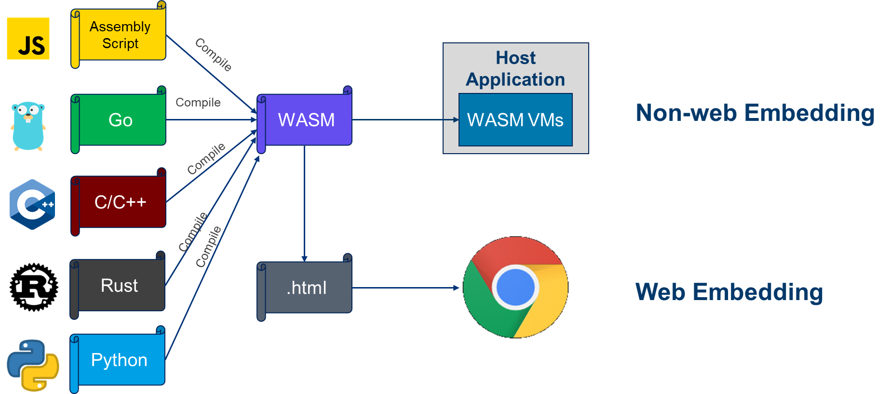

+++
title = '使用 WebAssembly 扩展后端应用'
date = 2021-09-17T10:15:00+08:00
categories = ['技术']
tags = ['其他', 'MegaEase']
summary = "本文介绍了使用 WebAssembly 扩展后端应用的具体过程以及常见问题的解决方法。"
+++

[English Version]()

# 1. WebAssembly 简介

随着互联网的发展，越来越多的应用借助 Javascript 转到了 Web 端。但人们也意识到，日益复杂的应用逻辑，导致大量时间被消耗在了 Javascript 的下载、解析、编译上，由此引发的加载缓慢、性能低下等问题进而导致了用户流失。

为了解决这些问题，Mozilla 的工程师 Alon Zakai 在 2012 年提出了 Asm.js。之后，经过几年的发展，最终在 2015 年演变成了 WebAssembly。

> WebAssembly（简写为 Wasm）是一种用于堆栈式虚拟机的二进制指令格式。它的设计目的，是成为其它编程语言的一个可移植的编译目标，以便在 Web 上布署客户端和服务端应用。

这是 [WebAssembly 官网](https://webassembly.org)上的定义，从这个定义中我们可以知道，WebAssembly 是一种二进制指令格式。但在日常的讨论中，我们也常常把 WebAssembly Text Format 称为 WebAssembly，而这种文本格式更像是一种编程语言。

正式发布后，WebAssembly 迎来了迅猛的发展，到 2017 年 11 月，Mozilla 宣布包括 Chrome、Firefox、Safari 等在内的所有主流浏览器都已经支持 WebAssembly，而根据 2021 年 7 月的数据，用户正在使用的浏览器中，已经有 94% 支持了 WebAssembly。

得到了浏览器的广泛支持之后，一些重量级的应用也逐渐被被移植到了 Web 端，其中包括：
- [Google Earth](https://earth.google.com/web/) - 一个3D地图应用
- [AutoCAD](https://web.autocad.com/) - 一个工业制图应用
- [Doom](http://www.continuation-labs.com/projects/d3wasm/) - 一个经典的第一人称射击游戏
- [TensorFlow](https://blog.tensorflow.org/2020/03/introducing-webassembly-backend-for-tensorflow-js.html) - Google 开源的机器学习框架
- ……

这些案例也说明，WebAssembly 达到了自己的设计目标——在 Web 上部署桌面原生应用。而 WebAssembly 能够获得如此快速的发展，得益于它的几个特点：

- **性能好**：接近机器代码的运行速度，评测表明，WebAssembly 只比原生代码慢大约 10%。
- **体积小**：加载速度快，WebAssembly 是一种紧凑的二进制格式，体积通常远小于完成同样功能的 Javascript 代码。
- **安全高**：WebAssembly 代码运行在沙箱内，默认无法进行任何外部访问。
- **多语言**：WebAssembly 并不限制用户使用何种语言开发，只要有相应的编译器，任何语言都可以被编译成 WebAssembly。

# 2. WebAssembly在后端的应用

在 WebAssembly 的官方定义中，“用于堆栈式虚拟机的”这个定语也非常值得关注，因为它导致 WebAssembly 这项最初以 Web 端为应用场景，以至于名字中都包含“Web”这个词的技术，慢慢进入了后端应用的领域。

从早期的 VMWare WorkStation、VirtualBox，到今天的 Docker，虚拟化技术一直是云计算的重要基础。所以，作为一种具有很多特点的虚拟机代码格式，WebAssembly 进入后端应用领域是必然趋势。Docker 的创始人 Solomon Hykes 在 2019 年说“如果 2008 年就有 WASM 和 WASI，我们就不用发明 Docker 了”，对其在后端应用的前景之看好，可见一斑。

当然，Solon Hykes 后来也说他的意思不是“WebAssembly 会取代 Docker”，这也是当今业界普遍的观点：WebAssembly 和 Docker 各有优势，互为补充。具体来说：
- WebAssembly 程序的体积通常只有1M左右，而 Docker 镜像则动辄超过100M，所以 WebAssembly 具有快得多的加载速度。
- WebAssembly 程序的冷启动速度大约是 Docker 容器的 100 倍。
- WebAssembly 默认运行在沙箱内，任何与外部的交互，都只有获得明确的许可之后才能进行，具有极佳的安全性。
- WebAssembly 模块仅仅是二进制的程序代码，不包含操作系统环境，所以不可能像在Docker 中那样简单的编译下就能执行。

下面，通过实际的示例介绍下如何在后端应用中使用 WebAssembly。

## 2.1. 在应用中嵌入 WebAssembly

如下图所示，不管是 Web 应用还是非 Web 应用，要使用 WebAssembly，都需要在宿主程序中嵌入 WebAssembly 运行时引擎，区别只在于，在 Web 应用中，这个宿主程序是浏览器，而在非 Web 应用中，宿主程序是我们自己开发的，具体到本文关注的后端应用，宿主程序则是我们的后端服务程序。



目前可选的 WebAssembly 运行时引擎有 [Wasmtime](https://wasmtime.dev/)、[WasmEdge](https://wasmedge.org/)、[WAVM](https://wavm.org/)、[Wasmer](https://wasmer.io/) 等很多种，各有自己的优势和缺陷。本文将以 Wasmtime 为例，介绍如何在以 Go 语言开发的宿主程序中嵌入 WebAssembly，这本身非常简单，在省略错误处理的情况下，只要下面几行代码即可：

```go
func createWasmVM(code []byte) {
    engine := wasmtime.NewEngine()
    module, _ := wasmtime.NewModule(engine, code)
    store := wasmtime.NewStore(engine)
    linker := wasmtime.NewLinker(engine)
    inst, _ := linker.Instantiate(store, module)
    _ = inst
}
```

但其中涉及了实际开发中需要了解的几个重要概念，简单介绍如下：

- **引擎（engine）**：用于编译和管理模块的全局上下文。
- **模块（module）**：编译后的 WebAssembly 模块。
- **仓库（store）**：WebAssembly 程序和宿主之间的纽带，维护各种关联信息。
- **实例（instance）**：实例化的模块，是真正可以执行的程序。
- **链接器（linker）**：wasmtime 中的一个工具对象，用于实例化模块。

虽然上面的代码创建了 WebAssembly 模块的实例，并且根据 WebAssembly 的规范，模块实例化时就可以执行 WebAssembly 代码，但由于安全性的限制，其执行结果无法对外输出，所以这种“执行”毫无意义。因此，我们需要实现宿主程序和 WebAssembly 程序的互操作，为 WebAssembly 程序提供输入/输出接口。

## 2.2. 宿主调用 WebAssembly

假设我们的 WebAssembly 程序中有一个名为 sum 的函数，接收两个整形变量作为参数，返回它们的和，则宿主程序可以使用下面的代码来调用这个函数：

```go
    fn := inst.GetExport(store, "sum").Func()
    r, _ := fn.Call(store, 1, 2)
    fmt.Println(r.(int32))
```

虽然不同的宿主开发语言和 WebAssembly 运行时引擎具体的调用方式有区别，但运行时引擎的文档一般都有相关说明，所以这一步照着文档做就好，没有难度。

这里的难点在于，如何才能在 WebAssembly 程序中暴露出这个函数，以便宿主程序能找到并调用它。前面说过，只要有相应的编译器，各种语言都可以编译成 WebAssembly，但大多数语言设计时并没有考虑 WebAssembly 的需要，也就没有提供暴露函数的方法。所以这个问题只能通过特定编译器的非标准扩展来解决。也就是说，找到这个非标准扩展是解决问题最关键的一步。但也正由于“非标准”，相关的资料有时并不容易找到。

作为示例，下面给出的是使用 C/C++（编译器是 emscripten）和 AssemblyScript 时对外暴露函数的方法：

```c
// C/C++
EMSCRIPTEN_KEEPALIVE int sum( int a, int b ) {
    return a + b;
}
```

```js
// AssemblyScript
export function sum( a: i32, b: i32 ): i32 {
    return a + b
}
```

## 2.3. WebAssembly 调用宿主

与宿主调用 WebAssembly 类似，运行时引擎的文档中一般会介绍宿主端如何暴露一个函数给 WebAssembly 程序。

```go
 fn := func() {
     fmt.Println("hello wasm")
 }
 linker.DefineFunc(store, "easegress", "hello", fn)
```

问题的难度同样在于 WebAssembly 程序中如何使用语言的非标准扩展来导入这个函数，下面是 C/C++ 和 AssemblyScript 中的具体方法：

```c
// C/C++
__attribute__((import_module("easegress"), import_name("hello"))) void hello();
void call_hello() {
    hello();
}
```

```js
// AssemblyScript
@external("easegress", "hello") declare function hello(): void
export function callHello(): void {
    hello()
}
```

## 2.4. 复杂参数的传递

宿主和 WebAssembly 程序相互调用对方的函数时，也需要传递参数和返回值，如果是整数等简单数据类型，直接传递即可。但当数据类型是字符串等复杂类型时，就会遇到新的问题，具体有两点：

宿主程序和 WebAssembly 程序的开发语言一般并不相同，所以复杂参数的内存布局也不同，直接传递的话，接收方根本理解不了，也就无法使用。

由于安全性设计，宿主程序和 WebAssembly 程序的内存是隔离开的，WebAssembly 程序访问不了宿主的内存。

因为宿主程序可以访问 WebAssembly 的内存，所以第二个问题的解决方法是 WebAssembly 程序暴露内存管理的相关函数，让宿主来操作 WebAssembly 的内存，例如：

```c
// C/C++
EMSCRIPTEN_KEEPALIVE void* wasm_alloc( int size ) {
    return malloc( size );
}
 
EMSCRIPTEN_KEEPALIVE void wasm_free( void* p ) {
    free( p );
}
```

```js
// AssemblyScript
export function wasm_alloc(size: i32): number {
    let buf = new ArrayBuffer(size)
    let ptr = changetype<usize>(buffer)
    return __pin(ptr)
}
 
export function wasm_free(ptr: number): void {
    __unpin(ptr)
}
```

之后，我们可以借助这些内存管理函数，并通过序列化/反序列化相关数据类型来传递它们，比如在下面 WebAssembly 调用宿主函数的代码中，参数和返回值本来各是一个字符串，但通过序列化/反序列化之后，只要传递它们在 WebAssembly 内存中的地址（整数）即可：

```go
// Host: Go
func foo(addr int32) int32 {
    // ...
    mem := inst.GetExport(store, "memory").Memory().UnsafeData(store)
    start := addr
    for mem[addr] != 0 {
        addr++
    }
    data := make([]byte, addr-start)
    copy(data, mem[start:addr])
    param := string(data)
    // ...
    result := "result"
    vaddr, _ := inst.GetExport(store, "wasm_alloc").Func().Call(store, len(result)+1) 
    addr = vaddr.(in32)
    copy(mem[addr:], []byte(result))
    mem[addr + int32(len(result))] = 0
    return addr
}
```

```js
// WebAssembly: AssemblyScript
@external("easegress", "foo") declare function foo(addr: number): number
export func callFoo(name: string): string {
    let buf = String.UTF8.encode(name + '\0')
    let addr = changetype<number>(buf)
    addr = foo(addr)
    buf = changetype<ArrayBuffer>(addr)
    wasm_free(addr)
    buf = buf.slice(0, buf.byteLength - 1)
    return String.UTF8.decode(buf)
}
```

## 2.5. SDK

看了上面宿主程序和 WebAssembly 程序互操作的过程，相信大家已经发现它和 RPC 调用的过程非常像。不同的是，在 RPC 调用中，一系列非常繁琐的序列化/反序列化操作，都由工具自动生成代码实现，使用者根本无需关心。

而在 WebAssembly 应用的开发中，用户也不希望每次都处理那么多的细节。所以，作为宿主程序的开发者，我们需要为用户提供相关 SDK，屏蔽掉底层细节，让用户能够专注于业务逻辑的开发。

由于用户可以使用多种语言开发 WebAssembly 应用，所以我们需要提供针对不同语言的 SDK，或者至少也需要覆盖目标用户使用的主流语言。

## 2.6. 错误处理

像普通程序一样，WebAssembly 程序也会有各种错误，虽然作为宿主程序的开发者，我们无法预知具体的错误，但我们必须把这些错误的影响范围限制在 WebAssembly 虚拟机内部，不能让它们影响宿主程序的功能。

宿主程序要防范的第一类错误是 WebAssembly 程序中的死循环。实际场景中，其实宿主程序并没有办法判断是否真的出现了死循环，所以，折衷的解决办法是给 WebAssembly 程序设置一个最大运行时间，一旦超过了这个时间还没有结束，就认为里面出现了死循环，并终止它的执行。终止执行的示例代码如下：

```go
ih, _ := store.InterruptHandle()
ih.Interrupt()
```

要防范的第二类错误是 WebAssembly 程序中的非法内存访问等导致的崩溃，WebAssembly 运行时引擎一般会将这类错误转换为宿主程序中的异常（在 Go 语言中是一个 panic），我们只要处理这个异常即可。由于宿主程序并不知道具体的错误原因，也不知道 WebAssembly 程序出现错误后的具体状态，所以宿主程序能进行的处理一般只能是释放出问题的 WebAssembly 虚拟机占用的资源并重新创建一个虚拟机来替代它。

# 3. Easegress 中的 WebAssembly

Easegress 是 MegaEase 开发的下一代流量型网关，具有云原生、高可用、可观测、可扩展等特点。在 Easegress 之前，市场上已经有包括 nginx 在内的多个成熟网关产品。但 MegaEase 认为，流量调度型网关并不仅仅是一个反向代理，还需要能够动态的进行流量编排和调度。此外，在具体应用场景中，还涉及各种各样的业务逻辑侵入，因此，必须高度可扩展。

基于以上观点，Easegress 从诞生之日就将可扩展性放到了重要位置，并在多个层面进行了针对性的设计。

首先，在开发语言的选择上，我们有 C/C++/Java/Rust/Go 这些主流的静态语言的选项：

- 使用 C/C++ 或 Rust 肯定会给 Easegress 带来最好的性能，但这些语言门槛太高，一般用户很难掌握，开发效率过低，也就谈不上通过修改代码来扩展业务逻辑了
- Java 易学易用，也非常适合写业务逻辑，但是体积大，而且性能不能满足要求；
- 相对而言，Go 简单易学，性能也比较好，特别是在 Easegress 所处的网络应用领域，由于语言本身的特殊设计，很多场景下与 C/C++ 的性能差距基本可以忽略。所以，Easegress 最终选择了 Go 作为开发语言。但不管使用什么语言，源码级的扩展都不可避免的将用户限制到一门特定的语言，而且会涉及重新编译、重新布署、重新启动，造成服务的中断。

第二，通过外部调用的方式扩展，如FaaS。通过云原生的 FaaS 方式的好处是不限制用户的开发语言，而且可以让整个架构具有很好的可伸缩性，但其缺点是需要引用 Kubernetes 等的比较重的外部依赖，导致整个运维非常复杂（注：Easegress 目前已经支持了 Knative）

第三，通过嵌入其它语言的解释器进行扩展。这方面，Lua 本身就是为嵌入其它程序而设计的，具有相应的优势。但我们认为 Lua 也有两个缺点，一是本身表现力不够，不适合写复杂的业务逻辑；二是太小众，不是主流语言，有相关经验的程序员太少。所以，经过权衡，Easegress 最终选择了嵌入 WebAssembly，主要基于两点考虑：一是接近于原生代码的高性能；二是不限制用户的开发语言，用户可以使用自己喜欢或熟悉的语言开发业务逻辑。

作为使用 WebAssembly 扩展业务逻辑的样例，我们之前已经发布了[《使用 Easegress + WebAssembly 做秒杀》]()，欢迎大家阅读并向我们反馈更多的实际案例。

当然，选择了 WebAssembly 意味着我们需要开发多种语言的 SDK，目前已经完成了 [AssemblyScript SDK](https://github.com/megaease/easegress-assemblyscript-sdk) 的开发，相信在 MegaEase 和整个开源社区的共同努力下，我们支持的语言会越来越多。
