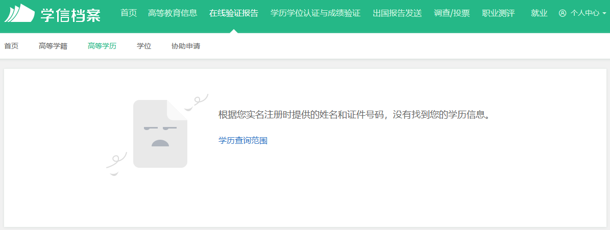
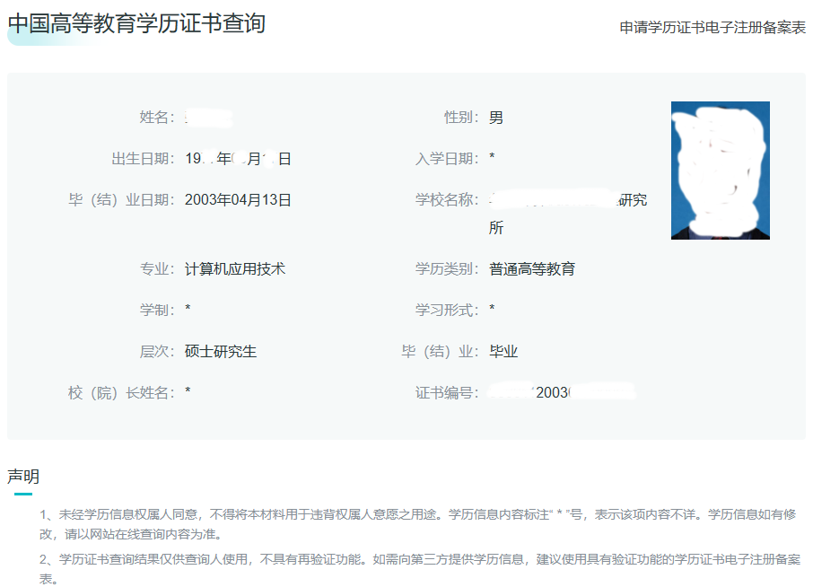
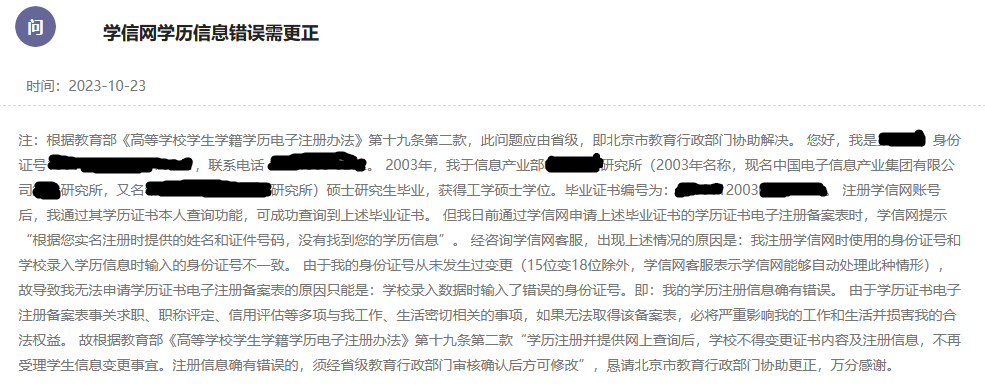
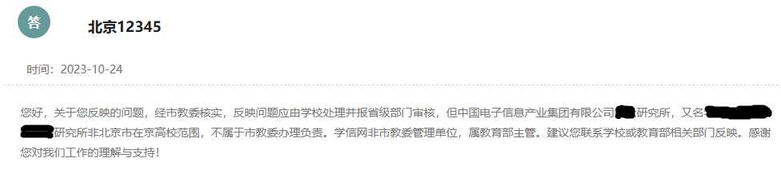
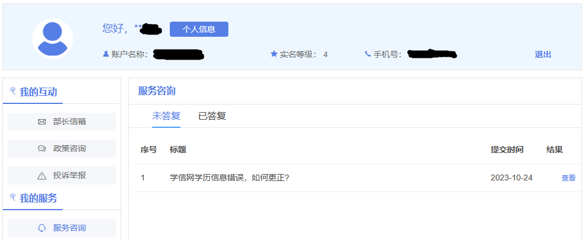
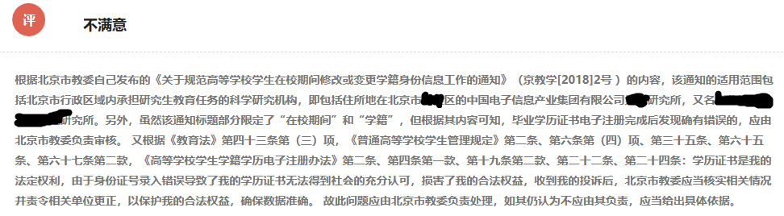
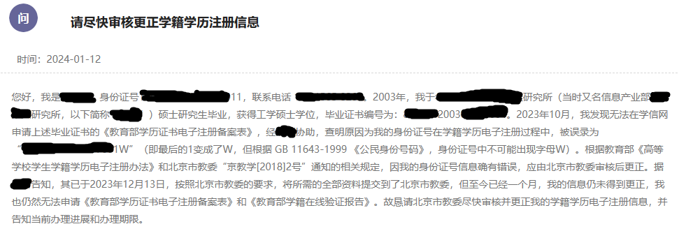
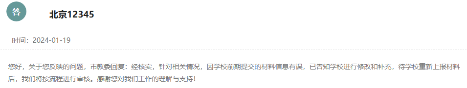

+++
title = '学信网身份信息更正记'
date = 2024-02-03T18:55:22+08:00
summary = "毕业二十年，发现毕业证是“假”的，与学校、教委的沟通更正过程，及相关的法律法规依据。"
aliases = ["/archives/identity-number-correction"]
+++

对我来说，2023年是相当不顺利的一年，其倒霉程度，绝对可以在我已经走过的人生中名列三甲。而且，其它比较倒霉的年份，基本是掉进一个现挖的坑中；而2023年则是不断掉入各种坑中，这些坑有现挖的，也有很多年前挖下的。本文记录的，就是其中年代最为久远的那个，因为我发现，掉进这个坑的并非只有我一人，但却没有人详细介绍过自己的填坑过程，所以我把自己的经验教训总结成文，供遇到类似问题的人参考。

# 1. 踩坑和填坑

## 1.1 毕业二十年，发现毕业证是“假”的

我是一名“老龄”程序员，这一点在之前的文章中已经提到过。事实上，我是2003年硕士毕业的，到2023年正好20年。这20年中，我拿着我的纸质毕业证肆意横行，从未遇到过任何问题。虽然几年前就知道有个[学信网](https://www.chsi.com.cn/)，甚至注册过账号（已经记不清为啥注册了），但我却根本没关心过这个网到底是干啥的。直到2023年的下半年，我需要[申请《教育部学历证书电子注册备案表》](https://my.chsi.com.cn/archive/bab/index.action)，发现学信网给出了下面的提示：

没有？！这可麻烦了，因为我已经知道，这个备案表是用于验证毕业证书真伪的，如果申请不了，岂不是相当于我辛辛苦苦读了将近三年研究生，最后拿了个假证……

所以，吓得我连忙又试了试学信网的[零散查询](https://www.chsi.com.cn/xlcx/lscx/query.do)，能查到啊！

怎么回事？赶紧给学信网打电话，漫长的音乐后，终于听到了客服甜美的声音，大意是，我这种情况，是注册学信网账号时用的身份证号与毕业证书绑定的身份证号不一致造成的，零散查询只比对证书编号和姓名，所以能查出来；申请那个备案表还会比对身份证号，就查不到了。

客服说这类问题一般是身份证号非自然升位导致的，因为身份证号一开始只有15位，而且那时的系统没有联网，很多都是手工操作，所以有号码重复的情况。后来，在升18位的时候，这些重复的号码没法自然升位（年份加19，最后补一个校验位，其它位都保持不变），就发生了变化。学信网只能处理自然升位，处理不了非自然升位，就查不出来了。

我说我的就是自然升位。客服说，不管是不是自然升位，你只能找学校问问实际绑定的身份证号是什么，用那个身份证号重新注册个账号，并且注册时“证件类型”要选“其它证件”，不要选身份证，应该就可以了。

挂断电话，我马上给学校打电话。要提前说下，我毕业的学校，不是普通的大学，而是一个研究所，属于科研机构，这一点给我带来了更多的困扰。

电话打到总机后，前台说研究所现在是涉密单位，所以既不能告诉我相关负责人的电话，也不能把电话转过去，她会记录我的问题，后面会有人跟进联系我。但事实是，我先后两次打到前台，后续都没人理我。

联系学校的同时，我也理了理思路，发现我不能接受客服给的方案，因为除了前面说的备案表，还有一个《教育部学籍在线验证报告》。与备案表不同，这个验证报告上有证件号码。所以，如果我接受客服的方案，那以后用到这个验证报告时，我就要证明那个证件号是我的，而我根本没法证明，况且，我的情况肯定是数据录入错误导致的。所以，我必须把它更正过来。

虽然做了决定，我却不知道找谁更正。表面上看，应该找学信网，但与客服的对话让我感觉他们只负责具体的技术工作，我的问题不归他们管；找学校的话，我都毕业二十年了，物不是，人更非，打到前台的电话已经没有后文了，还会有人管我吗？而且，如果我没有足够的依据，不论找到哪个单位，被踢皮球几乎是必然的。

先搜搜其它人的经验吧。这一搜发现，遇到类似问题的人还真有一些，但只有极少数说最终更正过来了，却又对更正过程语焉不详，所以找不到什么有价值的信息。

再次理了理思路，我觉得要找到责任单位，只能从教育部的相关规定入手。经过大量的搜索，终于发现教育部[《高等学校学生学籍学历电子注册办法》](http://www.moe.gov.cn/srcsite/A15/s3263/201408/t20140825_174309.html)第十九条第二款是这样写的：

> 　学历注册并提供网上查询后，学校不得变更证书内容及注册信息，不再受理学生信息变更事宜。注册信息确有错误的，须经省级教育行政部门审核确认后方可修改。

虽然这条规定很模糊，完全没说要提交哪些材料，要走什么流程，但有两点是清楚的：一是我的事学校不再受理了，二是北京市教委这个省级教育行政部门是责任单位。

## 1.2 官僚机构

我很快通过北京市12345平台提出了下面的诉求：

北京市教委皮球也踢得既快又好，第二天就给出了下面的回复：

看到这个回复，我一下就懵了。因为，前面已经提到，我就读的学校是一个研究所，属于科研机构，不是普通的大学。所以，北京市教委说不归他们管，貌似很有道理。可是，不归北京市教委管，归谁管呢？

2003年的时候，这个研究所隶属于信息产业部。今天，信息产业部已经变成了工信部，查了查它的机构设置，下面还真有个[人事教育司](https://wap.miit.gov.cn/jgsj/rjj/jgzz/art/2020/art_8093f9d02b2b4739ba6dfc1afdb36f0f.html)。都说省部同级，所以这个司也是“省级教育行政部门”？我要找他们？

感觉不太对，因为这个研究所现在已经是中国电子信息产业集团的下属单位了。虽然我们口头上会说后者是部级央企，但事实上它没有正式的行政级别，所以，它下面有“教育行政部门”吗？而且，它的总部刚刚从北京迁到深圳，这要让我来回跑几趟成本也太高了。中国电子信息产业集团所隶属的国资委倒是个部级单位，可它下面并没有主管教育的部门……

彻底晕了，问问教育部吧，但至今没有答复：

在等待教育部回复的时候，我也没有闲着，因为直觉上，我认为这件事就是归北京市教委管。而且，前面的搜索中我偶然看到北航的《校内申诉和听证规定》有下面的内容：

> 复查决定为学校最终决定。申诉人对复查决定有异议的，在接到复查决定书之日起 15 日内，可向北京市教育委员会提出书面申诉。

北航是工信部部属高校，也不是北京市在京高校，它为什么要规定向北京市教委申诉呢？所以，一定是北京市教委，我只需找到过硬的依据。

功夫不负有心人，反复搜索，仔细查阅之后，我终于找到了下面这些规定：

首先，教育部[《普通高等学校学生管理规定》](http://www.moe.gov.cn/srcsite/A02/s5911/moe_621/201702/t20170216_296385.html)第二条和《高等学校学生学籍学历电子注册办法》第二条，都明确规定“科研机构”属于这些规定的中所说的“高等学校”。

> 第二条 本规定适用于普通高等学校、承担研究生教育任务的科学研究机构（以下称学校）对接受普通高等学历教育的研究生和本科、专科（高职）学生（以下称学生）的管理。

> 第二条 高等学校学生学籍学历电子注册是运用现代信息技术，对高等学校（含具有颁发国家承认学历文凭资格的公办、民办普通高等学校、成人高等学校，开放大学）和经批准承担培养研究生任务的科学研究机构（以下合并简称高等学校或学校）按国家规定录取的高等学历教育学生取得的学籍、获得的学历证书（含通过高等教育自学考试获得的毕业证书）进行在线审核、电子标注、数据备案和网上查询的管理方式。

第二，《普通高等学校学生管理规定》六十五条规定了属地管辖的原则。

> 　第六十五条 学生认为学校及其工作人员违反本规定，侵害其合法权益的；或者学校制定的规章制度与法律法规和本规定抵触的，可以向**学校所在地**省级教育行政部门投诉。

第三，教育部[《高等教育学历证书电子注册管理暂行规定》（教学[2001]4号）](http://www.moe.gov.cn/s78/A15/xss_left/moe_779/s3263/201006/t20100602_88643.html)中多处规定，学校所在省（自治区、直辖市）的教育行政部门是学历证书电子注册的主管部门。

最后，也是最重要的，是北京市教委在自己发布的[《关于规范高等学校学生在校期间修改或变更学籍身份信息工作的通知》（京教学[2018]2号）](https://jw.beijing.gov.cn/xxgk/zfxxgkml/zfgkzcwj/zwgkxzgfxwj/202001/t20200107_1562951.html)通知中，明确说了这事归他们管：

> (二)本通知适用于北京市行政区域内高等学校、承担研究生教育任务的科学研究机构对接受高等学历教育的研究生、本科、专科(高职)学生学籍信息的管理。

而且，虽然这个通知说的是“在校期间”，但实际上包括了我的情况：

> 毕业学历证书电子注册完成后提出申请的，不再受理。属于学历注册信息确有错误的，须经市教委审核后方可修改。

所以，我又通过12345对市教委的答复做了反馈：

但是，这个反馈居然是12345处理流程的最后一步，不管我是否满意，也不管我不满意的理由是否充分，它就这样彻底结束了。

## 1.3 研究所

我第三次静下心来整理思路：首先，虽然教育部规定“学校不再受理”，但不论是学信网的回复，还是教委的回复，都指向了学校；第二，不论这件事当前归哪个单位负责，要彻底解决都离不开学校的参与。另外，我也搜到了[《学历查询有异常 当事人：感受到“百口难辨”啥滋味》](https://www.sohu.com/a/526434173_120388781)这则新闻，其中，最终解决问题的，就是刘女士就读的学校。所以，我觉得需要重新把重点放到研究所，起码要确认报上去的身份证号到底是什么。

由于打前台电话没用，我就在研究所的网站上搜其它的电话，很快在招生公告中找到了一位负责老师的电话（我不相信这个用于招生的电话号码有什么保密的必要，前台连个电话都不转，真是太拿着鸡毛当令箭了）。同时，我也通过一位师妹拿到了所领导的联系方式，一些其它朋友也说可以帮我找到所里的人，虽然最终没有动用任何私人关系，但有这条路，确实在过程中给了我莫大的信心，在此，对大家的帮助表示衷心的感谢。

这件事本身就是个奇葩，所以联系上负责老师后，她一开始以为是另一个问题，说给所里发个函就可以了。几番沟通下来，她终于弄明白了实际情况，但估计是觉得麻烦，找了个借口就往外推。我说“这事相当于我的毕业证是假的，对我的影响非常非常大，我不可能不解决”，她才意识到我态度坚决，开始着手处理。

由于当时登录不上学信网的后台系统，所以没有马上查到上报的身份证号。几天以后，她给我打电话，说查到了，我的身份证号最后一位错了，本来是“1”，实际上报的是“W”。但她说她也不知道怎么更正，现在系统也不让改，只能先问问教委了。

又过了几天没有动静，我再次打通负责老师的电话，她说已经和教委联系了，下一步要去教育考试院查当年的报考档案，以确定正确的身份证号。这里有一个问题，就是虽然只差一位，但系统里的身份证号是错的并不意味着我的身份证号就是对的。所以，为了证明我的身份证号才是正确的身份证号，我查了各个政府部门的好多规定。相对来说，查报考档案这个办法比我的预想简单不少。

然后我就隔三岔五的打电话问情况，但一直没有实质进展。我非常着急，一度想找私人关系推进了，但又觉得负责老师的语气和态度一直不错，不像故意拖着不办的样子，而且新一年的研究生考试也很近了，她应该也确实比较忙，就忍了下来。

直到12月12日下午，负责老师说其它材料已经备齐，让我写一份更正申请并附上毕业证、学位证、身份证，然后将全部材料交到北京市教委审核就可以了。第二天一早，我将更正申请等材料发给了她，她也立即发给了北京市教委，我以为很快就能改过来了，没想到后面又是漫长的等待。

## 1.4 更正

等了一个多星期，仍然没有更正过来。我又打电话给负责老师，她说帮问下情况。如此往复了几次，时间就来到了2024年。

新年以后，我打负责老师的电话就再也打不通了，而且不只她的电话不通，我能找到的研究所的电话都不通。我又耐着性子等了十来天，想：材料已经交到教委了，现在应该是卡在教委这儿，我给所里打电话，即使打通了意义也不大，我必须想办法直接联系教委，所以我再次通过北京市12345平台提出诉求：

1月15日，也就是投诉后的下一个工作日，北京市教委给我打来了电话，说之前研究所提交的材料仍然有问题，他们一直在跟研究所沟通，只要重新提交下材料就行了。教委还告诉我研究所的负责老师换人了。

由于所里的电话实在打不通，我给之前的负责老师发了封邮件，让她帮我和新的负责老师建立联系。下午6点的时候，接到了新负责老师的电话，解释了一下拖这么长时间的原因，说新材料已经都准备好了，明天就提交。

后来，1月20日上午，12345给我打了回访电话（没想到他们周六还上班），我说有人联系我了，但还没有解决，我认为这件事情拖得时间太长了，对当前进展不满意。我问打这个电话的意思是要把我的投诉关掉吗，回答说不是，只是阶段性回访。但是，我后来发现，1月19日的时候，12345已经在平台上回复了我，按照第一次的经验，这个投诉已经被关掉了……

而问题之所以到1月20日还没解决，是因为出了新情况。

之前1月17日的时候，负责老师已经联系过我，说身份证号可以改了，但当初系统里没有“学制”信息，现在的系统又必须录，这也是一项变更，教委要当年的招生简章作为证明，她得多花些时间去找。我说毕业证上写了学制是2.5年，她说教委说毕业证不能作为证据。

但找一份24年前的招生简章谈何容易，所以我把目光放到了替代方案上。很快，我发现毕业时的报到证上有学制信息，而且上面有北京市教委的章，负责老师说发给教委试试吧，后来又告诉我教委那边的直接负责人也不知道行不行，已经请示领导了。

实际上，学制是个历史问题，在教育部2001年发布的《高等教育学历证书电子注册管理暂行规定》上，学制不是必须信息，到了2014年的《高等学校学生学籍学历电子注册办法》才要求必须有学制。而且，教委说毕业证不能作为学制的证据，逻辑上也不通，因为，这时已经确认了正确的身份证号，也就证明我确实拿到了毕业证，而既然有真毕业证，我就完全没有动机去做个假证，更没有动机去编造个无关紧要的学制。

好在教委也没有认死理，1月22日的时候，同意了使用报到证作为证据。然后，研究所的负责老师很快重新提交了全部材料，下午5点的时候，她告诉我流程已经走完，更正过来了，但我却仍然查不到。基于职业经验，我觉得是数据还没有同步。果然，到了晚上9点多，出来了，试了试申请《教育部学历证书电子注册备案表》和《教育部学籍在线验证报告》，全部成功。

至此，历时三个多月，“假”毕业证复真。

# 2. 表扬和批评

回头来看，整个更正过程并不复杂，只是事情太过罕见，我和学校都没有经验，才花了这么长时间。

事实上，在确定北京市教委是责任单位并找齐法律法规依据后，我制定了一个逐步升级的维权计划，而问题在这个计划的第一步就解决了。所以，虽然花的时间不少，但还算顺利，也基本符合我最初的预期。并且，过程中也确实有一些事比我预想的好：

首先，整个社会，尤其是政府部门的信息化水平确实提高了，这么罕见的情况，我一趟都没有跑，完全是通过电话、微信、电子邮件解决的；学校那边向教委提交各种材料应该也全部是通过网络完成的。

第二，12345 确实有用，投诉之后，明显感觉教委和学校有压力了，主动了。

第三，与我直接打交道的人的语气和态度都还不错。

但需要批评的显然更多：

首先，我身份证号最后两位都是“1”，键盘上“1”和“W”虽然距离不远却也并不相邻，所以当年那位录入员手要抖成什么样才能把“11”录成“1W”？！

第二，根据国家标准[《公民身份号码》（GB 11643-1999）](https://openstd.samr.gov.cn/bzgk/gb/newGbInfo?hcno=080D6FBF2BB468F9007657F26D60013E)，身份证号最后一位是根据前17位计算出来的校验码，只可能是数字或“X”，根本不可能是“W”。而根据教育部的规定，这个数据要经过多级审核，但这么明显的错误却没有审核出来。

第三，人审核不出来也就罢了，身份证号的校验算法非常简单，学信网的系统也不做校验实在有点说不过去。

第四，教育部《高等学校学生学籍学历电子注册办法》第十九条第二款规定的过于模糊并具有误导性，导致我走了弯路。

第五，如果北京市教委负责一点，在我第一次投诉时不推诿，从上向下推动，需要的时间会少得多。

第六，研究所第一次提交材料后，或者教委没有及时审核，或者研究所没有根据审核意见及时更新相关材料。

最后，12345 平台在相关部门一次回复后就无条件关闭投诉，可以提高统计数字上的问题解决率，但不利于问题的实质性解决。

# 3. 其他维权方法

前面提到，我制定过一个逐步升级的维权计划，这个计划包含友好沟通、教委投诉、行政复议、诉讼、媒体曝光等五步。我的问题在第一步就解决了，但从我在网上搜到的同类案例看，需要升级维权手段的也不少，比如在[《学信网上身份证号录错致学历无法认证，学校：提交证明资料可更正》](https://www.thepaper.cn/newsDetail_forward_22033238)这则新闻里，我认为学校让袁女士自己准备《新生花名册》等全部材料就是在推卸责任，看似配合，实则刁难。

所以，我也简单介绍下后续步骤中的一些关键点，但要提前说明：第一，本文针对的是数据录入错误导致的问题，不是身份证号变更导致的问题；第二，友好沟通是成本最低的方式，不到万不得已，不要升级；第三，后续步骤我并未亲身实践，无法保证它们一定正确或有效。

## 3.1 法律程序

教委投诉、行政复议、诉讼这三步都可以算作法律程序，所以放在一起。而作为法律程序，最重要的就是法律依据。

首先，学历证书是对受教育者总体情况的评价，只有合格才能毕业，上面一般会有“修完培养计划规定的全部课程，成绩合格，毕业论文答辩通过，准予毕业”等内容。

第二，《教育法》规定：

> 第四十三条 受教育者享有下列权利：
>　　（三）在学业成绩和品行上获得公正评价，完成规定的学业后获得相应的学业证书、学位证书；

也就是说，“在学业成绩和品行上获得公正评价”是受教育者的法定权利。

第三，《高等教育学历证书电子注册管理暂行规定》规定：
> 第四条　教育部授权各省、自治区、直辖市教育行政部门实施学历证书注册工作。教育部对经注册的证书进行审核、备案；经审核、备案后国家方予承认和保护。

综合以上几点可以知道，受教育者申请不了《教育部学历证书电子注册备案表》，就相当于学历证书没有得到国家的承认，也就相当于“在学业成绩和品行上没有获得公正评价”，受教育者的合法权益受到了损害。

而造成这一损害的责任方是谁呢？是学校，因为《高等学校学生学籍学历电子注册办法》规定：

> 第四条 高等学校学生学籍学历电子注册以高等学校为主体，由高等学校对符合国家规定、依法录取的学生学籍、毕（结）业生学历证书进行电子注册。省级教育行政部门依法对高等学校学生学籍学历电子注册工作进行监督和指导。
> 
> 第二十四条 高等学校、教育行政部门、就业指导中心的采集、录入及管理服务人员应严格按照工作权限规范管理和服务，数据注册、标注、修改等应专人操作，严格遵守岗位制度、认真履行工作程序，确保数据注册及时准确。

当然，依据该办法，省级教育行政部门、教育部学生服务与素质发展中心（2022年之前叫全国高等学校学生信息咨询与就业指导中心）也有监管、审核等责任，但这是次要的。

所以，如果友好沟通解决不了问题，受教育者可以依据《普通高等学校学生管理规定》以学校违反了《高等学校学生学籍学历电子注册办法》，没有“确保数据注册及时准确”，侵害了自己“在学业成绩和品行上获得公正评价”的合法权益为由，向省级教育行政部门投诉，要求其责令学校改正：

> 第三十五条 学校应当执行高等教育学籍学历电子注册管理制度，完善学籍学历信息管理办法，按相关规定及时完成学生学籍学历电子注册。
>
> 第六十五条 学生认为学校及其工作人员违反本规定，侵害其合法权益的；或者学校制定的规章制度与法律法规和本规定抵触的，可以向学校所在地省级教育行政部门投诉。
> 
> 教育主管部门在实施监督或者处理申诉、投诉过程中，发现学校及其工作人员有违反法律、法规及本规定的行为或者未按照本规定履行相应义务的，或者学校自行制定的相关管理制度、规定，侵害学生合法权益的，应当责令改正；

如果对省级教育行政部门的处理不满意，受教育者可以再依据《行政复议法》以“申请行政机关履行保护人身权利、财产权利、受教育权利等合法权益的法定职责，行政机关拒绝履行、未依法履行或者不予答复”为由，向教育部或省级人民政府申请行政复议：

> 第十一条　有下列情形之一的，公民、法人或者其他组织可以依照本法申请行政复议：
> （十一）申请行政机关履行保护人身权利、财产权利、受教育权利等合法权益的法定职责，行政机关拒绝履行、未依法履行或者不予答复；

如果对行政复议的结果还不满意，就只好向法院提起行政诉讼了。

但这里我要再多说一句：法律是非常专业的事，普通人走法律程序前请咨询专业人士。比如，《普通高等学校学生管理规定》有下面的规定：

> 第六条 学生在校期间依法享有下列权利：
>　（四）在思想品德、学业成绩等方面获得科学、公正评价，完成学校规定学业后获得相应的学历证书、学位证书；

和《教育法》第四十三条相比，其中多出来的“在校期间”这四个字可能会被很多人完全忽略掉，但它带来的问题是：毕业后就不在校了，受教育者还有这项权利吗？

而要回答这个问题，就要研究《立法法》，知道什么叫法律，什么叫部门规章，什么是上位法，什么是下位法，上位法和下位法不一致时的法律适用原则，等等。并且，准确的说，两条规定也没什么不一致，上面的问题只是《普通高等学校学生管理规定》挖的一个小坑。

这仅仅是个小例子，深入细节会有更多的问题，而一旦启动法律程序，前后程序之间就有非常严格时间限制，超过了时限，即使自己再有理也白搭。也就是说，就算学习能力超群，现用现学也不一定来得及。

而且，我觉得，如果我们的情况符合相关规定，走到教委投诉这一步就应该可以解决了；如果仍然解决不了，我们真的需要仔细审视下自己的情况是否符合规定，否则，继续走下去很可能就是劳心伤财，这方面我之前在“裁判文书网”也找到了案例 ，但现在却没了，所以不贴链接了。

当然，法律专业人士也不一定就专业，我认为[《女子毕业 20 年起诉母校被驳，如何从法律角度解读此案件？》](https://www.zhihu.com/question/625112768)下，某律师的回答就很有问题：

首先，这类案件提起行政诉讼的话，最重要的被告必须是省级教育行政部门（如果起诉前经过了行政复议，则可能是教育部或省级政府）。为了有利于问题的解决，可以同时把学校和教育部学生服务与素质发展中心列为被告或第三人，但绝不能只告学校。

其次，起诉的事项也绝不能是“很多年前的数据录入错误”，而必须是“申请行政机关履行保护人身权利、财产权利、受教育权利等合法权益的法定职责，行政机关拒绝履行、未依法履行或者不予答复”，后者可以很好的规避起诉期限问题。

## 3.2 媒体曝光

辛辛苦苦上了多年学，却拿了个“假”证，是很奇葩的事，天然吸引眼球，而一旦引起关注，必然给责任单位带来极大压力，促使它们主动解决问题，前文中的刘女士就是一例。所以，媒体曝光也是个办法。

但这么大的国家和世界，这么复杂的社会，每天的奇葩事数不胜数，就像汪峰永远上不了头条一样，曝光容易，引起关注，难。

而引起关注后，就会有另一个问题：欲戴王冠，必承其重，出名后的各种压力，不是每个人都能承受的。所以，只有实在没有其它选择的时候，我才建议走媒体曝光这条路。

最后，祝所有人都能万事顺利，永远不遇上这些麻烦事。

