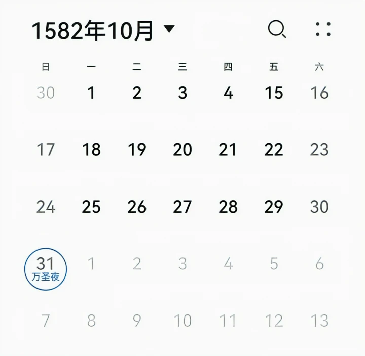
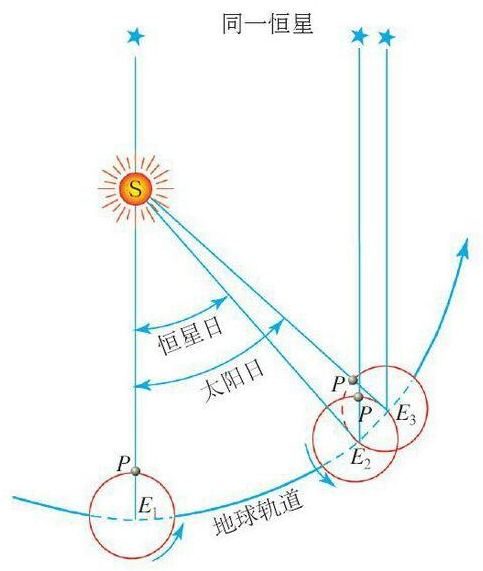

+++
title = '时间处理'
date = 2024-12-12T15:08:22+08:00
categories = ['技术']
tags = ['其他']
draft = true
+++

2月29号的时候，看到一则新闻：某激光雷达厂商因为没有处理好闰年，导致所有相关车辆的自动驾驶功能歇菜了。说实话，我有点被这则新闻震惊到了，因为我一直认为闰年是常识，不应该考虑不到，测试不到。但后来，一位老同事发给我一个链接，才发现，原来闰年导致的程序 bug 还很多，国内国外都有案例，甚至包括一些知名大厂。

时间是程序员每天都在处理的东西，一般来说，相关逻辑都极其简单。但除了闰年这个算不上例外的例外，时间处理里还有太多例外，其中一些甚至鲜为人知，一旦遇上就是一个 bug。本文就介绍下我知道的各种例外，有漏下的欢迎大家留言补充。

由于这篇文章以闰年开头，就先来看看历史上闰年给历法造成的最大麻烦。

## 一个月可以有多少天？

28天、29天、30天、31天，都对，都没有问题。但如果我们把日历翻到 1582 年 10 月，就会发现，这个月 4 号之后就是 15 号，中间少了 10 天，导致这个月只有 21 天。

原来，公元纪年最早采用的是儒略历，一个回归年是 365.25 天，所以固定每四年设置一个闰年。但实际上，一个回归年只有 365.2422 天，少了11分14秒。这11分14秒经过1500多年的累积，就导致了10天左右的误差。

为了解决这个问题，时任教皇是格里高利十三世开始推行后来被称为“格里高利历”的新历法：将一个回归年改成 365.2425 天，四年一闰，百年不闰，四百年再闰，这解决了未来的问题。然后，为了修正历史遗留问题，格里高利决定从1582 年的 10 月直接抹去 10 天。

格里高利历就是现行的公历，其 365.2425 天的回归年长度仍然比实际长一点，大约每 3300 年会产生一天的误差，所以，几万年后，历法或许又会有新的调整。

## 时区

理论上，时区每15°经线一个，只有 UTC-12，UTC-11、……、UTC、UTC+1、……、UTC+12 等25个（UTC±12各占7.5°）。但现实中，由于历史、地理、政治、经济等因素，实际使用的时区要复杂的多，以下略举一二：

1. 基里巴斯的国土横跨国际日期变更线，为了让全国日期同一，在 1995 年设立了 UTC+13 和 UTC+14 时区。而萨摩亚促进与中国、澳大利亚和新西兰等国的贸易，也在2011年12月29日完结时把标准时间从国际日期变更线以东调整到国际日期变更线以西，即从时区 UTC-11改成了 UTC+13，这导致其跳过了2011年12月30日。
2. 我们的东邻朝鲜，为了与日本相区别，2015年8月15日将自己从 UTC+9 改到了 UTC+8:30，2018年5月5日又改了回去。
3. 尼泊尔的时区是 UTC+5:45。

## 夏令时

为了节约能源，很多国家实行夏令时，中国在 1986 年到 1991 年也实行过 6 年，年龄稍大些的读者应该对此有印象。虽然在世界范围内很常见，但由于中国近30年没有夏令时，所以国内的程序员很可能会忽略这个问题，导致程序推广到施行夏令时的国家后出现 bug。

## 相对论效应

根据狭义相对论，物体运动速度越快，其时间流逝就越慢，但日常生活中的物体都太“慢”了，所以这种效应的影响完全可以忽略不记。但天上飞的人造卫星就不一样了，以 GPS 卫星为例，其时钟会因此比地球上每天慢大约 7 微妙。

另一方面，根据广义相对论，引力越大时间流逝越慢，人造卫星距地面几百到几万公里，其受到的地球引力要比地面上小，同样以 GPS 卫星 为例，其时钟会因此每天快大约 45 微秒。

两者综合起来，GPS 卫星上的时钟每天大约比地面时钟快 38 微秒，会导致大约 10000米/天 的定位误差。好在 GPS 设计时就考虑到了相对论效应，纠正了误差。

# 闰秒

## 闰秒是怎么产生的？

简单的说，闰秒是由于地球自转速度不均匀导致的。但由于涉及一些时间相关的基本概念，我想说得稍微详细一点。

中学物理告诉我们，“秒”是七个基本物理学单位之一，所以，对于一秒代表多长时间，应该有一个精确的定义。

### GMT 时间

基于日常生活经验，人们会很自然的认为，把某天正午到第二天正午定义为一天，然后把一天平均分为24小时，每小时平均分为60分钟，每分钟再平均分为60份就得到了“秒”。但事实上，“秒”的定义要复杂的多。

首先，地球自转的同时也在公转，这就导致，从某个位置的今天正午开始，自转一圈之后，由于在公转轨道上也前进了一点，那个位置不会正对太阳，而是需要再多自转一点才行。这就是恒星日和太阳日的区别，自转一圈是一个恒星日，两个正午之间是一个太阳日。

第二，地球的公转轨道是椭圆形，太阳位于一个焦点，这就导致地球公转时与太阳的距离时远时近，离得近时，公转速度快，单位时间内扫过的角度大，地球需要自转更多才能形成一个太阳日，反之，则只需要少一点的自转就能形成一个太阳日。同时，黄道和天赤道的夹角也会导致太阳日时长的变化。

第三，上面说的太阳日实际上叫“真太阳日”，由于它时短时长，所以没法用来计时。后来，人们就想了个办法，把一年之内的所以真太阳日平均一下，计算出了一个平均太阳日，简称“平太阳日”，这就消去了前面两点导致时长变化的因素，可以用来计时了。我们平时说的格林尼治时间（即 Greenwich Mean Time，GMT）就是根据平太阳日制定的，其全称是“格林尼治平太阳时间”。

需要说明，GMT 目前的正式名称是 UT1 （Universal Time 1），而且，GMT 在今天已经不再是一个时间标准，而是一个时区的名字。

### 原子时间

对日常生活而言，UT1（GMT）已经足够精确了，但对科学研究来说，还远远不够，因为人们发现，地球的自转速度并不均匀，所以平太阳日在不同年份的长度也会有差异，导致一秒所代表的时长发生变化。而且，虽然由于日月引力的潮汐锁定效应，地球自转速度总体上越来越慢，但在某段时间内，其变化毫无规律。所以就需要找一个新方法来定义“秒”。

最终，科学家们决定把平均海平面上铯-133原子基态的两个超精细能阶之间跃迁时所辐射的电磁波的周期的 9,192,631,770 倍定义为一秒。然后，科学家们又把一天定义为 86400 秒。

上面的时间定义就是国际原子时间（即 TAI，International Atomic Time，缩写缘于法文 Temps Atomique International）。

### UTC 时间和闰秒

UTC 的中文名叫“协调世界时”，它协调的是谁呢？就是上面的 UT1（GMT）和 TAI。

UTC 规定，在绝大多数情况下，每 86400 秒（指 TAI 定义的秒）为一天。但如果 UT1 和 UTC 之间的偏差超过 0.9 秒，就在当年的六月三十日或十二月三十一日最后插入一个闰秒，这个闰秒可能是正的，也可能是负的（到目前为止，已经插入的闰秒都是正的），所以，UTC 时间的一天也可能有 86399 秒或 86401 秒。

我们的日常交流中，经常把 GMT 和 UTC 当作同义词，但从上面的定义可以看出，二者有明显的区别。另外，再说一点八卦，对 UTC 命名时，英法两国各执一词，英国认为应该按英文 Coordinated Universal Time 将其缩写为 CUT，法国认为应该按法文 Temps Universel Coordonné 缩写为 TUC，所以最后缩写就变成了 UTC。

## 闰秒的处理

根据 UTC 的定义，对负闰秒的正确处理方法应该是在 23:59:58 后直接跳到第二天的 00:00:00；对正闰秒则应在 23:59:59 后增加一个 23:59:60。

但现实中，绝大多数软件系统都不需要那么精确的时间，也支持不了上面的处理方式，

## 单调时钟和墙上时钟